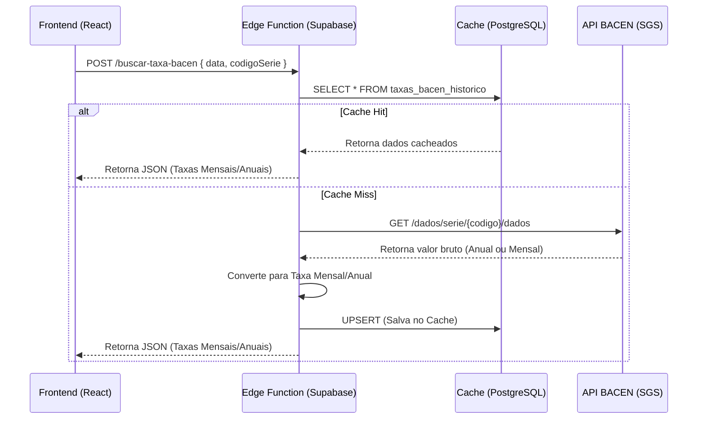
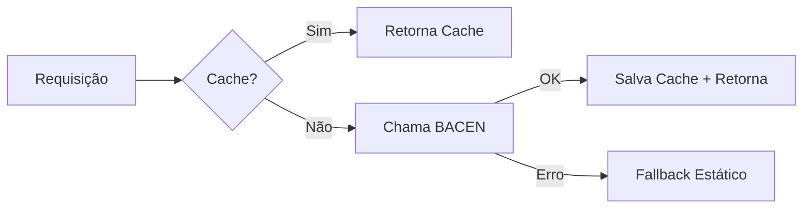

# Documentação Técnica: Integração API BACEN (SGS)

**Versão:** 2.0 (Dezembro 2025)  
**Status:** Produção  
**Responsável:** Equipe de Engenharia OctoApps

---

## 1. Visão Geral

O sistema OctoApps integra-se com o Sistema Gerenciador de Séries Temporais (SGS) do Banco Central do Brasil para obter taxas médias de mercado aplicadas a operações de crédito e índices financeiros (TR, IPCA, etc.).

Esta integração é crítica para os módulos de **Análise Prévia** (Triagem) e **Cálculo Revisional**, servindo como parâmetro de comparação para detectar abusividade nas taxas de juros contratuais.

### Fluxo de Dados



---

## 2. Componentes do Sistema

### 2.1 Banco de Dados (Cache)

A tabela `public.taxas_bacen_historico` armazena as taxas recuperadas para evitar requisições excessivas ao BACEN e garantir performance.

#### Schema Completo

| Coluna | Tipo | Restrições | Default | Descrição |
|--------|------|------------|---------|-----------|
| `id` | `uuid` | `PK, NOT NULL` | `gen_random_uuid()` | Identificador único |
| `serie_bacen` | `text` | - | `'432'` | Código da série SGS (ex: '20749') |
| `ano` | `integer` | `NOT NULL` | - | Ano de referência |
| `mes` | `integer` | `NOT NULL` | - | Mês de referência (1-12) |
| `ano_mes` | `text` | `NOT NULL` | - | Período textual (ex: '2023-10') |
| `taxa_mensal_percent` | `numeric(10,6)` | `NOT NULL` | - | Taxa mensal em % (ex: 1.9122) |
| `taxa_mensal_decimal` | `numeric(10,8)` | `NOT NULL` | - | Taxa mensal decimal (ex: 0.019122) |
| `taxa_anual_decimal` | `numeric(10,8)` | `NOT NULL` | - | Taxa anual decimal (ex: 0.2546) |
| `modalidade` | `text` | - | `'Aquisição...'` | Descrição da modalidade |
| `fonte` | `text` | - | `'BACEN - API SGS'` | Origem do dado |
| `data_atualizacao` | `timestamptz` | - | `now()` | Última atualização |
| `created_at` | `timestamptz` | - | `now()` | Data de criação |

#### Índices e Constraints

```sql
-- Chave Única (para UPSERT)
UNIQUE INDEX taxas_bacen_historico_unique_entry ON (serie_bacen, ano, mes)

-- Índices de Busca (B-Tree)
CREATE INDEX idx_taxas_bacen_ano_mes ON taxas_bacen_historico(ano_mes);
CREATE INDEX idx_taxas_bacen_ano ON taxas_bacen_historico(ano);
CREATE INDEX idx_taxas_bacen_mes ON taxas_bacen_historico(mes);
```

#### Exemplo de Consulta

```sql
-- Buscar taxa de veículos para abril/2025
SELECT taxa_mensal_percent, taxa_anual_decimal 
FROM taxas_bacen_historico 
WHERE serie_bacen = '20749' 
  AND ano = 2025 
  AND mes = 4;

-- Resultado: taxa_mensal_percent = 1.9122, taxa_anual_decimal = 0.2552
```

#### Exemplo de UPSERT

```sql
INSERT INTO taxas_bacen_historico (
  serie_bacen, ano, mes, ano_mes, 
  taxa_mensal_percent, taxa_mensal_decimal, taxa_anual_decimal,
  modalidade, fonte
) VALUES (
  '20749', 2025, 4, '2025-4',
  1.9122, 0.019122, 0.2552,
  'Veículos PF', 'BACEN_SGS_LIVE'
)
ON CONFLICT (serie_bacen, ano, mes) 
DO UPDATE SET 
  taxa_mensal_percent = EXCLUDED.taxa_mensal_percent,
  taxa_mensal_decimal = EXCLUDED.taxa_mensal_decimal,
  taxa_anual_decimal = EXCLUDED.taxa_anual_decimal,
  data_atualizacao = now();
```

> [!NOTE]
> A tabela possui **Row Level Security (RLS)** habilitado. Consultas de leitura são permitidas para usuários autenticados.

### 2.2 Tabela de Referência (`tipos_operacao_bacen`)

Tabela centralizada que mapeia tipos de operação para suas séries BACEN correspondentes. Permite dropdowns dinâmicos nos formulários.

#### Schema

| Coluna | Tipo | Descrição |
|--------|------|-----------|
| `codigo` | `text` | Identificador único (ex: 'VEICULOS_PF') |
| `nome` | `text` | Nome para exibição (ex: 'Veículos - Pessoa Física') |
| `categoria` | `text` | EMPRESTIMO, VEICULO, IMOBILIARIO, CARTAO, EMPRESARIAL, INDICE |
| `serie_bacen` | `integer` | Código SGS (ex: 20749) |
| `tipo_taxa` | `text` | ANUAL ou MENSAL |
| `ativo` | `boolean` | Se aparece nos dropdowns |
| `ordem` | `integer` | Ordenação no dropdown |

#### Uso no Frontend

```typescript
import { useTiposOperacao } from '@/hooks/useTiposOperacao';

// No componente
const { tiposOperacao, getSeriePorCodigo } = useTiposOperacao({ 
  categoria: 'VEICULO' 
});

// Dropdown
<Select>
  {tiposOperacao.map(op => (
    <SelectItem key={op.codigo} value={op.codigo}>
      {op.nome}
    </SelectItem>
  ))}
</Select>

// Ao consultar taxa
const serie = getSeriePorCodigo(valorSelecionado); // 20749
await fetchMarketRate(serie, dataContrato);
```

### 2.3 Edge Function (`buscar-taxa-bacen`)

Localizada em: `supabase/functions/buscar-taxa-bacen/index.ts`

Esta função é o "cérebro" da integração. Ela resolve um problema crítico: a padronização das taxas. **O BACEN retorna algumas séries em % ao ano e outras em % ao mês.** A função normaliza tudo para entregar ambas as visões ao frontend.

#### Lógica de Conversão (Crítica)

A função mantém uma lista de séries que sabidamente retornam valores anuais.

```typescript
// Lista de séries ANUAIS (Crédito) - v2.0
const seriesAnuais = [
  // Empréstimos PF
  25464, 25463, 25462, 25470, 20742, 25471,
  // Empresarial
  20739, 20722, 20723,
  // Veículos
  20749, 20728,
  // Imobiliário
  20773, 25497, 432,
  // Cartão (Anual)
  25482
];

// Cálculo com Decimal.js (precisão 20 casas)
const decVal = new Decimal(val);
const taxaMensalDec = new Decimal(1)
  .plus(decVal.div(100))
  .pow(new Decimal(1).div(12))
  .minus(1);
```

**Algoritmo:**
1. Busca valor bruto na API.
2. Se `codigoSerie` está na lista `seriesAnuais`:
   * Valor Bruto = Taxa Anual Percentual (ex: 10.24)
   * `Taxa Anual Decimal` = 10.24 / 100 = 0.1024
   * `Taxa Mensal Decimal` = $(1 + 0.1024)^{1/12} - 1$
   * `Taxa Mensal Percent` = Taxa Mensal Decimal * 100
3. Se não está na lista (ex: TR, IPCA):
   * Valor Bruto = Taxa Mensal Percentual
   * `Taxa Mensal Decimal` = Valor Bruto / 100
   * `Taxa Anual Decimal` = $(1 + Taxa Mensal Decimal)^{12} - 1$

---

## 3. Mapeamento de Séries SGS

As seguintes séries são utilizadas pelo sistema:

### Séries Anuais (% a.a.) - Conversão Exponencial

| Módulo | Série SGS | Descrição |
|--------|-----------|-----------|
| **Empréstimos** | `25464` | Crédito Pessoal PF |
| **Empréstimos** | `25463` | Consignado Privado |
| **Empréstimos** | `25462` | Consignado Público |
| **Empréstimos** | `25470` | Consignado INSS |
| **Empréstimos** | `20742` | Crédito Pessoal Não Consignado |
| **Empréstimos** | `25471` | Crédito Pessoal Total |
| **Empresarial** | `20739` | Capital de Giro até 365d |
| **Empresarial** | `20722` | Capital de Giro até 365d (alt) |
| **Empresarial** | `20723` | Capital de Giro > 365d |
| **Veículos** | `20749` | Aquisição de Veículos PF |
| **Veículos** | `20728` | Aquisição de Veículos PJ |
| **Imobiliário** | `20773` | Financiamento SFH |
| **Imobiliário** | `25497` | Financiamento SFI |
| **Imobiliário** | `432` | Mercado não referenciadas |
| **Cartão** | `25482` | Rotativo PF (Anual) |

### Séries Mensais (% a.m.) - Divisão Simples

| Módulo | Série SGS | Descrição |
|--------|-----------|-----------|
| **Índice** | `226` | TR (Taxa Referencial) |
| **Índice** | `433` | IPCA |
| **Índice** | `188` | INPC (Correção de Indébito) |
| **Índice** | `189` | IGP-M |
| **Cartão** | `25455` | Rotativo PF (Mensal) |

---

## 4. Consumo no Frontend

O arquivo centralizador é `src/utils/financialCalculations.ts`.

### Função `fetchMarketRate`

Responsável por chamar a Edge Function. **Importante:** Desde a versão 2.0, esta função **não realiza conversão de taxas**. Ela confia que a Edge Function já retorna o valor mensal correto no campo `taxaMediaMensalPercent`.

```typescript
// Exemplo de uso simplificado
const taxaMensal = await fetchMarketRate('IMOBILIARIO_SFH', '2025-04-01');
// Retorna number: ex 0.8157 (representando 0.8157% a.m.)
```

### Fallback

Se a API falhar ou não houver dados para a data (ex: feriado/futuro), o frontend utiliza taxas estáticas definidas em `getStaticFallbackRate`:
* Veículos: 1.69% a.m.
* Geral: 1.71% a.m.
* Imobiliário: 0.91% a.m.

---

## 5. Troubleshooting e Manutenção

### Problema: Taxas vindo com valor incorreto (ex: 0.08% a.m. em vez de 0.8%)

**Causa Provável:** Cache poluído com dados de uma versão antiga da Edge Function que fazia conversão errada (dividia taxa anual por 100 achando que era mensal).

**Solução:** Limpar o cache para a série afetada. No Dashboard Supabase -> SQL Editor:

```sql
-- Exemplo para limpar série Imobiliária SFH (20773)
DELETE FROM taxas_bacen_historico WHERE serie_bacen = '20773';
```

### Problema: API BACEN fora do ar

O sistema automaticamente usará o fallback estático e registrará um aviso no console (`console.warn`). Nenhuma ação imediata é necessária, o sistema tentará buscar novamente na próxima consulta.

### Como Adicionar Nova Série

1. Identifique o código SGS no site do BACEN.
2. Verifique se o retorno é % a.a. ou % a.m.
3. Se for % a.a., adicione o código ao array `seriesAnuais` em `supabase/functions/buscar-taxa-bacen/index.ts`.
4. Faça deploy da função: `npx supabase functions deploy buscar-taxa-bacen`.
5. Adicione o mapeamento no `financialCalculations.ts` para permitir o uso pelo nome do módulo.

---

## 6. Pontos de Consumo na Aplicação

### 6.1 `src/components/triagem/ModuloGeralForm.tsx` (Veículos e Empréstimos)
*   **Gatilho:** `useEffect` monitorando alterações em `watchDataContrato` ou `watchTipoContrato`.
*   **Parâmetros:**
    *   `dataContrato`: Input do usuário.
    *   `modulo`: Determinado por `getModuloParaBacen()` ('VEICULOS' ou 'GERAL').
*   **Uso do Dado:**
    *   Atualiza estado `taxaMercado` (State React).
    *   Exibe no formulário: "Taxa média na época: X % a.m.".
    *   Utilizado no cálculo de `economiabacen` ao submeter a análise.

### 6.2 `src/components/triagem/ModuloImobiliarioForm.tsx` (Financiamento Imobiliário)
*   **Gatilho:** `useEffect` monitorando `watchDataContrato` ou `watchTipoFinanciamento`.
*   **Parâmetros:**
    *   `dataContrato`: Input do usuário.
    *   `modulo`: 'IMOBILIARIO_SFH' ou 'IMOBILIARIO_SFI' (baseado no select).
*   **Uso do Dado:**
    *   Atualiza estado `taxaMercado`.
    *   Crucial para o **Cenário B (Taxa Média BACEN)** na comparação de viabilidade.
    *   Define se o contrato é considerado abusivo (se `taxaContrato` > `taxaMercado` + tolerância).

---

## 7. Carga Histórica (Bulk Fetch)

### Edge Function: `seed-taxas-bacen`

Localizada em: `supabase/functions/seed-taxas-bacen/index.ts`

Esta função realiza a carga em massa de 20 anos de dados históricos de taxas BACEN para popular o cache local.

**Execução:**
```bash
# Deploy
npx supabase functions deploy seed-taxas-bacen

# Invocar via Dashboard Supabase ou curl
curl -X POST https://<project>.supabase.co/functions/v1/seed-taxas-bacen \
  -H "Authorization: Bearer <SERVICE_ROLE_KEY>" \
  -H "Content-Type: application/json" \
  -d '{"iniciar": true}'
```

### Séries Processadas

| Série | Nome | Tipo | Registros (~) |
|-------|------|------|---------------|
| 20749 | Veículos PF | Anual | 250+ |
| 20728 | Veículos PJ | Anual | 176+ |
| 20773 | Imobiliário SFH | Anual | 250+ |
| 25497 | Imobiliário SFI | Anual | 200+ |
| 226 | TR | Mensal | 250+ |
| 433 | IPCA | Mensal | 250+ |
| 188 | INPC | Mensal | 250+ |
| 189 | IGP-M | Mensal | 250+ |

### Características

- **Período:** 01/01/2005 → Data Atual
- **Processamento em Lotes:** 100 registros por lote
- **Delay entre Séries:** 500ms para não sobrecarregar API BACEN
- **Conflitos:** UPSERT com `onConflict: 'serie_bacen, ano, mes'`
- **Fonte no Banco:** `BACEN_SGS_BULK`

---

## 8. Precisão Financeira (Decimal.js)

Para evitar divergência de centavos em cálculos de longo prazo, toda a aritmética de taxas utiliza a biblioteca **Decimal.js** com precisão de 20 casas decimais.

```typescript
import { Decimal } from "https://esm.sh/decimal.js@10.4.3";

Decimal.set({ precision: 20, rounding: Decimal.ROUND_HALF_UP });

// Conversão Anual → Mensal
const taxaMensalDec = new Decimal(1)
  .plus(decVal.div(100))
  .pow(new Decimal(1).div(12))
  .minus(1);
```

> [!IMPORTANT]
> Nunca use `Math.pow()` para cálculos financeiros. O objeto `Math` nativo do JavaScript introduz erros de arredondamento que se acumulam ao longo de 360 parcelas.

---

## 9. Priorização de Consulta

O fluxo de priorização segue esta ordem:

1. **Busca Local (Cache):** Verifica `taxas_bacen_historico` por `(serie, ano, mes)`.
2. **Busca Remota (Fallback):** Se não existe, chama API BACEN em tempo real.
3. **Atualização de Cache:** Salva resultado com `fonte: BACEN_SGS_LIVE`.
4. **Fallback Estático:** Se tudo falhar, usa taxas hardcoded de segurança.



---

## 10. Guia de Integração para Desenvolvedores

Esta seção orienta desenvolvedores sobre **quando e como** consumir os dados de taxas BACEN no sistema.

### 10.1 Estratégia Recomendada: Via Edge Function

Para a **maioria dos casos de uso** (Análise Prévia, consultas pontuais), utilize a Edge Function `buscar-taxa-bacen`:

```typescript
// src/utils/financialCalculations.ts
const taxaMensal = await fetchMarketRate('VEICULOS', '2025-04-01');
// Retorna: 1.9122 (representando 1.9122% a.m.)
```

**Vantagens:**
- ✅ Auto-população do cache (dados novos são salvos automaticamente)
- ✅ Conversão de taxas centralizada (anual↔mensal)
- ✅ Fallback automático para taxa estática em caso de erro
- ✅ Lógica de negócio isolada no backend

**Quando usar:**
- Formulários de Triagem/Análise Prévia
- Consultas individuais por data
- Qualquer cenário onde você precisa de UMA taxa específica

### 10.2 Estratégia Alternativa: Consulta Direta na Tabela

Para **cálculos em batch** com múltiplos meses (ex: evolução de 360 parcelas com correção monetária), a consulta direta na tabela é mais eficiente:

```typescript
// Exemplo: Buscar TR de 30 meses de uma vez
const { data: taxasTR } = await supabase
  .from('taxas_bacen_historico')
  .select('ano, mes, taxa_mensal_decimal')
  .eq('serie_bacen', '226') // TR
  .gte('ano_mes', '2023-1')
  .lte('ano_mes', '2025-6')
  .order('ano', { ascending: true })
  .order('mes', { ascending: true });

// Resultado: Array de 30 objetos com as taxas mensais
```

**Vantagens:**
- ✅ Uma única query para múltiplos meses
- ✅ Performance superior para cálculos de longo prazo
- ✅ Permite agregações e transformações no banco

**Quando usar:**
- Cálculo Revisional completo (360 parcelas)
- Relatórios de evolução histórica
- Exportação de dados em massa

### 10.3 Estratégia Híbrida (Recomendada para Cálculo Revisional)

Para módulos complexos, combine as duas estratégias:

```typescript
async function obterTaxasParaCalculo(serie: string, meses: { ano: number, mes: number }[]) {
  // 1. Tenta buscar tudo do cache
  const { data: cached } = await supabase
    .from('taxas_bacen_historico')
    .select('*')
    .eq('serie_bacen', serie)
    .in('ano_mes', meses.map(m => `${m.ano}-${m.mes}`));

  // 2. Identifica meses faltantes
  const cachedPeriodos = new Set(cached?.map(c => `${c.ano}-${c.mes}`) || []);
  const faltantes = meses.filter(m => !cachedPeriodos.has(`${m.ano}-${m.mes}`));

  // 3. Busca faltantes via Edge Function (popula cache)
  for (const falta of faltantes) {
    await fetchMarketRate(getModuloBySerie(serie), `${falta.ano}-${falta.mes}-01`);
  }

  // 4. Retorna dados completos do cache
  return supabase
    .from('taxas_bacen_historico')
    .select('*')
    .eq('serie_bacen', serie)
    .in('ano_mes', meses.map(m => `${m.ano}-${m.mes}`));
}
```

### 10.4 Tabela de Decisão

| Cenário | Método | Justificativa |
|---------|--------|---------------|
| Triagem Rápida | Edge Function | Uma taxa por consulta, auto-cache |
| Cálculo Revisional | Híbrido | 360 meses, precisa do bulk + preenchimento |
| Relatório PDF | Consulta Direta | Dados já no cache após cálculo |
| Novo mês (sem dados) | Edge Function | Popula cache automaticamente |
| Conferência de valores | Consulta Direta | Debug/auditoria |

### 10.5 Mapeamento Série ↔ Módulo

Use esta tabela para determinar qual série usar baseado no módulo:

```typescript
function getSerieParaModulo(modulo: string): number {
  const mapa: Record<string, number> = {
    'VEICULOS': 20749,
    'VEICULOS_PJ': 20728,
    'GERAL': 20742,
    'CONSIGNADO': 25463,
    'IMOBILIARIO_SFH': 20773,
    'IMOBILIARIO_SFI': 25497,
    'CARTAO': 25482,
    'TR': 226,
    'IPCA': 433,
    'INPC': 188,
    'IGPM': 189,
  };
  return mapa[modulo] || 20742; // Default: Crédito Pessoal
}
```

> [!TIP]
> Para novos desenvolvedores: **comece sempre pela Edge Function**. Só migre para consulta direta quando tiver certeza de que os dados já estão no cache e precisar de performance em batch.


