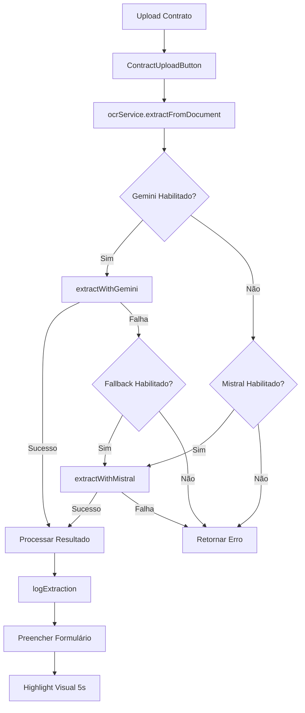

# OCR - Documentação Técnica

## Visão Geral

O sistema OCR do OctoApp extrai dados de contratos bancários usando IA (Gemini/Mistral) com fallback automático, configuração dinâmica de campos por categoria e logging completo.

---

## Arquitetura



---

## Componentes

### 1. OCRService (`src/services/ocr.service.ts`)

| Método | Descrição |
|--------|-----------|
| `extractFromDocument(file, category, userId)` | Ponto de entrada principal |
| `getSettings(userId)` | Busca configurações do usuário no Supabase |
| `getOrCreateFieldConfigs(userId, category)` | Busca ou cria campos padrão |
| `buildSystemPrompt(category, fields)` | Monta o prompt dinâmico |
| `extractWithGemini(...)` | Chamada via `@google/genai` SDK |
| `extractWithMistral(...)` | Chamada via `@mistralai/mistralai` SDK |
| `logExtraction(log)` | Persiste log no `ocr_logs` |

### 2. ContractUploadButton (`src/components/calculations/wizard/ContractUploadButton.tsx`)

Componente reutilizável que:
- Aceita `category` (define quais campos extrair)
- Valida tipo (PDF/JPG/PNG) e tamanho (máx 20MB)
- Exibe loading e feedback via toast
- Chama `onDataExtracted(data)` para preencher o form

### 3. OCRSettingsPage (`src/components/settings/OCRSettingsPage.tsx`)

Interface para:
- Configurar API Keys (Gemini/Mistral)
- Escolher modelos (Gemini 2.0 Flash, Mistral OCR Latest)
- Ativar/desativar fallback
- Gerenciar campos por categoria

---

## Categorias e Campos

O sistema usa **configuração dinâmica por categoria**. Campos são armazenados em `ocr_field_configs` e podem ser customizados por usuário.

### EMPRESTIMOS_VEICULOS

| Campo | Tipo | Obg. | Categoria | Hint |
|-------|------|------|-----------|------|
| **Dados do Contrato** |
| `nome_credor` | text | ✅ | Identificação | Nome do banco, financeira |
| `nome_devedor` | text | ✅ | Identificação | Nome do cliente/contratante |
| `numero_contrato` | text | ✅ | Identificação | Nº do contrato, CCB |
| `modalidade` | text | ❌ | Identificação | CDC, Leasing, Consignado |
| **Dados Financeiros** |
| `valor_financiado` | number | ✅ | Financeiro | Valor do Crédito, Principal |
| `valor_bem` | number | ❌ | Financeiro | Valor de mercado do veículo |
| `valor_entrada` | number | ❌ | Financeiro | Entrada, Sinal |
| `prazo_meses` | number | ✅ | Financeiro | Quantidade de parcelas |
| `taxa_juros_mensal` | number | ✅ | Financeiro | % a.m., Taxa Mensal |
| `taxa_juros_anual` | number | ❌ | Financeiro | % a.a., CET |
| `valor_parcela` | number | ❌ | Financeiro | Prestação, PMT |
| **Datas** |
| `data_contrato` | date | ✅ | Temporal | Data de assinatura |
| `data_liberacao` | date | ❌ | Temporal | Liberação do crédito |
| `data_primeiro_vencimento` | date | ✅ | Temporal | 1º vencimento |
| **Sistema** |
| `sistema_amortizacao` | text | ❌ | Sistema | SAC, PRICE |
| `capitalizacao` | text | ❌ | Sistema | Mensal, Diária |
| **Tarifas e Seguros** |
| `tarifa_tac` | number | ❌ | Encargos | Tarifa Abertura Crédito |
| `tarifa_avaliacao` | number | ❌ | Encargos | Avaliação do bem |
| `tarifa_registro` | number | ❌ | Encargos | Registro do contrato |
| `seguro_prestamista` | number | ❌ | Encargos | Seguro Morte/Invalidez |
| `iof` | number | ❌ | Encargos | IOF |

### IMOBILIARIO

| Campo | Tipo | Obg. | Categoria | Hint |
|-------|------|------|-----------|------|
| **Dados do Contrato** |
| `nome_credor` | text | ✅ | Identificação | Banco, CEF, instituição |
| `nome_devedor` | text | ✅ | Identificação | Nome do mutuário |
| `numero_contrato` | text | ✅ | Identificação | Nº do contrato |
| `tipo_financiamento` | text | ❌ | Identificação | SFH, SFI, Carta Crédito |
| **Dados do Imóvel** |
| `valor_imovel` | number | ✅ | Imóvel | Valor compra/avaliação |
| `valor_avaliacao` | number | ❌ | Imóvel | Avaliação bancária |
| `valor_entrada` | number | ❌ | Imóvel | Entrada, Sinal |
| `valor_fgts` | number | ❌ | Imóvel | FGTS utilizado |
| `valor_financiado` | number | ✅ | Imóvel | Valor financiado (PV) |
| **Dados Financeiros** |
| `prazo_meses` | number | ✅ | Financeiro | Prazo total |
| `taxa_juros_mensal` | number | ❌ | Financeiro | % a.m. |
| `taxa_juros_anual` | number | ✅ | Financeiro | % a.a., TEA |
| `valor_prestacao` | number | ❌ | Financeiro | Prestação mensal |
| **Datas** |
| `data_contrato` | date | ✅ | Temporal | Data assinatura |
| `data_liberacao` | date | ❌ | Temporal | Liberação crédito |
| `data_primeira_parcela` | date | ✅ | Temporal | 1º vencimento |
| **Sistema e Indexador** |
| `sistema_amortizacao` | text | ✅ | Sistema | SAC, PRICE, SACRE |
| `indexador` | text | ✅ | Sistema | TR, IPCA, INPC, IGPM |
| **Seguros Habitacionais** |
| `seguro_mip_valor` | number | ❌ | Seguros | MIP (Morte/Invalidez) |
| `seguro_dfi_valor` | number | ❌ | Seguros | DFI (Danos ao Imóvel) |
| **Taxas e Tarifas** |
| `taxa_administracao` | number | ❌ | Tarifas | Taxa adm mensal |
| `taxa_avaliacao` | number | ❌ | Tarifas | Avaliação imóvel |
| `taxa_registro` | number | ❌ | Tarifas | Registro cartório |
| `taxa_analise` | number | ❌ | Tarifas | Análise garantia |

### CARTAO_CREDITO
| Campo | Tipo | Obrigatório | Hint |
|-------|------|-------------|------|
| `bandeira_banco` | text | ✅ | - |
| `limite_credito` | number | ❌ | - |
| `taxa_rotativo` | number | ❌ | - |
| `valor_fatura` | number | ❌ | - |
| `encargos_atraso` | number | ❌ | - |
| `data_vencimento` | date | ❌ | - |

---

## Prompt de Extração

O prompt é gerado dinamicamente baseado nos campos ativos:

```text
Você é um especialista em OCR e extração de dados de contratos bancários e jurídicos brasileiros.

Analise o documento fornecido e extraia os seguintes campos específicos.
Retorne APENAS um objeto JSON válido. NÃO inclua formatação markdown (como ```json).

Categoria: {CATEGORY}

Campos para extrair:
- "{field_key}" ({field_label}): {extraction_hint} [Type: {field_type}]
...

Regras:
1. Se um campo não for encontrado claramente, defina como null. NÃO invente dados.
2. Para datas, use formato YYYY-MM-DD.
3. Para números/valores monetários, retorne como números puros (ex: 1500.50), não strings ("R$ 1.500,50").
4. Remova separadores de milhares (pontos) e substitua vírgula decimal por ponto.
5. Identifique "Capitalização Diária" vs "Mensal" se aplicável.
```

---

## Provedores de IA

### Google Gemini
- **SDK:** `@google/genai`
- **Modelos:** `gemini-2.0-flash` (recomendado), `gemini-2.0-pro`
- **Método:** `ai.models.generateContent()` com `responseMimeType: 'application/json'`

### Mistral
- **SDK:** `@mistralai/mistralai`
- **Modelos:** `mistral-ocr-latest` (recomendado), `pixtral-large-latest`
- **Método:** 2 etapas:
  1. `client.ocr.process()` → Extrai texto em Markdown
  2. `client.chat.complete()` com `mistral-large-latest` → Estrutura em JSON

---

## Banco de Dados

### Tabelas

| Tabela | Descrição |
|--------|-----------|
| `ocr_settings` | Configurações por usuário (API keys, modelos, fallback) |
| `ocr_field_configs` | Campos de extração por categoria/usuário |
| `ocr_logs` | Histórico de extrações (auditoria, tokens, tempo) |

### Enums

| Enum | Valores |
|------|---------|
| `ocr_category` | `EMPRESTIMOS_VEICULOS`, `IMOBILIARIO`, `CARTAO_CREDITO` |
| `ocr_provider` | `GEMINI`, `MISTRAL` |
| `ocr_status` | `SUCCESS`, `PARTIAL`, `FAILED`, `TIMEOUT` |

---

## Fluxo de Uso

1. **Configurar:** Usuário insere API keys em `Configurações > OCR & IA`
2. **Upload:** Usuário clica em "Inserir Contrato (IA)" no wizard
3. **Extração:** Sistema envia documento ao provider configurado
4. **Fallback:** Se Gemini falhar e fallback ativo, tenta Mistral automaticamente
5. **Preenchimento:** Campos extraídos são inseridos no formulário
6. **Highlight:** Campos preenchidos exibem borda verde por 5 segundos
7. **Log:** Extração é registrada para auditoria

---

## Configurações por Local (Roadmap)

> **Planejado:** Permitir configurações personalizadas para cada instância do `ContractUploadButton`.

Exemplo de uso futuro:
```tsx
<ContractUploadButton 
    category="EMPRESTIMOS_VEICULOS"
    customFields={['valor_financiado', 'taxa_juros_mensal', 'prazo_meses']}
    customPromptSuffix="Foque em contratos de veículos financiados."
    onDataExtracted={handleOcrData}
/>
```

Isso permitirá:
- Campos específicos por contexto (ex: só extrair campos relevantes para aquela etapa)
- Prompts customizados por tipo de documento
- Override de provider/modelo por local

---

## Limitações

- **Tamanho máximo:** 20MB por arquivo
- **Formatos:** PDF, JPG, PNG
- **Performance:** ~5-15 segundos para PDFs complexos
- **Precisão:** Depende da qualidade do scan e clareza do contrato
