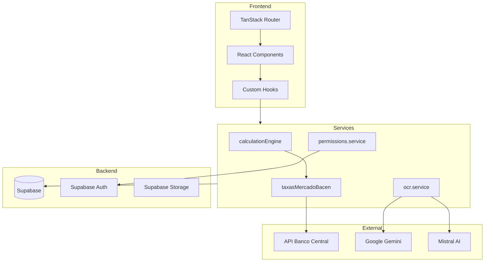

# 🐙 OctoApps System Index (MCP)

> **Status da Leitura:** 2026-01-16  
> **Resumo:** Mapa central de documentação e código do sistema OctoApps.  
> **Versão:** 1.0

---

## 1. Mapa de Navegação Rápida

### 📁 Diretórios de Documentação

| Diretório | Propósito |
| :--- | :--- |
| `/docs` | Documentação raiz (PRD, Schema, Stack, Requisitos) |
| `/docs/calculo-revisional` | Especificações técnicas do motor de cálculo financeiro |
| `/docs/crm` | Arquitetura e componentes do CRM/Pipeline |
| `/docs/geral` | Módulos gerais, fluxos, permissões e segurança |

### 📁 Diretórios de Código-Fonte

| Diretório | Propósito |
| :--- | :--- |
| `/src/components/calculations` | Componentes de UI para cálculos revisionais (Wizard, Listas) |
| `/src/components/crm` | Kanban, cards de oportunidades, pipeline |
| `/src/components/contacts` | Gestão de contatos/leads |
| `/src/components/peticoes` | Geração de petições |
| `/src/components/ui` | Componentes base Shadcn/Radix (53 componentes) |
| `/src/services` | Lógica de negócio e motores de cálculo |
| `/src/services/calculationEngine` | Subpastas com engines específicos por tipo |
| `/src/hooks` | Custom hooks para estado e APIs |
| `/src/types` | Definições TypeScript centralizadas |
| `/src/routes` | Rotas TanStack Router (file-based) |

---

## 2. Status das Funcionalidades (Doc vs. Code)

### 🧮 Módulo de Cálculo Revisional

| Funcionalidade | Documentação | Código | Status |
| :--- | :--- | :--- | :--- |
| Motor SAC (Imobiliário) | [`MODULO_IMOBILIARIO_TECNICO.md`](file:///c:/Users/Usuario/OneDrive/Documentos/Antigravity/Octoapps/OctoApp/docs/calculo-revisional/MODULO_IMOBILIARIO_TECNICO.md) | [`calculationEngine.ts`](file:///c:/Users/Usuario/OneDrive/Documentos/Antigravity/Octoapps/OctoApp/src/services/calculationEngine.ts) | ✅ Implementado |
| Motor PRICE (Veículos/Geral) | [`MODULO_VEICULOS_TECNICO.md`](file:///c:/Users/Usuario/OneDrive/Documentos/Antigravity/Octoapps/OctoApp/docs/calculo-revisional/MODULO_VEICULOS_TECNICO.md) | [`calculationEngine.emprestimo.ts`](file:///c:/Users/Usuario/OneDrive/Documentos/Antigravity/Octoapps/OctoApp/src/services/calculationEngine.emprestimo.ts) | ✅ Implementado |
| Motor Cartão de Crédito (RMC) | [`MODULO_CALCULO_REVISIONAL.md`](file:///c:/Users/Usuario/OneDrive/Documentos/Antigravity/Octoapps/OctoApp/docs/calculo-revisional/MODULO_CALCULO_REVISIONAL.md) | [`calculationEngine.cartao.ts`](file:///c:/Users/Usuario/OneDrive/Documentos/Antigravity/Octoapps/OctoApp/src/services/calculationEngine.cartao.ts) | ✅ Implementado |
| Análise Prévia de Viabilidade | [`MODULOS.md`](file:///c:/Users/Usuario/OneDrive/Documentos/Antigravity/Octoapps/OctoApp/docs/geral/MODULOS.md) | [`calculoDetalhado.service.ts`](file:///c:/Users/Usuario/OneDrive/Documentos/Antigravity/Octoapps/OctoApp/src/services/calculoDetalhado.service.ts) | ✅ Implementado |
| Integração BACEN (Taxa Média) | [`INTEGRACAO_BACEN_TECNICO.md`](file:///c:/Users/Usuario/OneDrive/Documentos/Antigravity/Octoapps/OctoApp/docs/INTEGRACAO_BACEN_TECNICO.md) | [`taxasMercadoBacen.ts`](file:///c:/Users/Usuario/OneDrive/Documentos/Antigravity/Octoapps/OctoApp/src/services/taxasMercadoBacen.ts) | ✅ Implementado |
| Geração de Fluxos (Original/Revisado) | [`DATABASE_SCHEMA.md`](file:///c:/Users/Usuario/OneDrive/Documentos/Antigravity/Octoapps/OctoApp/docs/DATABASE_SCHEMA.md) | Tabela `fluxo_caixa` | ✅ Implementado |
| Capitalização Diária | [`REQUISITOS.md`](file:///c:/Users/Usuario/OneDrive/Documentos/Antigravity/Octoapps/OctoApp/docs/REQUISITOS.md) RN-004 | [`calculationEngine/`](file:///c:/Users/Usuario/OneDrive/Documentos/Antigravity/Octoapps/OctoApp/src/services/calculationEngine) | ✅ Implementado |
| Precisão com Decimal.js | [`REQUISITOS.md`](file:///c:/Users/Usuario/OneDrive/Documentos/Antigravity/Octoapps/OctoApp/docs/REQUISITOS.md) RN-002 | Utilizado nos services | ✅ Implementado |

### 📄 Módulo OCR / Automação IA

| Funcionalidade | Documentação | Código | Status |
| :--- | :--- | :--- | :--- |
| Extração de Dados PDF | [`OCR.md`](file:///c:/Users/Usuario/OneDrive/Documentos/Antigravity/Octoapps/OctoApp/docs/calculo-revisional/OCR.md) | [`ocr.service.ts`](file:///c:/Users/Usuario/OneDrive/Documentos/Antigravity/Octoapps/OctoApp/src/services/ocr.service.ts) | ✅ Implementado |
| Provider Gemini | [`OCR.md`](file:///c:/Users/Usuario/OneDrive/Documentos/Antigravity/Octoapps/OctoApp/docs/calculo-revisional/OCR.md) | `extractWithGemini()` | ✅ Implementado |
| Provider Mistral | [`OCR.md`](file:///c:/Users/Usuario/OneDrive/Documentos/Antigravity/Octoapps/OctoApp/docs/calculo-revisional/OCR.md) | `extractWithMistral()` | ✅ Implementado |
| Logs de Processamento | [`DATABASE_SCHEMA.md`](file:///c:/Users/Usuario/OneDrive/Documentos/Antigravity/Octoapps/OctoApp/docs/DATABASE_SCHEMA.md) | Tabela `ocr_logs` | ✅ Implementado |
| Tipos TypeScript OCR | [`OCR.md`](file:///c:/Users/Usuario/OneDrive/Documentos/Antigravity/Octoapps/OctoApp/docs/calculo-revisional/OCR.md) | [`ocr.types.ts`](file:///c:/Users/Usuario/OneDrive/Documentos/Antigravity/Octoapps/OctoApp/src/types/ocr.types.ts) | ✅ Implementado |

### 👥 Módulo CRM (Pipeline Kanban)

| Funcionalidade | Documentação | Código | Status |
| :--- | :--- | :--- | :--- |
| Pipeline Kanban Drag-and-Drop | [`COMPONENTES.md`](file:///c:/Users/Usuario/OneDrive/Documentos/Antigravity/Octoapps/OctoApp/docs/crm/COMPONENTES.md) | [`/components/crm/`](file:///c:/Users/Usuario/OneDrive/Documentos/Antigravity/Octoapps/OctoApp/src/components/crm) (11 arquivos) | ✅ Estável |
| Hook Kanban DnD | [`HOOKS.md`](file:///c:/Users/Usuario/OneDrive/Documentos/Antigravity/Octoapps/OctoApp/docs/crm/HOOKS.md) | [`useKanbanDnd.ts`](file:///c:/Users/Usuario/OneDrive/Documentos/Antigravity/Octoapps/OctoApp/src/hooks/useKanbanDnd.ts) | ✅ Implementado |
| Etapas do Funil (Admin) | [`REGRAS_NEGOCIO.md`](file:///c:/Users/Usuario/OneDrive/Documentos/Antigravity/Octoapps/OctoApp/docs/crm/REGRAS_NEGOCIO.md) | [`useEtapasFunil.ts`](file:///c:/Users/Usuario/OneDrive/Documentos/Antigravity/Octoapps/OctoApp/src/hooks/useEtapasFunil.ts) | ✅ Implementado |
| Oportunidades CRUD | [`DATABASE.md`](file:///c:/Users/Usuario/OneDrive/Documentos/Antigravity/Octoapps/OctoApp/docs/crm/DATABASE.md) | Tabela `oportunidades` | ✅ Implementado |
| Contatos CRUD | [`DATABASE_SCHEMA.md`](file:///c:/Users/Usuario/OneDrive/Documentos/Antigravity/Octoapps/OctoApp/docs/DATABASE_SCHEMA.md) | [`/components/contacts/`](file:///c:/Users/Usuario/OneDrive/Documentos/Antigravity/Octoapps/OctoApp/src/components/contacts) | ✅ Implementado |

### 🔐 Módulo de Autenticação e Permissões

| Funcionalidade | Documentação | Código | Status |
| :--- | :--- | :--- | :--- |
| Login Supabase Auth | [`FLUXOS.md`](file:///c:/Users/Usuario/OneDrive/Documentos/Antigravity/Octoapps/OctoApp/docs/geral/FLUXOS.md) | [`useAuth.ts`](file:///c:/Users/Usuario/OneDrive/Documentos/Antigravity/Octoapps/OctoApp/src/hooks/useAuth.ts) | ✅ Implementado |
| Sistema de Permissões CLED | [`PERMISSOES.md`](file:///c:/Users/Usuario/OneDrive/Documentos/Antigravity/Octoapps/OctoApp/docs/geral/PERMISSOES.md) | [`usePermissions.ts`](file:///c:/Users/Usuario/OneDrive/Documentos/Antigravity/Octoapps/OctoApp/src/hooks/usePermissions.ts) | ✅ Implementado |
| Service de Permissões | [`PERMISSOES.md`](file:///c:/Users/Usuario/OneDrive/Documentos/Antigravity/Octoapps/OctoApp/docs/geral/PERMISSOES.md) | [`permissions.service.ts`](file:///c:/Users/Usuario/OneDrive/Documentos/Antigravity/Octoapps/OctoApp/src/services/permissions.service.ts) | ✅ Implementado |
| Gestão de Usuários | [`USUARIOS.md`](file:///c:/Users/Usuario/OneDrive/Documentos/Antigravity/Octoapps/OctoApp/docs/geral/USUARIOS.md) | [`users.service.ts`](file:///c:/Users/Usuario/OneDrive/Documentos/Antigravity/Octoapps/OctoApp/src/services/users.service.ts) | ✅ Implementado |
| Row Level Security (RLS) | [`SEGURANCA.md`](file:///c:/Users/Usuario/OneDrive/Documentos/Antigravity/Octoapps/OctoApp/docs/geral/SEGURANCA.md) | Habilitado em todas as tabelas | ✅ Implementado |

### 📝 Módulo de Petições

| Funcionalidade | Documentação | Código | Status |
| :--- | :--- | :--- | :--- |
| Geração de Petições | [`MODULOS.md`](file:///c:/Users/Usuario/OneDrive/Documentos/Antigravity/Octoapps/OctoApp/docs/geral/MODULOS.md) | [`peticoes.service.ts`](file:///c:/Users/Usuario/OneDrive/Documentos/Antigravity/Octoapps/OctoApp/src/services/peticoes.service.ts) | ✅ Implementado |
| Templates Word | [`MODULOS.md`](file:///c:/Users/Usuario/OneDrive/Documentos/Antigravity/Octoapps/OctoApp/docs/geral/MODULOS.md) | [`/components/peticoes/`](file:///c:/Users/Usuario/OneDrive/Documentos/Antigravity/Octoapps/OctoApp/src/components/peticoes) | ✅ Implementado |
| Exportação PDF | [`PDF_GERACAO_SISTEMA.md`](file:///c:/Users/Usuario/OneDrive/Documentos/Antigravity/Octoapps/OctoApp/docs/geral/PDF_GERACAO_SISTEMA.md) | [`/components/pdf-engine/`](file:///c:/Users/Usuario/OneDrive/Documentos/Antigravity/Octoapps/OctoApp/src/components/pdf-engine) | ✅ Implementado |
| Laudo Técnico Export | [`PDF_GERACAO_SISTEMA.md`](file:///c:/Users/Usuario/OneDrive/Documentos/Antigravity/Octoapps/OctoApp/docs/geral/PDF_GERACAO_SISTEMA.md) | [`laudoExport.service.ts`](file:///c:/Users/Usuario/OneDrive/Documentos/Antigravity/Octoapps/OctoApp/src/services/laudoExport.service.ts) | ✅ Implementado |

### ⚙️ Funcionalidades Complementares

| Funcionalidade | Documentação | Código | Status |
| :--- | :--- | :--- | :--- |
| Dashboard Principal | [`PRD.md`](file:///c:/Users/Usuario/OneDrive/Documentos/Antigravity/Octoapps/OctoApp/docs/PRD.md) | [`/components/dashboard/`](file:///c:/Users/Usuario/OneDrive/Documentos/Antigravity/Octoapps/OctoApp/src/components/dashboard) | ✅ Implementado |
| White Label (Logo/Cores) | [`DATABASE_SCHEMA.md`](file:///c:/Users/Usuario/OneDrive/Documentos/Antigravity/Octoapps/OctoApp/docs/DATABASE_SCHEMA.md) | Tabela `user_document_settings` | ✅ Implementado |
| Agendamentos | [`DATABASE_SCHEMA.md`](file:///c:/Users/Usuario/OneDrive/Documentos/Antigravity/Octoapps/OctoApp/docs/DATABASE_SCHEMA.md) | [`useAgendamentos.ts`](file:///c:/Users/Usuario/OneDrive/Documentos/Antigravity/Octoapps/OctoApp/src/hooks/useAgendamentos.ts) | ✅ Implementado |
| Tarefas | [`DATABASE_SCHEMA.md`](file:///c:/Users/Usuario/OneDrive/Documentos/Antigravity/Octoapps/OctoApp/docs/DATABASE_SCHEMA.md) | [`useTasks.ts`](file:///c:/Users/Usuario/OneDrive/Documentos/Antigravity/Octoapps/OctoApp/src/hooks/useTasks.ts) | ✅ Implementado |
| Triagem de Contratos | [`MIGRATION_CONTRATOS_REVISIONAIS.md`](file:///c:/Users/Usuario/OneDrive/Documentos/Antigravity/Octoapps/OctoApp/docs/MIGRATION_CONTRATOS_REVISIONAIS.md) | [`/components/triagem/`](file:///c:/Users/Usuario/OneDrive/Documentos/Antigravity/Octoapps/OctoApp/src/components/triagem) | ✅ Implementado |

### ❌ Funcionalidades Fora do Escopo (MVP)

| Funcionalidade | Documentação | Status |
| :--- | :--- | :--- |
| Integração VoIP | [`PRD.md`](file:///c:/Users/Usuario/OneDrive/Documentos/Antigravity/Octoapps/OctoApp/docs/PRD.md) Seção 6 | ❌ V2 |
| IA Generativa Avançada (Teses) | [`PRD.md`](file:///c:/Users/Usuario/OneDrive/Documentos/Antigravity/Octoapps/OctoApp/docs/PRD.md) Seção 6 | ❌ V2 |
| API Pública para Terceiros | [`PRD.md`](file:///c:/Users/Usuario/OneDrive/Documentos/Antigravity/Octoapps/OctoApp/docs/PRD.md) Seção 6 | ❌ Fase SaaS |
| Gateway de Pagamentos | [`PRD.md`](file:///c:/Users/Usuario/OneDrive/Documentos/Antigravity/Octoapps/OctoApp/docs/PRD.md) Seção 6 | ❌ Fase SaaS |

---

## 3. Discrepâncias Encontradas

> [!WARNING]
> **Inconsistências que requerem atenção:**

- [ ] **src/README.md menciona Next.js 15**, mas o projeto utiliza **Vite 6 + React 18** conforme `TECH_STACK.md` e `package.json`. O README do /src está desatualizado.

- [ ] **src/README.md menciona rotas do App Router** (`/app` directory), mas o projeto usa **TanStack Router** com file-based routing em `/src/routes`. Documentação inconsistente.

- [ ] **src/README.md** menciona porta **localhost:3000**, mas Vite tipicamente usa **localhost:5173**.

> [!NOTE]
> **Recomendações de atualização:**

- [ ] Atualizar `src/README.md` para refletir a stack real (Vite 6, TanStack Router)
- [ ] Remover referências a Next.js do README interno

---

## 4. Mapeamento de Documentação

### 📚 Documentos Raiz (`/docs/`)

| Arquivo | Propósito | Prioridade |
| :--- | :--- | :--- |
| [PRD.md](file:///c:/Users/Usuario/OneDrive/Documentos/Antigravity/Octoapps/OctoApp/docs/PRD.md) | Product Requirements Document completo (PRD 000-005) | 🔴 Crítico |
| [DATABASE_SCHEMA.md](file:///c:/Users/Usuario/OneDrive/Documentos/Antigravity/Octoapps/OctoApp/docs/DATABASE_SCHEMA.md) | Schema PostgreSQL atualizado com todas as tabelas | 🔴 Crítico |
| [REQUISITOS.md](file:///c:/Users/Usuario/OneDrive/Documentos/Antigravity/Octoapps/OctoApp/docs/REQUISITOS.md) | Regras de negócio consolidadas (RN-001 a RN-005) | 🔴 Crítico |
| [TECH_STACK.md](file:///c:/Users/Usuario/OneDrive/Documentos/Antigravity/Octoapps/OctoApp/docs/TECH_STACK.md) | Tecnologias e versões do projeto | 🟡 Importante |
| [PROJECT_STRUCTURE.md](file:///c:/Users/Usuario/OneDrive/Documentos/Antigravity/Octoapps/OctoApp/docs/PROJECT_STRUCTURE.md) | Estrutura de pastas e padrão arquitetural | 🟡 Importante |
| [INTEGRACAO_BACEN_TECNICO.md](file:///c:/Users/Usuario/OneDrive/Documentos/Antigravity/Octoapps/OctoApp/docs/INTEGRACAO_BACEN_TECNICO.md) | Integração com API do Banco Central | 🟡 Importante |
| [UI_STANDARD.md](file:///c:/Users/Usuario/OneDrive/Documentos/Antigravity/Octoapps/OctoApp/docs/UI_STANDARD.md) | Padrões de interface | 🟢 Referência |

### 📁 Subdocs: Cálculo Revisional (`/docs/calculo-revisional/`)

| Arquivo | Propósito |
| :--- | :--- |
| [MODULO_CALCULO_REVISIONAL.md](file:///c:/Users/Usuario/OneDrive/Documentos/Antigravity/Octoapps/OctoApp/docs/calculo-revisional/MODULO_CALCULO_REVISIONAL.md) | Especificação matemática completa |
| [MODULO_IMOBILIARIO_TECNICO.md](file:///c:/Users/Usuario/OneDrive/Documentos/Antigravity/Octoapps/OctoApp/docs/calculo-revisional/MODULO_IMOBILIARIO_TECNICO.md) | Motor SAC/PRICE para SFH/SFI |
| [MODULO_VEICULOS_TECNICO.md](file:///c:/Users/Usuario/OneDrive/Documentos/Antigravity/Octoapps/OctoApp/docs/calculo-revisional/MODULO_VEICULOS_TECNICO.md) | Motor para financiamentos veiculares |
| [OCR.md](file:///c:/Users/Usuario/OneDrive/Documentos/Antigravity/Octoapps/OctoApp/docs/calculo-revisional/OCR.md) | Extração automática de contratos |
| [TECHNICAL_OVERVIEW.md](file:///c:/Users/Usuario/OneDrive/Documentos/Antigravity/Octoapps/OctoApp/docs/calculo-revisional/TECHNICAL_OVERVIEW.md) | Visão técnica geral do módulo |
| [especificacao_tecnica.md](file:///c:/Users/Usuario/OneDrive/Documentos/Antigravity/Octoapps/OctoApp/docs/calculo-revisional/especificacao_tecnica.md) | Detalhes de implementação |
| [ux.md](file:///c:/Users/Usuario/OneDrive/Documentos/Antigravity/Octoapps/OctoApp/docs/calculo-revisional/ux.md) | Fluxos de UX do wizard |

### 📁 Subdocs: CRM (`/docs/crm/`)

| Arquivo | Propósito |
| :--- | :--- |
| [ARQUITETURA.md](file:///c:/Users/Usuario/OneDrive/Documentos/Antigravity/Octoapps/OctoApp/docs/crm/ARQUITETURA.md) | Arquitetura do módulo CRM |
| [COMPONENTES.md](file:///c:/Users/Usuario/OneDrive/Documentos/Antigravity/Octoapps/OctoApp/docs/crm/COMPONENTES.md) | Componentes React do CRM |
| [DATABASE.md](file:///c:/Users/Usuario/OneDrive/Documentos/Antigravity/Octoapps/OctoApp/docs/crm/DATABASE.md) | Schema específico do CRM |
| [FLUXOS.md](file:///c:/Users/Usuario/OneDrive/Documentos/Antigravity/Octoapps/OctoApp/docs/crm/FLUXOS.md) | Fluxos de navegação CRM |
| [HOOKS.md](file:///c:/Users/Usuario/OneDrive/Documentos/Antigravity/Octoapps/OctoApp/docs/crm/HOOKS.md) | Hooks específicos do CRM |
| [REGRAS_NEGOCIO.md](file:///c:/Users/Usuario/OneDrive/Documentos/Antigravity/Octoapps/OctoApp/docs/crm/REGRAS_NEGOCIO.md) | Regras de negócio do CRM |

### 📁 Subdocs: Geral (`/docs/geral/`)

| Arquivo | Propósito |
| :--- | :--- |
| [MODULOS.md](file:///c:/Users/Usuario/OneDrive/Documentos/Antigravity/Octoapps/OctoApp/docs/geral/MODULOS.md) | Visão geral de todos os módulos |
| [FLUXOS.md](file:///c:/Users/Usuario/OneDrive/Documentos/Antigravity/Octoapps/OctoApp/docs/geral/FLUXOS.md) | Fluxos de navegação gerais |
| [PERMISSOES.md](file:///c:/Users/Usuario/OneDrive/Documentos/Antigravity/Octoapps/OctoApp/docs/geral/PERMISSOES.md) | Sistema de permissões CLED |
| [USUARIOS.md](file:///c:/Users/Usuario/OneDrive/Documentos/Antigravity/Octoapps/OctoApp/docs/geral/USUARIOS.md) | Perfis de usuário |
| [SEGURANCA.md](file:///c:/Users/Usuario/OneDrive/Documentos/Antigravity/Octoapps/OctoApp/docs/geral/SEGURANCA.md) | Políticas de segurança e RLS |
| [PDF_GERACAO_SISTEMA.md](file:///c:/Users/Usuario/OneDrive/Documentos/Antigravity/Octoapps/OctoApp/docs/geral/PDF_GERACAO_SISTEMA.md) | Sistema de geração de PDFs |

---

## 5. Glossário de Arquivos Chave

> [!IMPORTANT]
> **Os 10 arquivos mais importantes para entender o core business:**

### Tipos e Interfaces

1. **[calculation.types.ts](file:///c:/Users/Usuario/OneDrive/Documentos/Antigravity/Octoapps/OctoApp/src/types/calculation.types.ts)** (1586 linhas)  
   Tipagem central de todos os cálculos (SAC, PRICE, cenários AP01/AP03/AP05, requests/responses)

2. **[ocr.types.ts](file:///c:/Users/Usuario/OneDrive/Documentos/Antigravity/Octoapps/OctoApp/src/types/ocr.types.ts)** (13KB)  
   Tipos para extração OCR, providers, campos configuráveis

3. **[permissions.ts](file:///c:/Users/Usuario/OneDrive/Documentos/Antigravity/Octoapps/OctoApp/src/types/permissions.ts)** (4KB)  
   Tipos do sistema de permissões CLED

### Services (Lógica de Negócio)

4. **[calculationEngine.ts](file:///c:/Users/Usuario/OneDrive/Documentos/Antigravity/Octoapps/OctoApp/src/services/calculationEngine.ts)** (703 linhas)  
   Motor principal SAC com integração TR do Banco Central

5. **[calculoDetalhado.service.ts](file:///c:/Users/Usuario/OneDrive/Documentos/Antigravity/Octoapps/OctoApp/src/services/calculoDetalhado.service.ts)** (49KB)  
   Cálculos detalhados e análise de viabilidade

6. **[taxasMercadoBacen.ts](file:///c:/Users/Usuario/OneDrive/Documentos/Antigravity/Octoapps/OctoApp/src/services/taxasMercadoBacen.ts)** (16KB)  
   Integração com API SGS do Banco Central

7. **[ocr.service.ts](file:///c:/Users/Usuario/OneDrive/Documentos/Antigravity/Octoapps/OctoApp/src/services/ocr.service.ts)** (383 linhas)  
   Service de OCR com Gemini e Mistral

### Hooks

8. **[usePermissions.ts](file:///c:/Users/Usuario/OneDrive/Documentos/Antigravity/Octoapps/OctoApp/src/hooks/usePermissions.ts)** (221 linhas)  
   Hook central de permissões com Realtime sync

9. **[useCalculation.ts](file:///c:/Users/Usuario/OneDrive/Documentos/Antigravity/Octoapps/OctoApp/src/hooks/useCalculation.ts)** (9KB)  
   Hook para operações de cálculo

10. **[useTaxaBacen.ts](file:///c:/Users/Usuario/OneDrive/Documentos/Antigravity/Octoapps/OctoApp/src/hooks/useTaxaBacen.ts)** (7KB)  
    Hook para consulta de taxas do Banco Central

---

## 6. Stack Tecnológica

| Camada | Tecnologia | Versão |
| :--- | :--- | :--- |
| Frontend | React | 18.3.1 |
| Build | Vite | 6.3.5 |
| Linguagem | TypeScript | 5.9.3 |
| Estilização | Tailwind CSS | 4.1.18 |
| Componentes | Shadcn/ui (Radix) | - |
| Router | TanStack Router | v1 |
| State/Data | TanStack Query | - |
| Backend | Supabase | - |
| Database | PostgreSQL | 17.6 |
| Cálculos | Decimal.js | - |
| Drag-and-Drop | dnd-kit | - |

---

## 7. Comandos Úteis

```bash
# Desenvolvimento
npm run dev          # Inicia servidor de desenvolvimento (Vite)
npm run build        # Build de produção
npm run preview      # Preview do build

# Testes
npm run test         # Executa testes com Vitest

# Tipagem
npm run typecheck    # Verificação de tipos TypeScript

# Supabase
npx supabase db push # Push de alterações para o banco
npx supabase gen types typescript > src/types/database.types.ts  # Gerar tipos
```

---

## 8. Diagrama de Dependências



---

*Documento gerado automaticamente em 2026-01-15 | OctoApps v1.0*
