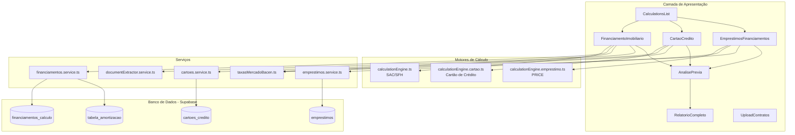
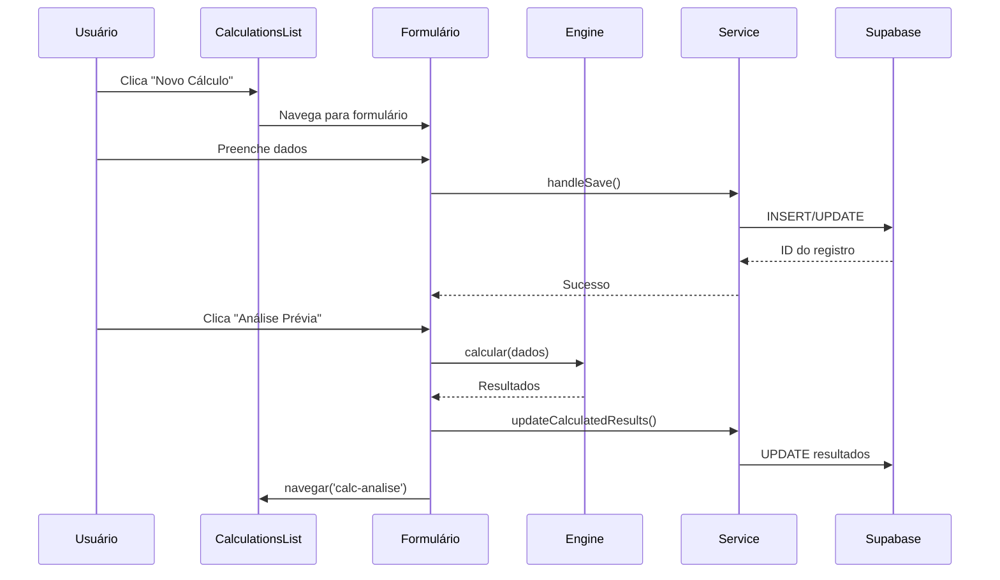
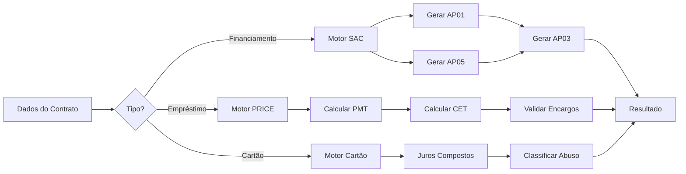

# Módulo de Cálculo Revisional

> **Documentação Técnica Completa**  
> Sistema OctoApps - Análise Revisional de Contratos Financeiros

---

## 📋 Sumário

1. [Visão Geral](#visão-geral)
2. [Arquitetura do Sistema](#arquitetura-do-sistema)
3. [Componentes de Interface](#componentes-de-interface)
4. [Motores de Cálculo](#motores-de-cálculo)
5. [Serviços e Integração com Banco de Dados](#serviços-e-integração-com-banco-de-dados)
6. [Tipos e Interfaces TypeScript](#tipos-e-interfaces-typescript)
7. [Regras de Negócio](#regras-de-negócio)
8. [Fluxos de Dados](#fluxos-de-dados)
9. [Integração com APIs Externas](#integração-com-apis-externas)
10. [Testes Automatizados](#testes-automatizados)

---

## Visão Geral

O **Módulo de Cálculo Revisional** é responsável por realizar análises financeiras de contratos de crédito, identificando práticas abusivas e calculando valores a serem restituídos ao consumidor. O módulo suporta três tipos principais de operações de crédito:

| Tipo de Operação | Sistema de Amortização | Motor de Cálculo |
|------------------|------------------------|------------------|
| **Financiamento Imobiliário** | SAC (Sistema de Amortização Constante) | `calculationEngine.ts` |
| **Cartão de Crédito** | Juros Compostos + SAC para relatório | `calculationEngine.cartao.ts` |
| **Empréstimos e Financiamentos** | PRICE (Parcelas Fixas) | `calculationEngine.emprestimo.ts` |

### Funcionalidades Principais

- ✅ Análise prévia rápida (viabilidade do caso)
- ✅ Relatório completo com tabela de amortização
- ✅ Comparativo Cobrado vs. Devido
- ✅ Detecção de irregularidades e encargos abusivos
- ✅ Integração com taxas de mercado BACEN
- ✅ Upload e extração automática de contratos (OCR)
- ✅ Exportação de relatórios

---

## Arquitetura do Sistema



### Estrutura de Arquivos

```
src/
├── components/calculations/
│   ├── CalculationsList.tsx          # Lista e gerenciamento de cálculos
│   ├── FinanciamentoImobiliario.tsx  # Formulário financiamento imobiliário (1268 linhas)
│   ├── CartaoCredito.tsx             # Formulário cartão de crédito (754 linhas)
│   ├── EmprestimosFinanciamentos.tsx # Formulário empréstimos/financiamentos (27KB)
│   ├── AnalisePrevia.tsx             # Visualização análise prévia
│   ├── AnalisePreviaCartao.tsx       # Análise prévia específica cartão (deprecated)
│   ├── RelatorioCompleto.tsx         # Relatório final com tabelas
│   ├── UploadContratos.tsx           # Upload e extração OCR
│   └── __tests__/                    # Testes unitários
│
├── services/
│   ├── calculationEngine.ts          # Motor SAC/SFH (703 linhas)
│   ├── calculationEngine.cartao.ts   # Motor Cartão (642 linhas)
│   ├── calculationEngine.emprestimo.ts # Motor PRICE (778 linhas)
│   ├── financiamentos.service.ts     # CRUD financiamentos
│   ├── cartoes.service.ts            # CRUD cartões
│   ├── emprestimos.service.ts        # CRUD empréstimos
│   ├── taxasMercadoBacen.ts          # Taxas de referência BACEN
│   └── documentExtractor.service.ts  # Extração OCR de contratos
│
├── types/
│   └── calculation.types.ts          # Tipos TypeScript (1257 linhas)
│
└── utils/
    └── parseNumber.ts                # Parsing de valores monetários BR
```

---

## Componentes de Interface

### 1. CalculationsList

**Arquivo:** `src/components/calculations/CalculationsList.tsx`

Componente principal que lista todos os cálculos revisionais do sistema, unificando financiamentos e cartões em uma única visualização.

**Funcionalidades:**
- Listagem unificada de todos os tipos de cálculo
- Busca e filtros
- Ações: Visualizar, Editar, Excluir
- Criação de novo cálculo (modal de seleção de tipo)
- Formatação de valores monetários e percentuais

**Props:**
```typescript
interface CalculationsListProps {
  onNavigate: (route: string, id?: string) => void;
}
```

**Funções Principais:**
| Função | Descrição |
|--------|-----------|
| `loadCalculations()` | Carrega financiamentos e cartões do banco |
| `handleCreateCalculation()` | Abre modal para seleção de tipo |
| `handleEdit(calc)` | Navega para edição do cálculo |
| `handleView(calc)` | Visualiza detalhes baseado no status |
| `handleConfirmDelete()` | Soft delete do registro |

---

### 2. FinanciamentoImobiliario

**Arquivo:** `src/components/calculations/FinanciamentoImobiliario.tsx`

Formulário completo para entrada de dados de financiamento imobiliário (SFH).

**Campos do Formulário:**

| Grupo | Campos |
|-------|--------|
| **Identificação** | Credor, Devedor, Nº Contrato, Nº Processo |
| **Contrato** | Valor Financiado, Valor Imóvel, Prazo (meses), 1º Vencimento |
| **Taxas** | Taxa Contrato (a.m./a.a.), Taxa Mercado, Índice Correção |
| **Seguros** | MIP, DFI, TCA |
| **Parcelas Detalhadas** | Até 600 parcelas com valores individuais |

**Funcionalidades:**
- Upload de contrato com extração automática via OCR
- Cálculo automático de taxa de mercado por tipo
- Análise prévia (quick check de viabilidade)
- Geração de relatório completo
- Histórico de alterações

---

### 3. CartaoCredito

**Arquivo:** `src/components/calculations/CartaoCredito.tsx`

Formulário para análise de dívidas de cartão de crédito.

**Campos do Formulário:**

| Grupo | Campos |
|-------|--------|
| **Identificação** | Credor (Banco/Bandeira), Devedor, Contrato |
| **Dívida** | Saldo Devedor, Valor Principal, Limite do Cartão |
| **Período** | Data Início Análise, Data Última Fatura, Meses de Análise |
| **Taxas** | Taxa Rotativo (a.m./a.a.), Taxa Mercado BACEN |
| **Encargos** | Juros Mora (%), Multa (%), IOF, Anuidade, Seguros, Tarifas |

**Diferencial:** Análise macro sem necessidade de histórico mensal de faturas.

---

### 4. EmprestimosFinanciamentos

**Arquivo:** `src/components/calculations/EmprestimosFinanciamentos.tsx`

Formulário para empréstimos pessoais, consignados, veículos, etc.

**Tipos de Empréstimo Suportados:**
- Pessoal
- Consignado
- Capital de Giro
- Veículo
- Imobiliário
- Cheque Especial

**Campos Específicos:**
- TAC/TEC (com validação por data de vedação)
- Seguro Prestamista
- Seguro Proteção Financeira
- Comissão Flat
- Tarifas

---

### 5. AnalisePrevia

**Arquivo:** `src/components/calculations/AnalisePrevia.tsx`

Visualização unificada dos resultados da análise prévia para todos os tipos de cálculo.

**Exibe:**
- Comparativo de taxas (Contrato vs. Mercado)
- Sobretaxa em pontos percentuais
- Total de juros cobrados vs. devidos
- Diferença a restituir
- Irregularidades detectadas
- Classificação de abusividade

**Type Guards para diferenciação:**
```typescript
const isCartaoData = (d: AnaliseData): d is AnaliseCartaoResponse => 
  'anatocismoDetectado' in d;

const isEmprestimoData = (d: AnaliseData): d is AnaliseEmprestimoResponse => 
  'sistemaAmortizacao' in d;
```

---

### 6. RelatorioCompleto

**Arquivo:** `src/components/calculations/RelatorioCompleto.tsx`

Relatório final completo com tabelas de amortização e análise detalhada.

**Seções:**
1. Informações do Contrato
2. Metodologia Utilizada
3. Comparativo de Taxas
4. Tabela de Amortização (AP01/AP05/AP03)
5. Resumo Executivo
6. Base Legal

**Exportação:**
- PDF (em desenvolvimento)
- DOCX (em desenvolvimento)

---

## Motores de Cálculo

### Motor SAC/SFH (calculationEngine.ts)

**Finalidade:** Análise de financiamentos imobiliários no Sistema Financeiro de Habitação.

**Características do SAC:**
- Amortização constante ao longo do contrato
- Parcelas decrescentes
- Juros calculados sobre saldo devedor

**Fórmulas Implementadas:**

```
Amortização = Principal / Número de Parcelas
Juros[n] = Saldo Devedor[n-1] × Taxa Mensal
Parcela[n] = Amortização + Juros[n]
Saldo[n] = Saldo[n-1] - Amortização
```

**Cenários Gerados:**

| Cenário | Código | Descrição |
|---------|--------|-----------|
| Cobrado | AP01 | Valores efetivamente cobrados do cliente |
| Devido | AP05 | Valores que deveriam ter sido cobrados (taxa mercado) |
| Comparativo | AP03 | Diferenças mensais entre cobrado e devido |

**Funções Exportadas:**

```typescript
// Geração de cenários
gerarCenarioAP01(params: ParametrosSAC): CenarioAP01
gerarCenarioAP05(params: ParametrosSAC, taxaMercado: number): CenarioAP05
gerarCenarioAP03(ap01: CenarioAP01, ap05: CenarioAP05, ...): CenarioAP03

// Utilitários
taxaMensalParaAnual(taxaMensal: number): number
taxaAnualParaMensal(taxaAnual: number): number
formatarMoeda(valor: number): string
formatarPercent(valor: number, casas?: number): string

// Integração BACEN
buscarTRBancoCentral(dataInicial: string, dataFinal: string): Promise<TRSerie[]>
buscarTRComCache(dataInicial: string, dataFinal: string): Promise<TRSerie[]>

// Validações
validarParametros(params: ParametrosSAC): void
validarTRSeries(trSeries?: TRSerie[]): void
validarEncargos(encargosMensais?: EncargosMensais[]): void
```

---

### Motor PRICE (calculationEngine.emprestimo.ts)

**Finalidade:** Análise de empréstimos pessoais e financiamentos com parcelas fixas.

**Características do Sistema PRICE:**
- Parcelas fixas ao longo do contrato
- Juros decrescentes
- Amortização crescente

**Fórmula PMT (Parcela):**

```
PMT = PV × [i × (1+i)^n] / [(1+i)^n - 1]

Onde:
- PV = Valor Financiado
- i = Taxa de juros mensal
- n = Número de parcelas
```

**Cálculo de CET (Custo Efetivo Total):**

Utiliza o método Newton-Raphson para encontrar a taxa que iguala:

```
PV - E = Σ (PMT_k / (1 + CET)^k)

Onde:
- E = Encargos iniciais (TAC, TEC, IOF, etc.)
- PMT_k = Valor da parcela k
```

**Funções Exportadas:**

```typescript
// Cálculo principal
calcularEmprestimoPRICE(params: CalculoEmprestimoPRICERequest): CalculoEmprestimoPRICEResponse

// Tabela de amortização
gerarTabelaPRICE(params): { tabela, valorParcela, totalJuros, ... }

// CET
calcularCET(params): { cetMensal, cetAnual }

// Validações de encargos vedados
validarTacTec(params): { tacTecIrregular, motivoIrregularidade }
validarSeguros(params): { segurosIrregulares }
validarComissaoPermanencia(params): { cumulacaoIrregular, motivoIrregularidade }

// Análise prévia
analisarEmprestimoPrevia(params: AnaliseEmprestimoRequest): AnaliseEmprestimoResponse
```

**Validações Implementadas:**

| Validação | Base Legal | Descrição |
|-----------|-----------|-----------|
| TAC/TEC após 30/04/2008 | Resolução CMN 3.518/2007 | Tarifas vedadas |
| Seguros sem consentimento | Art. 39, I CDC | Venda casada |
| Cumulação comissão permanência | Súmula 472 STJ | Não cumula com mora/multa |

---

### Motor Cartão (calculationEngine.cartao.ts)

**Finalidade:** Análise de dívidas de cartão de crédito sem necessidade de histórico mensal.

**Metodologia:**
- Análise macro baseada em saldo devedor e período
- Comparação taxa do contrato vs. taxa BACEN
- Simulação de juros compostos

**Fórmulas de Juros Compostos:**

```
Montante = Principal × (1 + i)^n

Sobretaxa Relativa = (i_contrato / i_bacen) - 1
Sobretaxa em p.p. = i_contrato - i_bacen
```

**Classificação de Abusividade:**

| Classificação | Critério |
|---------------|----------|
| Alta | Sobretaxa > 50% acima do mercado |
| Média | Sobretaxa entre 30% e 50% |
| Baixa | Sobretaxa entre 10% e 30% |
| Normal | Sobretaxa < 10% |

**Detecção de Irregularidades:**
- Anatocismo (juros sobre juros)
- Mora acima de 1% a.m.
- Multa acima de 2%
- IOF irregular

**Funções Exportadas:**

```typescript
// Análise prévia
analisarCartaoPrevia(params: AnaliseCartaoRequest): AnaliseCartaoResponse

// Relatório completo com tabela SAC
gerarRelatorioCompleto(
  params: AnaliseCartaoRequest, 
  analisePrevia: AnaliseCartaoResponse
): RelatorioCompletoCartao
```

---

## Serviços e Integração com Banco de Dados

### financiamentos.service.ts

**Tabelas:** `financiamentos_calculo`, `tabela_amortizacao`, `historico_financiamentos`

**Operações CRUD:**

```typescript
class FinanciamentosService {
  // Create
  create(data: FinanciamentoInsert): Promise<Financiamento>
  saveAmortizacao(id: string, cenario: Cenario, rows: []): Promise<void>
  createHistoryRecord(id: string, ...): Promise<void>
  
  // Read
  getById(id: string): Promise<Financiamento | null>
  getCompleto(id: string): Promise<FinanciamentoCompleto | null>
  getAll(filters?: FinanciamentoFilters): Promise<Financiamento[]>
  getAllCalculos(): Promise<any[]>
  getAmortizacao(id: string, cenario?: Cenario): Promise<AmortizacaoRow[]>
  
  // Update
  update(id: string, data: FinanciamentoUpdate): Promise<Financiamento>
  updateCalculatedResults(id: string, results: {}): Promise<void>
  updateStatus(id: string, status: Status): Promise<void>
  
  // Delete
  softDelete(id: string): Promise<void>
  softDeleteCalculo(id: string): Promise<void>
}
```

---

### cartoes.service.ts

**Tabelas:** `cartoes_credito`, `cartoes_faturas`

**Operações:**

```typescript
class CartoesService {
  // Cartão
  create(data: CartaoCreditoInsert): Promise<CartaoCredito>
  getById(id: string): Promise<CartaoCredito | null>
  getCompleto(id: string): Promise<CartaoCompleto | null>
  getAll(filters?: CartaoFilters): Promise<CartaoCredito[]>
  update(id: string, data: CartaoCreditoUpdate): Promise<CartaoCredito>
  updateCalculatedResults(id: string, results: {}): Promise<void>
  softDelete(id: string): Promise<void>
  
  // Faturas
  createFatura(data: FaturaInsert): Promise<CartaoFatura>
  createFaturas(faturas: FaturaInsert[]): Promise<CartaoFatura[]>
  getFaturas(cartaoId: string): Promise<CartaoFatura[]>
  updateFatura(faturaId: string, data: FaturaUpdate): Promise<CartaoFatura>
  
  // Estatísticas
  count(filters?: CartaoFilters): Promise<number>
  getTotalSaldoDevedor(filters?: CartaoFilters): Promise<number>
}
```

---

### taxasMercadoBacen.ts

**Propósito:** Fornecer taxas de referência do Banco Central para comparação.

**Taxas Configuradas (Janeiro 2025):**

| Tipo de Empréstimo | Taxa Mensal | Taxa Anual |
|-------------------|-------------|------------|
| Pessoal | 3.89% a.m. | 46.7% a.a. |
| Consignado | 1.93% a.m. | 23.2% a.a. |
| Capital de Giro | 4.28% a.m. | 51.4% a.a. |
| Veículo | 1.69% a.m. | 20.3% a.a. |
| Imobiliário | 0.91% a.m. | 10.9% a.a. |
| Cheque Especial | 7.99% a.m. | 95.9% a.a. |

**Funções:**

```typescript
obterTaxaMercado(tipoEmprestimo: TipoEmprestimo): number
obterDetalheTaxaMercado(tipoEmprestimo): { taxaMensal, taxaAnual, ... }
verificarAbusividade(taxaCobrada, tipoEmprestimo): { abusiva, sobretaxaPP, ... }
```

> **IMPORTANTE:** As taxas devem ser atualizadas trimestralmente.

---

## Tipos e Interfaces TypeScript

### Tipos Base

```typescript
// Faixa de taxa por período
interface FaixaTaxa {
  ini: string;   // Data início (YYYY-MM-DD)
  fim: string;   // Data fim (YYYY-MM-DD)
  i: number;     // Taxa mensal (decimal)
}

// Série histórica TR
interface TRSerie {
  data: string;
  fator: number;
}

// Encargos mensais
interface EncargosMensais {
  data: string;
  MIP: number;   // Seguro Morte/Invalidez
  DFI: number;   // Seguro Danos Físicos Imóvel
  TCA: number;   // Taxa de Cadastro/Administração
  multa: number;
  mora: number;
}

// Seguros médios (análise prévia)
interface SegurosMedios {
  MIP: number;
  DFI: number;
  TCA: number;
}
```

### Linha de Amortização

```typescript
interface LinhaAmortizacao {
  mes: number;
  data: string;
  valorOriginalParcela: number;
  valorCorrigido: number;
  juros: number;
  amortizacao: number;
  saldoDevedor: number;
  MIP?: number;
  DFI?: number;
  TCA?: number;
  multa?: number;
  mora?: number;
  totalPago?: number;
  diferenca?: number;  // Para cenário comparativo
}
```

### Cenários de Cálculo

```typescript
// AP01 - Cobrado
interface CenarioAP01 {
  tipo: 'AP01';
  tabela: LinhaAmortizacao[];
  totais: {
    valorPrincipal: number;
    totalJuros: number;
    totalMIP: number;
    totalDFI: number;
    totalTCA: number;
    totalMulta: number;
    totalMora: number;
    totalTaxas: number;
    totalPago: number;
  }
}

// AP05 - Devido
interface CenarioAP05 {
  tipo: 'AP05';
  tabela: LinhaAmortizacao[];
  totais: {
    valorPrincipal: number;
    totalJuros: number;
    totalDevido: number;
  }
}

// AP03 - Comparativo
interface CenarioAP03 {
  tipo: 'AP03';
  tabela: LinhaAmortizacao[];
  totais: {
    totalRestituir: number;
    taxaContratoAM: number;
    taxaMercadoAM: number;
    sobretaxaPP: number;
  }
}
```

### Requests e Responses

```typescript
// Análise Prévia
interface AnalisePreviaRequest {
  pv: number;
  n: number;
  primeiroVenc: string;
  taxaContratoMensal: number;
  taxaMercadoMensal: number;
  segurosMedios: SegurosMedios;
  horizonteMeses?: number;
  trSeries?: TRSerie[];
}

interface AnalisePreviaResponse {
  taxaContratoAM: number;
  taxaMercadoAM: number;
  sobretaxaPP: number;
  reducaoEstimadaSimples: number;
  reducaoEstimadaMedia: number;
  formatted?: {
    taxaContratoAM: string;
    taxaMercadoAM: string;
    sobretaxaPP: string;
    reducaoEstimadaSimples: string;
    reducaoEstimadaMedia: string;
  }
}

// Análise Cartão
interface AnaliseCartaoRequest {
  credor: string;
  devedor: string;
  data_calculo: Date;
  data_inicio_analise: Date;
  data_ultima_fatura: Date;
  saldo_devedor: number;
  valor_principal?: number;
  jurosRotativo: number;
  taxaMercadoMensal?: number;
  jurosMoraPercentual?: number;
  multaPercentual?: number;
  iofValor?: number;
  anuidade?: number;
  seguros?: number;
  tarifas?: number;
}

// Análise Empréstimo
interface AnaliseEmprestimoRequest {
  valorFinanciado: number;
  numeroParcelas: number;
  taxaMensal: number;
  taxaMercadoMensal?: number;
  dataContrato: string;
  tac?: number;
  tec?: number;
  iof?: number;
  seguros?: Array<{ nome: string; valor: number; consentimento: boolean }>;
}
```

---

## Regras de Negócio

### 1. Taxas de Mercado

- A taxa de mercado é obtida automaticamente do serviço `taxasMercadoBacen.ts`
- Se não informada, usa fallback de 3% a.m.
- Taxas devem ser atualizadas trimestralmente

### 2. Detecção de Abusividade

| Critério | Limite | Implicação |
|----------|--------|------------|
| Sobretaxa > 2 p.p. | OU | Considerado abusivo |
| Percentual abuso > 50% | - | Considerado abusivo |

### 3. Encargos Vedados

**TAC/TEC (após 30/04/2008):**
```typescript
const DATA_VEDACAO_TAC_TEC = new Date('2008-04-30');
// Cobrar após esta data = irregularidade
```

**Comissão de Permanência (Súmula 472 STJ):**
- Não pode cumular com juros de mora
- Não pode cumular com multa moratória
- Não pode cumular com correção monetária

### 4. Limites de Encargos

| Encargo | Limite Máximo |
|---------|---------------|
| Mora | 1% a.m. |
| Multa | 2% |
| IOF Diário | 0.0082% ao dia |
| IOF Adicional | 0.38% |

### 5. Anatocismo

Cobrança de juros sobre juros é detectada quando:
- Taxa efetiva > Taxa nominal × 1.05 (margem de 5%)
- Indica possível capitalização indevida

### 6. Correção Monetária (TR)

- Busca automática da série histórica via API BACEN
- Cache local para evitar múltiplas chamadas
- Fallback para fator 1.0 se não encontrado

### 7. Seguros

- Exigem consentimento expresso do consumidor
- Sem consentimento = venda casada (Art. 39, I CDC)
- Devem ser listados em `segurosIrregulares`

---

## Fluxos de Dados

### Fluxo de Criação de Cálculo



### Fluxo de Análise Prévia



---

## Integração com APIs Externas

### API Banco Central - Série TR

**Endpoint:** `https://api.bcb.gov.br/dados/serie/bcdata.sgs.226/dados`

**Série:** 226 (Taxa Referencial - TR)

**Implementação:**
```typescript
async function buscarTRBancoCentral(
  dataInicial: string,  // YYYY-MM-DD
  dataFinal: string     // YYYY-MM-DD
): Promise<TRSerie[]>
```

**Cache:**
- Implementado via `Map<string, TRSerie[]>`
- Chave: `${dataInicial}_${dataFinal}`

### Serviço de Extração OCR

**Arquivo:** `documentExtractor.service.ts`

**Funcionalidade:** Extrai dados de contratos PDF/imagem para preencher formulários automaticamente.

**Campos Extraídos:**
- Credor/Devedor
- Valor financiado
- Número de parcelas
- Taxa de juros
- Data primeiro vencimento
- Seguros e encargos

---

## Testes Automatizados

### Localização

```
src/services/__tests__/
├── calculationEngine.emprestimo.test.ts
├── calculationEngine.cartao.test.ts
└── calculationEngine.test.ts

src/components/calculations/__tests__/
└── (testes de componentes)
```

### Cobertura de Testes - Motor Empréstimo

| Cenário | Status |
|---------|--------|
| Cálculo básico PRICE | ✅ |
| Cenário cobrado vs devido | ✅ |
| Cálculo de CET | ✅ |
| Parcelas longas (até 600) | ✅ |
| Taxa muito baixa | ✅ |
| Identificação percentual de abuso | ✅ |
| Formatação de valores | ✅ |
| Convergência Newton-Raphson | ✅ |

### Cobertura de Testes - Motor Cartão

| Cenário | Status |
|---------|--------|
| Análise sem encargos adicionais | ✅ |
| Detecção de anatocismo | ✅ |
| Cálculo de sobretaxa | ✅ |
| Totais de encargos | ✅ |

### Executando Testes

```bash
# Todos os testes
npm test

# Testes específicos do motor
npm test calculationEngine

# Com cobertura
npm test -- --coverage
```

---

## Rotas do Sistema

| Rota | Componente | Descrição |
|------|------------|-----------|
| `/calculations` | CalculationsList | Lista de cálculos |
| `/calc-financiamento` | FinanciamentoImobiliario | Formulário financiamento |
| `/calc-cartao` | CartaoCredito | Formulário cartão |
| `/calc-emprestimos` | EmprestimosFinanciamentos | Formulário empréstimos |
| `/calc-analise` | AnalisePrevia | Análise prévia (unificada) |
| `/calc-relatorio` | RelatorioCompleto | Relatório final |
| `/upload-contratos` | UploadContratos | Upload e extração OCR |

---

## Considerações de Performance

1. **Cache de TR:** Evita múltiplas chamadas à API BACEN
2. **Lazy Loading:** Tabelas de amortização carregadas sob demanda
3. **Precisão Numérica:** Constante `PRECISAO = 1e-8` para cálculos internos
4. **Limites de Parcelas:** Suporte até 600 parcelas (50 anos)

---

## Manutenção

### Atualizações Necessárias

| Item | Frequência | Responsável |
|------|------------|-------------|
| Taxas BACEN | Trimestral | Desenvolvedor |
| Faixas de vedação | Conforme legislação | Jurídico + Dev |
| Limites de encargos | Conforme jurisprudência | Jurídico + Dev |

### Logs e Monitoramento

- Erros são logados via `console.error`
- Toast notifications para feedback ao usuário
- Histórico de alterações em `historico_financiamentos`

---

## Glossário

| Termo | Significado |
|-------|-------------|
| **SAC** | Sistema de Amortização Constante |
| **PRICE** | Sistema de parcelas fixas |
| **CET** | Custo Efetivo Total |
| **TR** | Taxa Referencial |
| **MIP** | Morte/Invalidez Permanente (seguro) |
| **DFI** | Danos Físicos ao Imóvel (seguro) |
| **TCA** | Taxa de Cadastro/Administração |
| **TAC** | Tarifa de Abertura de Crédito |
| **TEC** | Tarifa de Emissão de Carnê |
| **IOF** | Imposto sobre Operações Financeiras |
| **BACEN** | Banco Central do Brasil |
| **SFH** | Sistema Financeiro de Habitação |
| **AP01** | Cenário Cobrado |
| **AP05** | Cenário Devido |
| **AP03** | Cenário Comparativo |

---

> **Última atualização:** Dezembro 2024  
> **Versão do documento:** 1.0  
> **Sistema:** OctoApps - Plataforma de Análise Revisional
