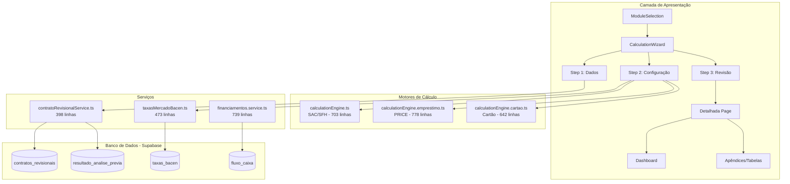
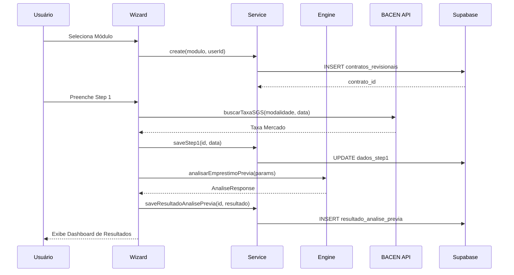
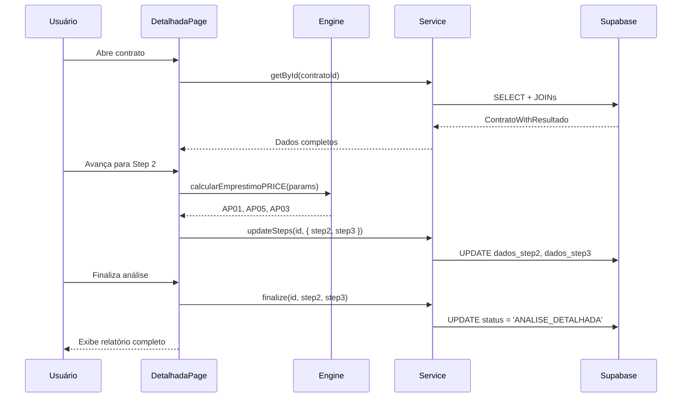

# 📘 Módulo de Cálculo Revisional - Visão Técnica Consolidada

> **Última Atualização:** Janeiro 2026  
> **Versão:** 2.0  
> **Sistema:** OctoApps - Plataforma Jurídico-Financeira

---

## 📋 Sumário

1. [Visão Geral](#visão-geral)
2. [Arquitetura do Sistema](#arquitetura-do-sistema)
3. [Motores de Cálculo](#motores-de-cálculo)
4. [Estrutura de Arquivos](#estrutura-de-arquivos)
5. [Serviços e Camada de Dados](#serviços-e-camada-de-dados)
6. [Tipos e Interfaces TypeScript](#tipos-e-interfaces-typescript)
7. [Banco de Dados](#banco-de-dados)
8. [Regras de Negócio](#regras-de-negócio)
9. [Integração BACEN](#integração-bacen)
10. [Fluxos de Trabalho](#fluxos-de-trabalho)
11. [Componentes de Interface](#componentes-de-interface)

---

## Visão Geral

O **Módulo de Cálculo Revisional** é o núcleo do OctoApps, responsável por analisar contratos de crédito e identificar práticas abusivas bancárias. O módulo suporta três verticais principais:

| Módulo | Sistema de Amortização | Motor | Séries BACEN |
|--------|------------------------|-------|--------------|
| **GERAL** (Veículos/Empréstimos) | PRICE | `calculationEngine.emprestimo.ts` | 20749, 20718, 20744-46 |
| **IMOBILIÁRIO** (SFH/SFI) | SAC | `calculationEngine.ts` | 20773, 25497, 226 (TR) |
| **CARTÃO** (RMC) | Juros Compostos + SAC | `calculationEngine.cartao.ts` | Rotativo PF |

### Funcionalidades Principais

- ✅ **Análise Prévia** - Triagem rápida de viabilidade (<5 min)
- ✅ **Análise Detalhada** - Recálculo mês a mês com tabela de amortização
- ✅ **Comparativo de Cenários** - AP01 (Cobrado) vs AP05 (Devido) vs AP03 (Diferenças)
- ✅ **Extração OCR** - Upload de PDF com preenchimento automático via AI
- ✅ **Integração BACEN** - Taxas médias de mercado em tempo real
- ✅ **Geração de Relatórios** - PDFs e laudos periciais

---

## Arquitetura do Sistema



---

## Motores de Cálculo

### 1. Motor SAC/SFH (`calculationEngine.ts`)

**Localização:** `src/services/calculationEngine.ts`  
**Linhas de Código:** 703  
**Sistema:** Amortização Constante para Financiamentos Imobiliários

#### Funções Principais

| Função | Descrição |
|--------|-----------|
| `gerarCenarioAP01(params)` | Gera cenário "Cobrado" com valores efetivamente pagos |
| `gerarCenarioAP05(params, taxaMercado)` | Gera cenário "Devido" com taxa de mercado |
| `gerarCenarioAP03(ap01, ap05)` | Gera comparativo com diferenças mensais |
| `buscarTRBancoCentral(ini, fim)` | Busca série TR via API BACEN |
| `buscarTRComCache(ini, fim)` | Cache local para evitar chamadas repetidas |
| `taxaMensalParaAnual(taxa)` | Conversão: `(1 + i)^12 - 1` |
| `taxaAnualParaMensal(taxa)` | Conversão: `(1 + i)^(1/12) - 1` |

#### Fórmulas SAC

```typescript
// Amortização constante
Amortização = Principal / Número de Parcelas

// Juros sobre saldo devedor
Juros[n] = Saldo Devedor[n-1] × Taxa Mensal

// Parcela decrescente
Parcela[n] = Amortização + Juros[n]

// Saldo após amortização
Saldo[n] = Saldo[n-1] - Amortização
```

---

### 2. Motor PRICE (`calculationEngine.emprestimo.ts`)

**Localização:** `src/services/calculationEngine.emprestimo.ts`  
**Linhas de Código:** 778  
**Sistema:** Parcelas Fixas (CDC, Empréstimos, Veículos)

#### Funções Principais

| Função | Descrição |
|--------|-----------|
| `calcularEmprestimoPRICE(params)` | Cálculo completo com cenários |
| `gerarTabelaPRICE(params)` | Tabela de amortização Price |
| `calcularPMT(pv, i, n)` | Valor da parcela fixa |
| `calcularCET(params)` | Custo Efetivo Total (Newton-Raphson) |
| `calcularJurosCarencia(params)` | Juros de carência/antecipação |
| `validarTacTec(params)` | Verifica TAC/TEC após 30/04/2008 |
| `validarSeguros(params)` | Detecta venda casada |
| `validarComissaoPermanencia(params)` | Súmula 472 STJ |
| `analisarEmprestimoPrevia(params)` | Análise prévia rápida |

#### Fórmula PMT

```typescript
// Parcela fixa no Sistema Price
PMT = PV × [i × (1+i)^n] / [(1+i)^n - 1]

// Onde:
// PV = Valor Financiado
// i  = Taxa de juros mensal
// n  = Número de parcelas
```

#### Cálculo de CET (Newton-Raphson)

```typescript
// Equação do CET
PV - E = Σ (PMT_k / (1 + CET)^k)

// Onde:
// E = Encargos iniciais (TAC, TEC, IOF, Seguros)
// Iterações até convergência (tolerância: 0.0001%)
```

---

### 3. Motor Cartão (`calculationEngine.cartao.ts`)

**Localização:** `src/services/calculationEngine.cartao.ts`  
**Linhas de Código:** 642  
**Sistema:** Análise Macro sem Histórico Mensal

#### Funções Principais

| Função | Descrição |
|--------|-----------|
| `analisarCartaoPrevia(params)` | Análise prévia agregada |
| `gerarRelatorioCompleto(params, analise)` | Relatório com tabela SAC |
| `calcularMontanteComposto(p, i, n)` | `M = P × (1 + i)^n` |
| `calcularMesesEntreDatas(ini, fim)` | Período de análise |
| `obterTaxaMediaBacen(ini, fim)` | Taxa média rotativo |

#### Classificação de Abusividade

| Classificação | Critério |
|---------------|----------|
| **Alta** | Sobretaxa > 50% da média |
| **Média** | Sobretaxa entre 30% e 50% |
| **Baixa** | Sobretaxa entre 10% e 30% |
| **Normal** | Sobretaxa < 10% |

---

## Estrutura de Arquivos

```
src/
├── components/calculations/
│   ├── ModuleSelection.tsx           # Seleção do módulo (GERAL/IMOB/CARTAO)
│   ├── ListaCasos.tsx                # Lista de contratos/casos
│   ├── detalhada-page.tsx            # Página de análise detalhada
│   ├── detalhada-relatorio-completo.tsx
│   │
│   ├── wizard/
│   │   ├── CalculationWizard.tsx     # Wizard principal (deprecated)
│   │   ├── detalhada-step-3-revisao.tsx
│   │   ├── detalhada-upload-button.tsx
│   │   └── steps/
│   │       ├── detalhada-emprestimo-veiculo-step-1.tsx
│   │       ├── detalhada-emprestimo-veiculo-step-2.tsx
│   │       ├── detalhada-imobiliaria-step-1.tsx
│   │       ├── detalhada-imobiliaria-step-2.tsx
│   │       └── detalhada-cartao-step-1.tsx
│   │
│   └── results/
│       ├── detalhada-dashboard.tsx    # Dashboard de resultados
│       ├── detalhada-kpi-cards.tsx    # Cards de KPIs
│       ├── detalhada-grafico-evolucao.tsx
│       ├── detalhada-tabela-comparacao.tsx
│       └── detalhada-apendices-tabs.tsx  # AP01, AP05, AP03
│
├── services/
│   ├── calculationEngine.ts          # Motor SAC (703 linhas)
│   ├── calculationEngine.emprestimo.ts # Motor PRICE (778 linhas)
│   ├── calculationEngine.cartao.ts   # Motor Cartão (642 linhas)
│   ├── financiamentos.service.ts     # CRUD financiamentos
│   ├── contratoRevisionalService.ts  # CRUD contratos revisionais
│   ├── taxasMercadoBacen.ts          # Taxas BACEN
│   ├── documentExtractor.service.ts  # Extração OCR
│   └── calculoDetalhado.service.ts   # Cálculo detalhado
│
├── types/
│   ├── calculation.types.ts          # Tipos base (1586 linhas)
│   └── contrato-revisional.types.ts  # Tipos contratos (88 linhas)
│
└── utils/
    ├── financialCalculations.ts      # Funções auxiliares
    └── parseNumber.ts                # Parsing moeda BR
```

---

## Serviços e Camada de Dados

### contratoRevisionalService.ts

**Propósito:** Gerencia o fluxo de contratos revisionais e análises prévias.

| Método | Descrição |
|--------|-----------|
| `create(modulo, userId, options)` | Cria contrato em RASCUNHO |
| `saveStep1(id, data, nome)` | Salva Step 1, atualiza status |
| `saveResultadoAnalisePrevia(id, resultado)` | Salva resultado com versionamento |
| `updateSteps(id, { step2, step3 })` | Atualiza steps 2/3 |
| `finalize(id, step2, step3)` | Finaliza como ANALISE_DETALHADA |
| `listPending(userId)` | Lista contratos pendentes |
| `listWithPagination(userId, options)` | Listagem paginada |
| `listByContato(contatoId)` | Contratos de um contato |
| `listByOportunidade(opId)` | Contratos de uma oportunidade |
| `archive(id)` / `delete(id)` | Arquivar/Excluir |

### financiamentos.service.ts

**Propósito:** CRUD para financiamentos (legacy) e tabelas de amortização.

| Método | Descrição |
|--------|-----------|
| `create(data)` | Cria financiamento |
| `saveAmortizacao(id, cenario, rows)` | Salva tabela de amortização |
| `createHistoryRecord(id, ...)` | Cria registro de auditoria |
| `getById(id)` / `getCompleto(id)` | Busca com/sem relacionamentos |
| `getAllCalculos()` | Lista todos os cálculos |
| `getAmortizacao(id, cenario)` | Busca tabela por cenário |
| `updateCalculatedResults(id, results)` | Atualiza resultados |
| `softDelete(id)` | Exclusão lógica |

### taxasMercadoBacen.ts

**Propósito:** Taxas de referência BACEN para comparação.

| Tipo de Empréstimo | Taxa Mensal | Taxa Anual | Série SGS |
|-------------------|-------------|------------|-----------|
| Pessoal | 1.71% | 22.52% | 20718 |
| Consignado | 1.45% | 18.80% | 20744-46 |
| Capital de Giro | 2.03% | 27.21% | 20755-56 |
| Veículo | 1.55% | 20.27% | 20749 |
| Imobiliário SFH | 0.91% | 11.47% | 20773 |
| Cheque Especial | 7.80% | 146.5% | 20757 |

> **IMPORTANTE:** Taxas atualizadas em Janeiro 2026. Atualização trimestral recomendada.

---

## Tipos e Interfaces TypeScript

### Tipos Base (`calculation.types.ts`)

```typescript
// Faixa de taxa por período
interface FaixaTaxa {
  ini: string;   // Data início (YYYY-MM-DD)
  fim: string;   // Data fim (YYYY-MM-DD)
  i: number;     // Taxa mensal (decimal)
}

// Série histórica TR
interface TRSerie {
  data: string;
  fator: number;
}

// Encargos mensais
interface EncargosMensais {
  data: string;
  MIP: number;   // Seguro Morte/Invalidez
  DFI: number;   // Danos Físicos Imóvel
  TCA: number;   // Taxa Cadastro/Admin
  multa: number;
  mora: number;
}

// Linha de amortização
interface LinhaAmortizacao {
  mes: number;
  data: string;
  valorOriginalParcela: number;
  valorCorrigido: number;
  juros: number;
  amortizacao: number;
  saldoDevedor: number;
  MIP?: number;
  DFI?: number;
  TCA?: number;
  diferenca?: number;
}
```

### Cenários de Cálculo

```typescript
// AP01 - Cobrado
interface CenarioAP01 {
  tipo: 'AP01';
  tabela: LinhaAmortizacao[];
  totais: {
    valorPrincipal: number;
    totalJuros: number;
    totalMIP: number;
    totalDFI: number;
    totalTCA: number;
    totalPago: number;
  }
}

// AP05 - Devido
interface CenarioAP05 {
  tipo: 'AP05';
  tabela: LinhaAmortizacao[];
  totais: {
    valorPrincipal: number;
    totalJuros: number;
    totalDevido: number;
  }
}

// AP03 - Comparativo
interface CenarioAP03 {
  tipo: 'AP03';
  tabela: LinhaAmortizacao[];
  totais: {
    totalRestituir: number;
    taxaContratoAM: number;
    taxaMercadoAM: number;
    sobretaxaPP: number;
  }
}
```

### Tipos de Contrato Revisional

```typescript
type ModuloCalculo = 'GERAL' | 'IMOBILIARIO' | 'CARTAO';

type StatusContrato = 
  | 'RASCUNHO' 
  | 'ANALISE_PREVIA' 
  | 'ANALISE_DETALHADA' 
  | 'ARQUIVADO';

interface ContratoRevisional {
  id: string;
  user_id: string;
  contato_id?: string;
  oportunidade_id?: string;
  modulo: ModuloCalculo;
  status: StatusContrato;
  nome_referencia?: string;
  valor_contrato?: number;
  data_contrato?: string;
  dados_step1?: Record<string, unknown>;
  dados_step2?: Record<string, unknown>;
  dados_step3?: Record<string, unknown>;
  created_at: string;
  updated_at: string;
}
```

---

## Banco de Dados

### Tabelas Principais

#### `contratos_revisionais`

| Coluna | Tipo | Descrição |
|--------|------|-----------|
| `id` | uuid | Chave primária |
| `user_id` | uuid | FK → auth.users |
| `contato_id` | uuid | FK → contatos (CRM) |
| `oportunidade_id` | uuid | FK → oportunidades (CRM) |
| `modulo` | modulo_calculo | GERAL, IMOBILIARIO, CARTAO |
| `status` | status_contrato | RASCUNHO, ANALISE_PREVIA, etc. |
| `dados_step1` | jsonb | Dados do Step 1 (wizard) |
| `dados_step2` | jsonb | Dados do Step 2 (wizard) |
| `dados_step3` | jsonb | Dados do Step 3 (wizard) |
| `nome_referencia` | text | Nome para identificação |
| `valor_contrato` | numeric | Valor financiado |
| `data_contrato` | date | Data do contrato |

#### `resultado_analise_previa`

| Coluna | Tipo | Descrição |
|--------|------|-----------|
| `id` | uuid | Chave primária |
| `contrato_id` | uuid | FK → contratos_revisionais |
| `taxa_contrato` | numeric | Taxa do contrato |
| `taxa_media_bacen` | numeric | Taxa média BACEN |
| `sobretaxa_percentual` | numeric | % acima da média |
| `economia_estimada` | numeric | Valor a restituir |
| `nova_parcela_estimada` | numeric | Parcela recalculada |
| `classificacao` | classificacao_viabilidade | VIAVEL, ATENCAO, INVIAVEL |
| `detalhes_calculo` | jsonb | Detalhes completos |
| `is_current` | boolean | Versão atual |
| `versao` | integer | Número da versão |

#### `taxas_bacen`

| Coluna | Tipo | Descrição |
|--------|------|-----------|
| `id` | uuid | Chave primária |
| `modalidade` | text | Tipo de operação |
| `data` | date | Data de referência |
| `taxa_mensal` | numeric | Taxa % a.m. |
| `taxa_anual` | numeric | Taxa % a.a. |
| `codigo_sgs` | integer | Código série SGS |

### Enums

```sql
-- Módulo de cálculo
CREATE TYPE modulo_calculo AS ENUM ('GERAL', 'IMOBILIARIO', 'CARTAO');

-- Status do contrato
CREATE TYPE status_contrato AS ENUM (
  'RASCUNHO', 
  'ANALISE_PREVIA', 
  'ANALISE_DETALHADA', 
  'ARQUIVADO'
);

-- Classificação de viabilidade
CREATE TYPE classificacao_viabilidade AS ENUM (
  'VIAVEL', 
  'ATENCAO', 
  'INVIAVEL'
);

-- Sistema de amortização
CREATE TYPE amortization_system AS ENUM (
  'SAC', 
  'PRICE', 
  'SACRE', 
  'GAUSS_SIMPLES'
);
```

### Funções PostgreSQL

| Função | Retorno | Descrição |
|--------|---------|-----------|
| `buscar_taxa_bacen(...)` | record | Busca taxa por data e modalidade |
| `fn_pmt(pv, i, n)` | numeric | Cálculo PMT |
| `fn_prestacao_price(...)` | numeric | Parcela Price |
| `fn_analise_viabilidade(...)` | uuid | Gera análise de viabilidade |
| `fn_calcular_diferencas(...)` | numeric | Calcula diferenças |
| `gerar_tabelas_amortizacao(...)` | json | Gera tabelas SAC/PRICE |
| `gerar_analise_completa(...)` | uuid | Análise completa |

---

## Regras de Negócio

### RN-001: Abusividade (STJ)

Taxa é considerada **abusiva** quando:
```
taxaContrato > taxaMercado × 1.5  (50% acima da média)
```

### RN-002: TAC/TEC Vedadas

Resoluação CMN 3.518/2007 vedou cobrança após **30/04/2008**:
```typescript
const DATA_VEDACAO_TAC_TEC = new Date('2008-04-30');
// Cobrar após esta data = irregularidade
```

### RN-003: Comissão de Permanência

Súmula 472 STJ - Não pode cumular com:
- Juros de mora
- Multa moratória
- Correção monetária

### RN-004: Limites de Encargos

| Encargo | Limite Máximo |
|---------|---------------|
| Mora | 1% a.m. |
| Multa | 2% |
| IOF Diário | 0.0082% ao dia |
| IOF Adicional | 0.38% |

### RN-005: Seguros (Venda Casada)

Art. 39, I do CDC - Seguros sem consentimento expresso do consumidor configuram venda casada.

### RN-006: Capitalização Diária

Quando detectada capitalização diária:
```typescript
taxaProporcional = Math.pow(1 + taxaMensal, dias / 30) - 1;
```

### RN-007: Classificação de Viabilidade

| Classificação | Critério |
|---------------|----------|
| **VIÁVEL** | Abusividade ≥ 50% OU Economia > R$ 10.000 |
| **ATENÇÃO** | Sobretaxa 20-50% OU Economia R$ 3.000 - 10.000 |
| **INVIÁVEL** | Economia < R$ 3.000 OU Taxa abaixo do mercado |

---

## Integração BACEN

### API SGS (Sistema Gerenciador de Séries)

**Endpoint Base:** `https://api.bcb.gov.br/dados/serie/bcdata.sgs.{CODIGO}/dados`

### Séries Utilizadas

| Código | Descrição | Tipo |
|--------|-----------|------|
| 226 | Taxa Referencial (TR) | Mensal |
| 433 | IPCA variação mensal | Mensal |
| 189 | INPC variação mensal | Mensal |
| 28655 | IGP-M variação mensal | Mensal |
| 20718 | Empréstimo Pessoal PF | Anual |
| 20744-46 | Consignado | Anual |
| 20749 | Veículos PF | Anual |
| 20773 | Imobiliário SFH | Anual |

### Implementação de Cache

```typescript
// Cache em memória para evitar chamadas repetidas
const trCache = new Map<string, TRSerie[]>();

async function buscarTRComCache(
  dataInicial: string,
  dataFinal: string
): Promise<TRSerie[]> {
  const cacheKey = `${dataInicial}_${dataFinal}`;
  
  if (trCache.has(cacheKey)) {
    return trCache.get(cacheKey)!;
  }
  
  const data = await buscarTRBancoCentral(dataInicial, dataFinal);
  trCache.set(cacheKey, data);
  return data;
}
```

---

## Fluxos de Trabalho

### Fluxo de Análise Prévia



### Fluxo de Análise Detalhada



---

## Componentes de Interface

### Wizard Steps

| Step | Componente | Campos Principais |
|------|------------|-------------------|
| **Step 1** | `detalhada-*-step-1.tsx` | Credor, Devedor, Valor, Prazo, Taxas, Datas |
| **Step 2** | `detalhada-*-step-2.tsx` | Sistema Amortização, Capitalização, Expurgos |
| **Step 3** | `detalhada-step-3-revisao.tsx` | Revisão, Tarifas, Confirmação |

### Componentes de Resultados

| Componente | Descrição |
|------------|-----------|
| `detalhada-dashboard.tsx` | Dashboard principal com resumo |
| `detalhada-kpi-cards.tsx` | Cards de indicadores (sobretaxa, economia) |
| `detalhada-grafico-evolucao.tsx` | Gráfico linha: Cobrado vs Devido |
| `detalhada-tabela-comparacao.tsx` | Tabela comparativa mês a mês |
| `detalhada-apendices-tabs.tsx` | Tabs AP01/AP05/AP03 |

---

## Referências

- **Documentação Detalhada:** [MODULO_CALCULO_REVISIONAL.md](./MODULO_CALCULO_REVISIONAL.md)
- **Especificação Técnica:** [especificacao_tecnica.md](./especificacao_tecnica.md)
- **Módulos por Vertical:** [MODULOS.md](./MODULOS.md)
- **Schema do Banco:** [DATABASE_SCHEMA.md](../DATABASE_SCHEMA.md)
- **API BACEN SGS:** https://www.bcb.gov.br/estatisticas/txjuros

---

> **Mantido por:** Equipe de Desenvolvimento OctoApps  
> **Última Revisão:** Janeiro 2026
