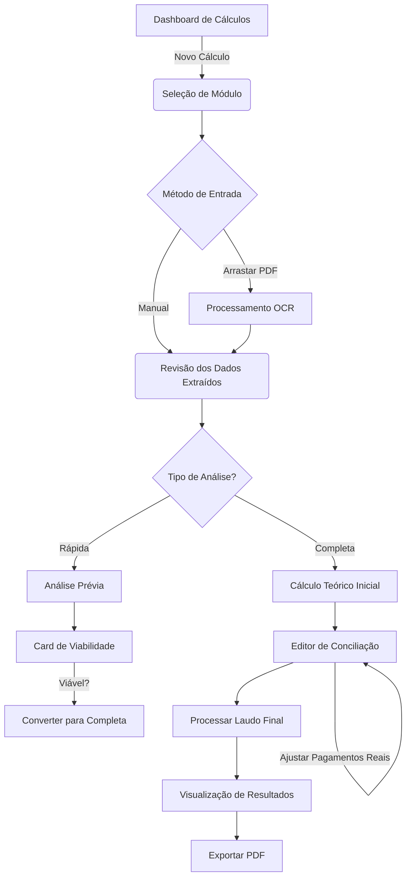

# 🎨 Documento de UX, Fluxos e Entregáveis: Hub de Perícia OctoApps

**Projeto:** OctoApps - Hub de Perícia Financeira

**Versão:** 2.0 (Com Editor de Conciliação)

**Público-Alvo:** Advogados Bancários (Triagem) e Peritos Financeiros (Laudo Técnico).

**Design System:** `shadcn/ui` + `TailwindCSS` (Tema: Professional Dark/Light).

---

## 1. Personas e Jornada

Para desenhar a UX correta, precisamos entender os dois modos de uso:

### **Persona A: Dr. Gestor (Foco em Triagem)**

* **Dor:** Recebe 10 contratos por dia. Precisa saber em 5 minutos se vale a pena ajuizar a ação.
* **Meta:** Input rápido (OCR) -> Ver a "Sobretaxa" -> Decidir (Go/No-Go).
* **UX Necessária:** Poucos cliques, feedback visual imediato (Verde/Vermelho).

### **Persona B: Diego, o Perito (Foco em Precisão)**

* **Dor:** O cliente pagou a parcela 15 com atraso e a 20 foi antecipada. O sistema precisa refletir o extrato real.
* **Meta:** Editar pagamentos pontuais, ajustar índices de correção, gerar laudo irrefutável.
* **UX Necessária:** Grid editável densa, controle total de variáveis, exportação detalhada.

---

## 2. Fluxograma de Usuário (User Flow)

O sistema deve guiar o usuário através de um funil lógico:

---

## 3. Especificação de Interface (UI) e Componentes

### 3.1. Tela de Entrada: O "Wizard" de Parametrização

* **Estrutura:** Componente `Stepper` (Passo 1: Dados, Passo 2: Teses, Passo 3: Revisão).
* **Funcionalidades de Automação (OCR):**
    * **Botão "Analisar Contrato":** Localizado no topo do Passo 1, permite o upload de contratos para extração automática de dados via AI/OCR.
* **Componentes de Entrada Inteligentes:**
    * **DatePicker Simplificado:** Interface de digitação manual direta no formato `DD/MM/AAAA`. Inclui máscara de auto-formatação (adiciona as barras automaticamente) e validação robusta no `onBlur`.
    * **Currency/Percent Input:** Comportamento de foco que limpa o valor se for zero, facilitando a digitação rápida.
* **Interação Chave (Feedback Instantâneo):**
    * Ao digitar a taxa de juros Mensal e Anual, o sistema calcula em *background*.
    * Se `(1+Mensal)^12 < Anual`, exibe um **Callout (Alert)** amarelo:
> ⚠️ **Alerta de Capitalização:** A taxa anual informada sugere capitalização diária. O sistema ativou a tese de expurgo automaticamente.

### 3.2. Dashboard de Resultados (A Visão Geral)

Uma tela dividida (Split View) para facilitar a comparação.

* **Header:**
* Nome do Cliente e Status (`Badge` Verde: "Viável").
* Botão Principal: `Gerar PDF`.

* **Cards de KPI (Topo):**
* **Economia Total:** R$ 15.450,00 (Texto Grande, Verde).
* **Nova Parcela:** R$ 850,00 (vs R$ 1.200,00 Original).
* **Taxa Praticada:** 3.5% a.m. (Badge Vermelho: "Abusiva - 210% da Média").

* **Gráfico Central (Recharts):**
* Duas linhas ao longo do tempo (Eixo X: Meses, Eixo Y: Saldo Devedor).
* **Linha Vermelha:** Evolução da Dívida Banco.
* **Linha Azul:** Evolução Recalculada.
* A área entre as linhas é pintada de verde suave, representando o **Indébito**.

### 3.3. O Editor de Conciliação (Grid do Perito)

*A etapa mais crítica para a precisão dos cálculos.*

* **Componente:** `TanStack Table` (Headless) estilizado com `shadcn`.
* **Layout:** Tabela densa, scroll infinito ou virtualizado.
* **Colunas:**
1. `Nº` (Fixo).
2. `Vencimento` (Texto cinza).
3. `Valor Parcela (Contrato)` (Texto cinza, lock icon).
4. `Data Pagamento Real` (Input Date Simplificado - *Default: Data Vencimento*).
5. `Valor Pago Real` (Input Currency - **Pré-preenchido com Valor Parcela**).
6. `Status` (Seletor de 4 ícones coloridos - ver abaixo).

* **Seletor de Status (Novo Design):**
  * Substituído o dropdown por **4 ícones clicáveis** lado a lado:
    * ✅ **PAGO** → Ícone verde (Emerald)
    * ⏳ **EM_ABERTO** → Ícone amarelo (Amber)
    * 🔄 **RENEGOCIADO** → Ícone roxo (Purple)
    * ❌ **ATRASO** → Ícone vermelho (Red)
  * Ao selecionar um status, a **linha inteira recebe um tom muito suave** da cor correspondente
  * Ícone selecionado exibe ring de destaque

* **Interações:**
* **Pagar Primeiras N:** Input no cabeçalho permite marcar rapidamente as primeiras X parcelas como pagas (útil quando cliente pagou em dia até certo mês).
* **Highlight:** Células editadas ficam com borda esquerda amarela para indicar divergência do contrato original.
* **Row Color:** Linhas recebem tom suave conforme status selecionado (verde, amarelo, roxo ou vermelho).
* **Selecionar Todos:** Checkbox na esquerda seleciona **todas as parcelas do contrato** (mesmo as que não estão visíveis na página atual).
* **Bulk Actions:** Barra flutuante permite marcar todas as linhas selecionadas com um status específico.

### 3.4. Navegação por Abas (Tabs)

Para organizar os Apêndices sem poluir a tela.

* `[Resumo]` -> Dashboard Visual.
* `[Conciliação]` -> O Editor de Pagamentos.
* `[AP01 - Evolução]` -> Tabela somente leitura do recálculo.
* `[AP02 - Diferenças]` -> Tabela de confronto (Pago vs Devido).
* `[Parâmetros]` -> Resumo técnico das taxas usadas (Séries Bacen).

---

## 4. Documentos Gerados (Output Final)

O objetivo final do sistema é gerar prova material para o processo judicial. O PDF gerado deve ser impecável.

### 4.1. Estrutura do Laudo Técnico (PDF)

O gerador de PDF deve montar o documento nas seguintes seções:

1. **Capa Profissional:**
* Logo do Escritório/OctoApps.
* Título: "Parecer Técnico Pericial - Revisional de Contrato".
* Referência: Nº Contrato / Nº Processo.
* Partes: Autor vs. Réu.

2. **Sumário Executivo (Para o Juiz):**
* Texto gerado dinamicamente: *"Trata-se de análise de contrato de [Tipo], no valor de [Valor], onde constatou-se a aplicação de taxa de juros de [X]%, superior à média de mercado de [Y]%..."*
* Tabela Resumo: Valor Cobrado | Valor Justo | Diferença a Restituir.

3. **Metodologia Aplicada (Blindagem Técnica):**
* Explicação das fórmulas utilizadas (Price/SAC/Gauss).
* Citação das fontes de dados (Séries Bacen nº 25471, etc.).
* Justificativa da Tese de Capitalização Diária (se aplicada).

4. **Apêndices Técnicos (As Tabelas):**
* Cada aba do sistema vira uma tabela no PDF.
* **AP01:** Recálculo da Evolução.
* **AP02:** Demonstração das Diferenças (Mês a Mês).
* **AP03/05:** Atualização Monetária dos Valores a Restituir (INPC).

### 4.2. Relatório de Análise Prévia (Output Simplificado)

Se o usuário escolher "Análise Prévia", gera-se um PDF de 1 página apenas.

* **Marca D'água:** "SIMULAÇÃO PRELIMINAR - USO INTERNO".
* **Conteúdo:** Gráfico de economia e tabela comparativa simples.
* **Disclaimer:** "Este documento não substitui o laudo pericial contábil."

---

## 5. Feedback de Sistema e Tratamento de Erros

Para garantir confiança na ferramenta:

1. **Loading States (Squeleton UI):**
* Ao buscar taxas no Bacen (pode levar 2s), mostrar `Skeleton` nas células da tabela. Não usar spinners bloqueantes.
* Mensagem: *"Consultando API do Banco Central - Série 25471..."*

2. **Validação de Inputs:**
* *Data do 1º Vencimento* anterior à *Data do Contrato* -> Erro Bloqueante (Borda Vermelha).
* *Valor Financiado* zerado -> Erro.

3. **Alertas de Viabilidade:**
* Se `Economia Final < R$ 2.000,00` -> Exibir Toast/Banner:
> "Atenção: A economia projetada é baixa. Verifique se os custos processuais compensam o ajuizamento."

---

## 6. Resultado Esperado de Negócio

Com a implementação desta UX:

1. **Redução de Tempo:** De 4 horas (Excel manual + busca Bacen) para **15 minutos** por laudo completo.
2. **Padronização:** Todos os laudos do escritório seguem o mesmo layout visual e rigor técnico, independentemente de qual advogado operou o sistema.
3. **Conversão:** A "Análise Prévia" impressa em 1 minuto serve como ferramenta de venda visual para convencer o cliente a fechar o contrato de honorários.
4. **Segurança Jurídica:** A conciliação de pagamentos editável garante que o laudo não será impugnado por "ignorar a realidade dos pagamentos feitos".