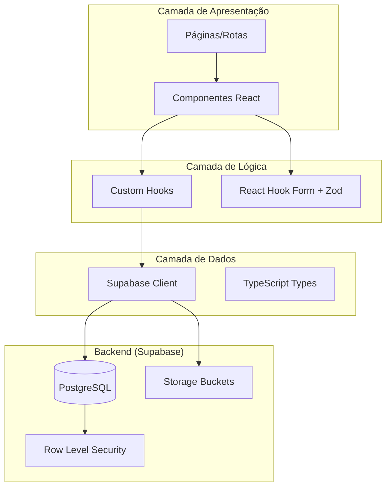
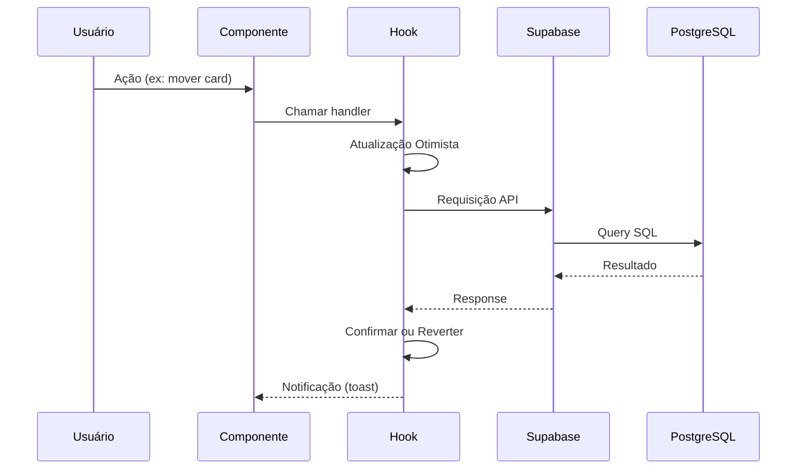

# Arquitetura do Módulo CRM

> **Última Atualização:** 2026-01-08

---

## Padrão Arquitetural

O módulo CRM segue a **Arquitetura Baseada em Features (Feature-Based Architecture)**, onde cada domínio de negócio possui seus próprios componentes, hooks e tipos organizados logicamente.

---

## Diagrama de Arquitetura



---

## Padrões de Design Utilizados

### 1. Container/Presentational Pattern
- **Containers**: Componentes que gerenciam estado e lógica (`CRMKanban`, `OpportunityDetails`)
- **Presentational**: Componentes puros de UI (`OpportunityCard`, `DroppableColumn`)

### 2. Custom Hooks Pattern
Toda lógica de acesso a dados é encapsulada em hooks customizados:

```typescript
// Exemplo: useEtapasFunil
const { etapas, createEtapa, updateEtapa, deleteEtapa } = useEtapasFunil();
```

### 3. Optimistic Updates
Atualizações são aplicadas localmente antes da confirmação do servidor para melhor UX:

```typescript
// useKanbanDnd.ts - Atualização otimista ao mover card
setOpportunities(prev => prev.map(opp =>
    opp.id === opportunityId
        ? { ...opp, etapa_funil_id: targetEtapaId }
        : opp
));
```

### 4. Soft Delete
Registros nunca são excluídos do banco, apenas marcados como `ativo = false`:

```typescript
// useEtapasFunil.ts
const { error } = await supabase
    .from('etapas_funil')
    .update({ ativo: false })
    .eq('id', id);
```

### 5. Activity Logging (Non-Blocking)
Todas as ações são registradas em `log_atividades` de forma assíncrona:

```typescript
// Logging não-bloqueante
supabase.from('log_atividades').insert({
    user_id: user?.id,
    acao: 'CRIAR_OPORTUNIDADE',
    entidade: 'oportunidades',
    entidade_id: createdOpp.id,
    dados_anteriores: null,
    dados_novos: { ... }
}).then(() => { }).catch(e => console.warn('Log failed:', e));
```

---

## Fluxo de Dados



---

## Decisões de Design

### Por que @dnd-kit para Drag and Drop?
- Performance superior com virtualização
- Suporte a múltiplos sensores (touch, pointer)
- API declarativa e React-first
- Menor bundle size que alternativas

### Por que React Hook Form + Zod?
- Validação em tempo de compilação
- Performance otimizada (re-renders mínimos)
- Integração nativa com TypeScript
- Schemas reutilizáveis

### Por que separar Contatos do CRM?
- **Contatos** são entidades reutilizáveis em todo o sistema
- **Oportunidades** são específicas do CRM
- Permite vincular contatos a múltiplas oportunidades

---

## Segurança

### Row Level Security (RLS)
Todas as tabelas possuem políticas RLS que garantem:
- Usuários só veem dados que criaram ou são responsáveis
- Admins têm acesso total

```sql
-- Exemplo de política RLS para oportunidades
CREATE POLICY "Users can view own opportunities" ON oportunidades
FOR SELECT USING (
    criado_por = auth.uid() OR responsavel_id = auth.uid()
);
```

### Permissões Granulares
O sistema de permissões controla:
- `canCreate('crm')`: Criar oportunidades
- `canUpdate('crm')`: Editar oportunidades
- `canDelete('crm')`: Excluir oportunidades

---

## Performance

### Estratégias Implementadas
1. **Paginação**: Logs e listas grandes são paginados
2. **Lazy Loading**: Tabs carregam dados sob demanda
3. **Debounce**: Buscas são debounced para evitar requisições excessivas
4. **Otimistic Updates**: Feedback instantâneo ao usuário

### Índices do Banco
```sql
CREATE INDEX idx_oportunidades_etapa ON oportunidades(etapa_funil_id);
CREATE INDEX idx_oportunidades_responsavel ON oportunidades(responsavel_id);
CREATE INDEX idx_contatos_categoria ON contatos(categoria_contato);
```

---

## Extensibilidade

O módulo foi projetado para fácil extensão:

1. **Novas etapas do funil**: Configuráveis via UI
2. **Novos tipos de tarefa**: Enum extensível
3. **Campos customizados**: Suporte a JSONB para dados extras
4. **Integrações**: Preparado para webhooks e APIs externas

---

*Documento técnico de arquitetura - OctoApps CRM*
