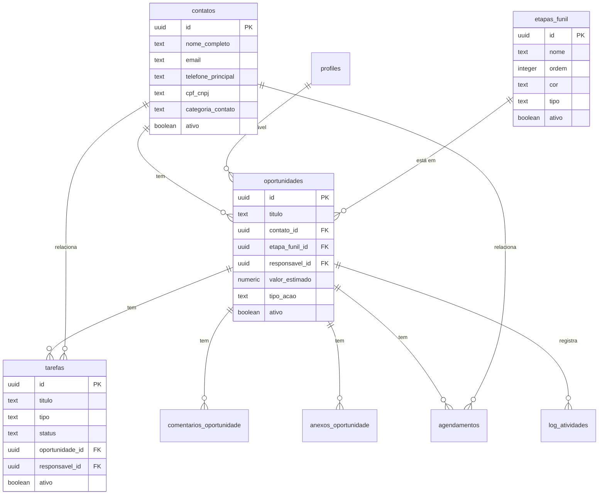

# Banco de Dados do Módulo CRM

> **Última Atualização:** 2026-01-08  
> **Referência:** [DATABASE_SCHEMA.md](../DATABASE_SCHEMA.md)

---

## Tabelas Principais

### contatos

> Contatos (clientes/leads) do CRM - Pessoa Física ou Jurídica

| Coluna | Tipo | Nullable | Default | Descrição |
|--------|------|----------|---------|-----------|
| `id` | `uuid` | NO | `gen_random_uuid()` | Identificador único |
| `nome_completo` | `text` | NO | — | Nome do contato |
| `email` | `text` | YES | — | E-mail principal |
| `telefone_principal` | `text` | YES | — | Telefone principal |
| `cpf_cnpj` | `text` | YES | — | CPF ou CNPJ |
| `tipo` | `text` | YES | `'Pessoa Física'` | Tipo de pessoa |
| `categoria_contato` | `text` | YES | `'LEAD'` | Categoria manual |
| `endereco` | `jsonb` | YES | — | Dados de endereço |
| `observacoes` | `text` | YES | — | Observações livres |
| `responsavel_id` | `uuid` | YES | — | FK para profiles |
| `ativo` | `boolean` | YES | `true` | Soft delete flag |
| `data_criacao` | `timestamptz` | YES | `now()` | Data de criação |
| `data_atualizacao` | `timestamptz` | YES | `now()` | Última atualização |

**CHECK Constraint:** `categoria_contato IN ('LEAD', 'CLIENTE', 'EX_CLIENTE')`

---

### oportunidades

> Oportunidades do CRM (funil de vendas)

| Coluna | Tipo | Nullable | Default | Descrição |
|--------|------|----------|---------|-----------|
| `id` | `uuid` | NO | `gen_random_uuid()` | Identificador único |
| `titulo` | `text` | NO | — | Título da oportunidade |
| `contato_id` | `uuid` | YES | — | FK para contatos |
| `responsavel_id` | `uuid` | YES | — | FK para profiles |
| `estagio` | `text` | YES | — | Estágio legado |
| `etapa_funil_id` | `uuid` | YES | — | FK para etapas_funil |
| `valor` | `numeric` | YES | — | Valor estimado (legado) |
| `valor_estimado` | `numeric` | YES | — | Valor estimado |
| `probabilidade` | `integer` | YES | `50` | % de probabilidade |
| `tipo_acao` | `text` | YES | — | Tipo de operação |
| `origem` | `text` | YES | — | Origem do lead |
| `data_previsao` | `date` | YES | — | Previsão de fechamento |
| `observacoes` | `text` | YES | — | Observações |
| `ativo` | `boolean` | YES | `true` | Soft delete flag |
| `ordem` | `integer` | YES | — | Ordem no Kanban |
| `criado_por` | `uuid` | YES | — | FK para auth.users |
| `created_at` | `timestamptz` | YES | `now()` | Data de criação |
| `updated_at` | `timestamptz` | YES | `now()` | Última atualização |

---

### etapas_funil

> Etapas do funil de vendas

| Coluna | Tipo | Nullable | Default | Descrição |
|--------|------|----------|---------|-----------|
| `id` | `uuid` | NO | `gen_random_uuid()` | Identificador único |
| `nome` | `text` | NO | — | Nome da etapa |
| `ordem` | `integer` | NO | — | Ordem no funil |
| `cor` | `text` | YES | `'#6366f1'` | Cor hexadecimal |
| `tipo` | `text` | YES | `'aberta'` | Tipo da etapa |
| `ativo` | `boolean` | YES | `true` | Soft delete flag |
| `criado_por` | `uuid` | YES | — | FK para auth.users |
| `created_at` | `timestamptz` | YES | `now()` | Data de criação |
| `updated_at` | `timestamptz` | YES | `now()` | Última atualização |

**Tipos de Etapa:**
- `aberta`: Etapa em andamento
- `fechada-ganha`: Oportunidade convertida
- `fechada-perdida`: Oportunidade não convertida

---

### tarefas

> Tarefas e interações do sistema

| Coluna | Tipo | Nullable | Default | Descrição |
|--------|------|----------|---------|-----------|
| `id` | `uuid` | NO | `gen_random_uuid()` | Identificador único |
| `titulo` | `text` | NO | — | Título da tarefa |
| `descricao` | `text` | YES | — | Descrição detalhada |
| `tipo` | `text` | NO | — | Tipo de tarefa |
| `status` | `text` | YES | `'Pendente'` | Status atual |
| `prioridade` | `text` | YES | `'Média'` | Prioridade |
| `oportunidade_id` | `uuid` | YES | — | FK para oportunidades |
| `contato_id` | `uuid` | YES | — | FK para contatos |
| `responsavel_id` | `uuid` | YES | — | FK para profiles |
| `data_vencimento` | `timestamptz` | YES | — | Data de vencimento |
| `data_conclusao` | `timestamptz` | YES | — | Data de conclusão |
| `ativo` | `boolean` | YES | `true` | Soft delete flag |
| `criado_por` | `uuid` | YES | — | FK para auth.users |
| `created_at` | `timestamptz` | YES | `now()` | Data de criação |
| `updated_at` | `timestamptz` | YES | `now()` | Última atualização |

**Tipos de Tarefa:**
`Tarefa`, `Follow-up`, `Reunião`, `Ligação`, `E-mail`, `Documento`, `Prazo Judicial`, `Audiência`, `Outros`

**Status:**
`Pendente`, `Em Andamento`, `Aguardando`, `Concluída`, `Cancelada`

---

### agendamentos

> Eventos de calendário

| Coluna | Tipo | Nullable | Default | Descrição |
|--------|------|----------|---------|-----------|
| `id` | `uuid` | NO | `gen_random_uuid()` | Identificador único |
| `user_id` | `uuid` | NO | — | FK para auth.users |
| `titulo` | `text` | NO | — | Título do evento |
| `descricao` | `text` | YES | — | Descrição |
| `cor` | `text` | NO | `'#3D96FF'` | Cor do evento |
| `data_inicio` | `timestamptz` | NO | — | Data/hora de início |
| `data_fim` | `timestamptz` | NO | — | Data/hora de fim |
| `dia_inteiro` | `boolean` | YES | `false` | Evento de dia inteiro |
| `contato_id` | `uuid` | YES | — | FK para contatos |
| `oportunidade_id` | `uuid` | YES | — | FK para oportunidades |
| `contrato_id` | `uuid` | YES | — | FK para contratos |
| `created_at` | `timestamptz` | YES | `now()` | Data de criação |
| `updated_at` | `timestamptz` | YES | `now()` | Última atualização |

---

### comentarios_oportunidade

> Comentários de oportunidades

| Coluna | Tipo | Nullable | Default | Descrição |
|--------|------|----------|---------|-----------|
| `id` | `uuid` | NO | `gen_random_uuid()` | Identificador único |
| `oportunidade_id` | `uuid` | NO | — | FK para oportunidades |
| `user_id` | `uuid` | NO | — | FK para auth.users |
| `texto` | `text` | NO | — | Conteúdo do comentário |
| `data_criacao` | `timestamptz` | YES | `now()` | Data de criação |

---

### anexos_oportunidade

> Arquivos anexados a oportunidades

| Coluna | Tipo | Nullable | Default | Descrição |
|--------|------|----------|---------|-----------|
| `id` | `uuid` | NO | `gen_random_uuid()` | Identificador único |
| `oportunidade_id` | `uuid` | NO | — | FK para oportunidades |
| `uploader_id` | `uuid` | NO | — | FK para auth.users |
| `nome_arquivo` | `text` | NO | — | Nome do arquivo |
| `tipo_arquivo` | `text` | NO | — | MIME type |
| `tamanho_bytes` | `integer` | NO | — | Tamanho em bytes |
| `url_storage` | `text` | NO | — | URL pública |
| `descricao` | `text` | YES | — | Descrição do anexo |
| `data_upload` | `timestamptz` | YES | `now()` | Data do upload |

---

### log_atividades

> Logs de atividades do sistema

| Coluna | Tipo | Nullable | Default | Descrição |
|--------|------|----------|---------|-----------|
| `id` | `uuid` | NO | `gen_random_uuid()` | Identificador único |
| `user_id` | `uuid` | YES | — | FK para auth.users |
| `acao` | `text` | NO | — | Tipo de ação |
| `entidade` | `text` | YES | — | Nome da tabela afetada |
| `entidade_id` | `uuid` | YES | — | ID do registro afetado |
| `dados_anteriores` | `jsonb` | YES | — | Snapshot antes |
| `dados_novos` | `jsonb` | YES | — | Snapshot depois |
| `data_criacao` | `timestamptz` | YES | `now()` | Data da ação |

**Ações Registradas:**
- `CRIAR_OPORTUNIDADE`
- `EDITAR_OPORTUNIDADE`
- `MOVER_OPORTUNIDADE`
- `EXCLUIR_OPORTUNIDADE`
- `ADICIONAR_COMENTARIO`
- `AGENDAR_INTERACAO`
- `ANEXAR_ARQUIVO`
- `EXCLUIR_ANEXO`

---

## Views

### v_contatos_status

> Calcula `status_atividade` automaticamente baseado em `data_atualizacao`

```sql
CREATE OR REPLACE VIEW public.v_contatos_status AS
SELECT 
    c.*,
    CASE 
        WHEN c.data_atualizacao >= NOW() - INTERVAL '90 days' THEN 'ATIVO'
        WHEN c.data_atualizacao >= NOW() - INTERVAL '180 days' THEN 'INATIVO'
        ELSE 'ARQUIVADO'
    END AS status_atividade
FROM public.contatos c;
```

| Status | Critério |
|--------|----------|
| `ATIVO` | Atualizado há menos de 90 dias |
| `INATIVO` | Atualizado entre 90-180 dias |
| `ARQUIVADO` | Atualizado há mais de 180 dias |

---

### v_funil_estatisticas

> Estatísticas agregadas por etapa do funil

| Coluna | Tipo | Descrição |
|--------|------|-----------|
| `id` | `uuid` | ID da etapa |
| `nome` | `text` | Nome da etapa |
| `cor` | `text` | Cor da etapa |
| `ordem` | `integer` | Ordem no funil |
| `tipo` | `text` | Tipo da etapa |
| `total_oportunidades` | `bigint` | Quantidade de oportunidades |
| `valor_total` | `numeric` | Soma dos valores |
| `probabilidade_media` | `numeric` | Média de probabilidade |

---

## Funções RPC

### reordenar_etapas_funil

Reordena etapas do funil de forma atômica:

```sql
CREATE FUNCTION reordenar_etapas_funil(
    etapa_id uuid,
    nova_ordem integer
) RETURNS void
```

---

## Diagrama ER



---

## Storage Bucket

### oportunidades-anexos

Bucket para armazenar arquivos anexados às oportunidades.

**Configuração:**
- Limite de tamanho: 10MB por arquivo
- Acesso: Público (URL gerada)
- Estrutura: `{oportunidade_id}/{timestamp}_{filename}`

---

*Documentação de banco de dados - OctoApps CRM*
