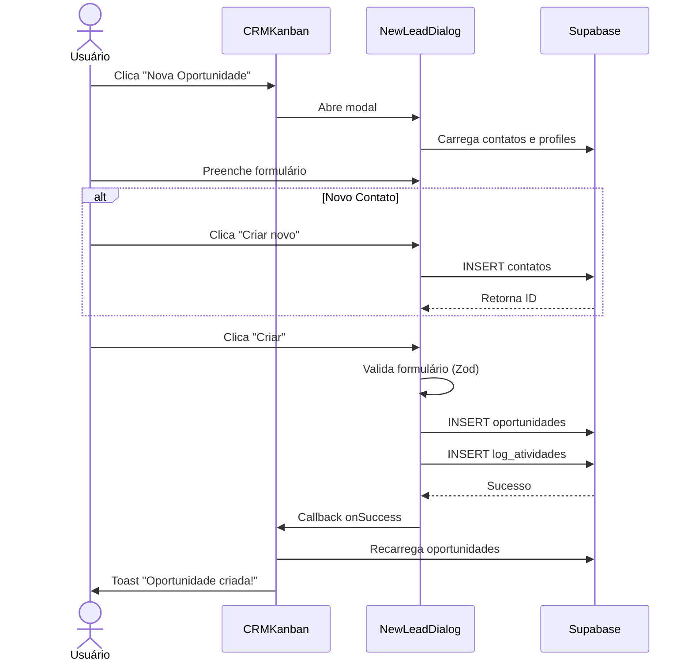
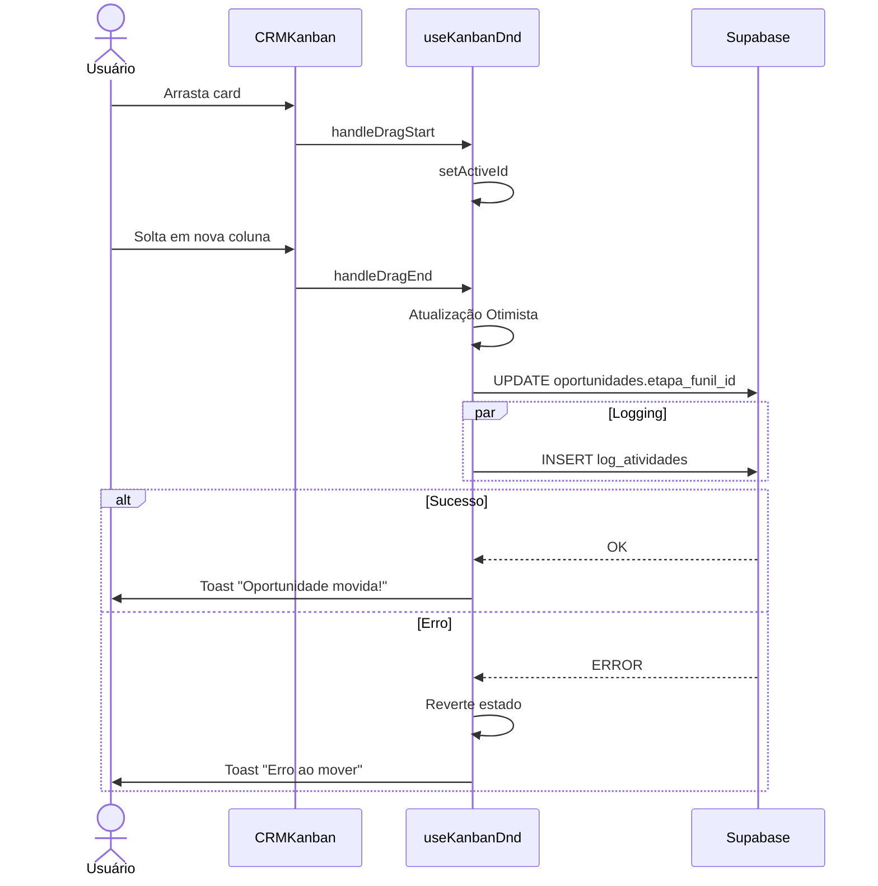
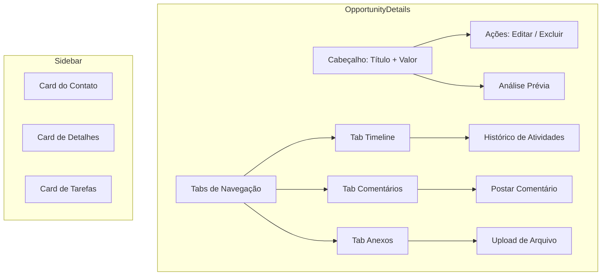
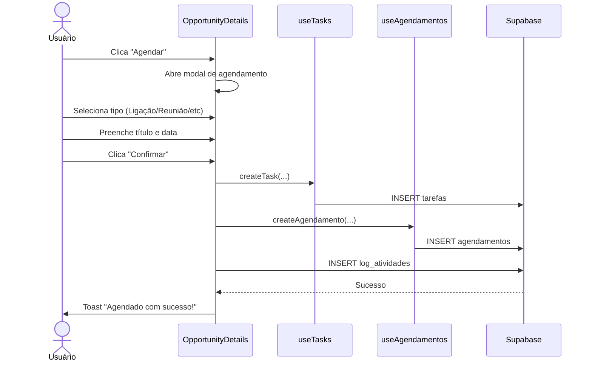
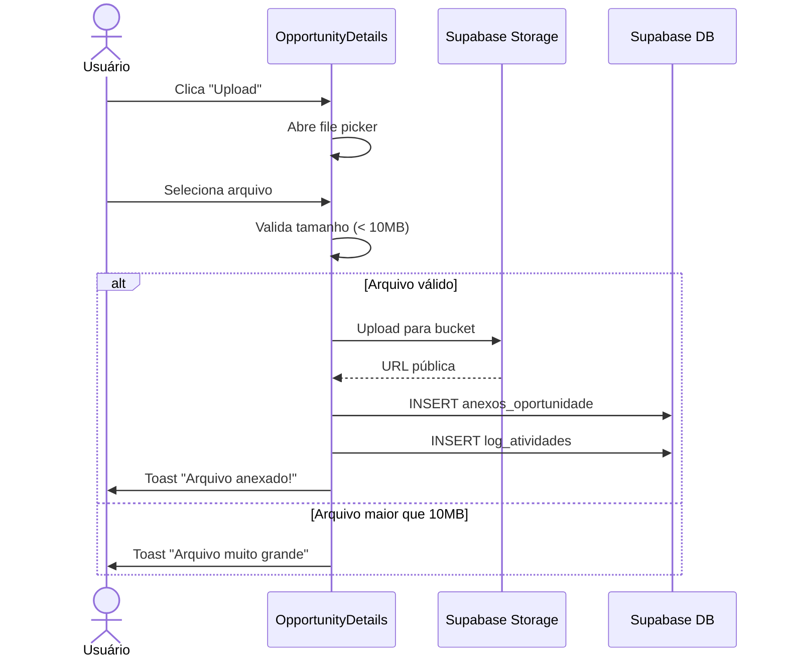
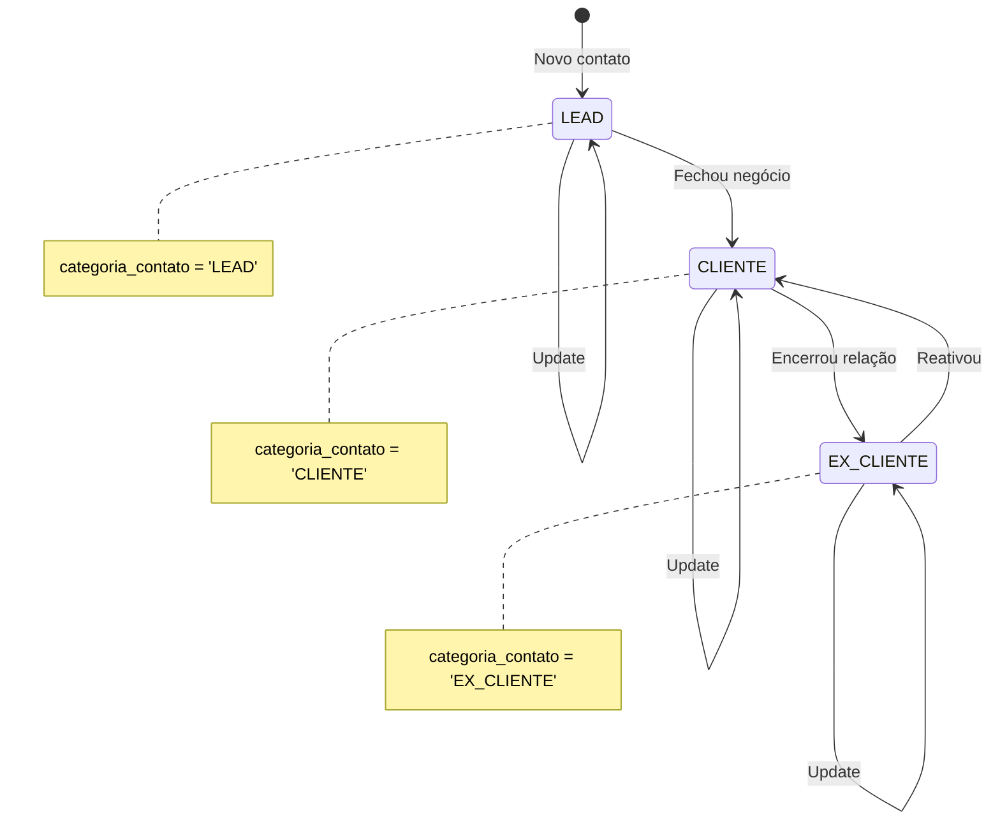
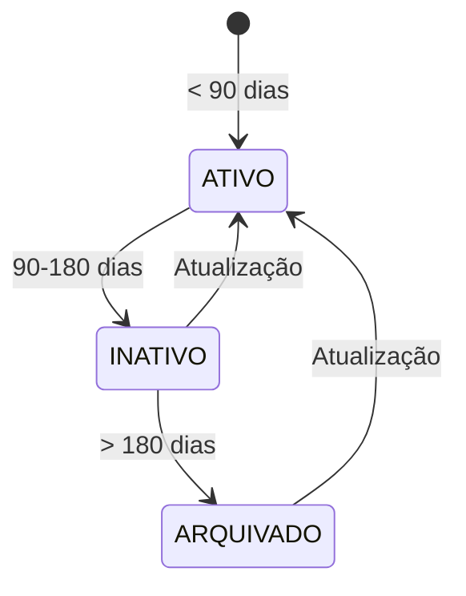
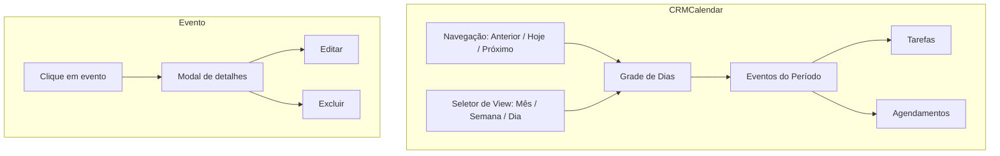
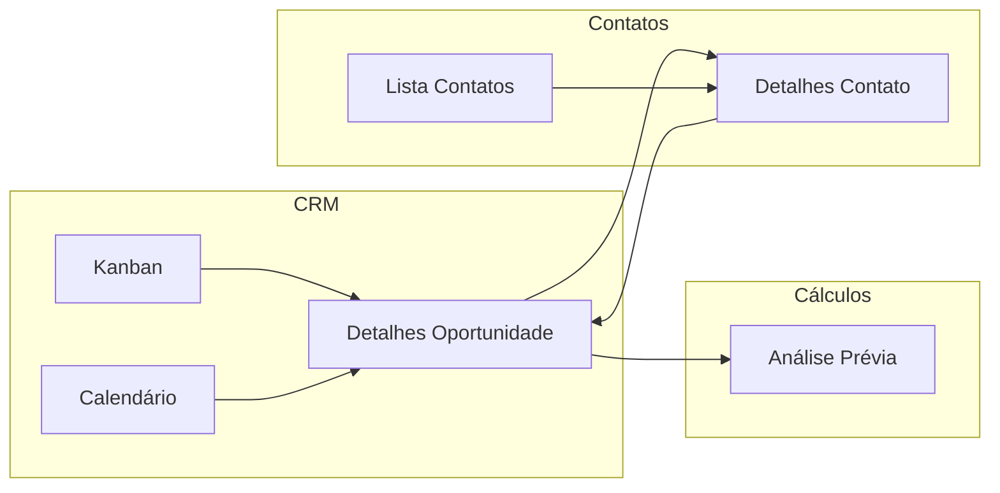

# Fluxos de Usuário do Módulo CRM

> **Última Atualização:** 2026-01-08

---

## Índice de Fluxos

| Fluxo | Descrição |
|-------|-----------|
| FL-001 | Criar Nova Oportunidade |
| FL-002 | Mover Oportunidade no Kanban |
| FL-003 | Gerenciar Detalhes da Oportunidade |
| FL-004 | Agendar Follow-up |
| FL-005 | Anexar Documento |
| FL-006 | Gestão de Contatos |
| FL-007 | Visualização de Calendário |

---

## FL-001: Criar Nova Oportunidade

### Diagrama

### Campos Obrigatórios
- Contato
- Responsável
- Tipo de Operação
- Etapa do Funil

### Campos Opcionais
- Valor Estimado
- Origem
- Observações

---

## FL-002: Mover Oportunidade no Kanban

### Diagrama

### Comportamento
1. Feedback visual imediato (optimistic update)
2. Persistência assíncrona no banco
3. Rollback automático em caso de erro
4. Log de atividade registrado

---

## FL-003: Gerenciar Detalhes da Oportunidade

### Diagrama

### Funcionalidades por Tab

| Tab | Funcionalidades |
|-----|-----------------|
| Timeline | Visualizar logs paginados, navegar páginas |
| Comentários | Postar, visualizar lista de comentários |
| Anexos | Upload, download, excluir, editar descrição |

---

## FL-004: Agendar Follow-up

### Diagrama

### Tipos de Interação

| Tipo | Ícone | Cor |
|------|-------|-----|
| Tarefa | 📋 | Azul |
| Follow-up | 🔄 | Roxo |
| Reunião | 👥 | Verde |
| Ligação | 📞 | Amarelo |
| E-mail | 📧 | Rosa |
| Documento | 📄 | Índigo |
| Prazo Judicial | ⚖️ | Vermelho |
| Audiência | 🏛️ | Laranja |

---

## FL-005: Anexar Documento

### Diagrama

### Limite de Arquivo
- **Máximo:** 10MB
- **Bucket:** `oportunidades-anexos`
- **Estrutura:** `{oportunidade_id}/{timestamp}_{filename}`

---

## FL-006: Gestão de Contatos

### Diagrama de Estados

### Status de Atividade (Calculado)

---

## FL-007: Visualização de Calendário

### Diagrama

### Modos de Visualização

| Modo | Descrição |
|------|-----------|
| Mês | Grade mensal completa |
| Semana | 7 dias em detalhe |
| Dia | Linha do tempo de 24h |
| Lista | Lista ordenada de eventos |

### Cores de Eventos

| Tipo | Cor Default |
|------|-------------|
| Tarefa | Cor por tipo (ver FL-004) |
| Agendamento | `#3D96FF` (personalizável) |

---

## Rotas do Módulo

| Rota | Componente | Descrição |
|------|------------|-----------|
| `/crm/oportunidades` | CRMKanban | Board Kanban |
| `/crm/oportunidade/$id` | OpportunityDetails | Detalhe |
| `/crm/contatos` | ContactsList | Lista de contatos |
| `/crm/calendario` | CRMCalendar | Calendário |
| `/contatos/$id` | ContactDetails | Detalhe do contato |

---

## Navegação entre Fluxos

---

*Documentação de fluxos de usuário - OctoApps CRM*
