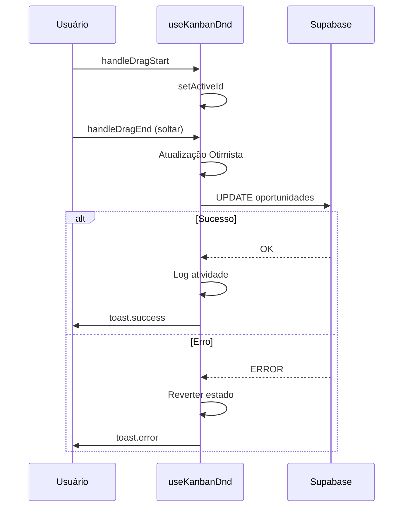
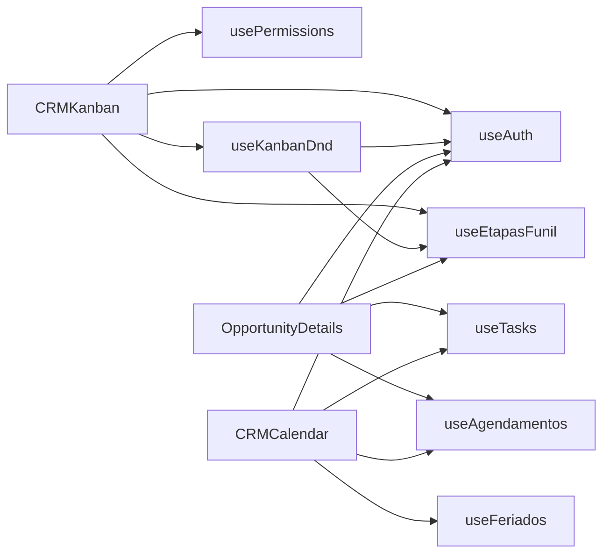

# Hooks do Módulo CRM

> **Última Atualização:** 2026-01-08

---

## Índice de Hooks

| Hook | Arquivo | Responsabilidade |
|------|---------|------------------|
| useContatos | `useContatos.ts` | CRUD de contatos simplificado |
| useEtapasFunil | `useEtapasFunil.ts` | Gestão de etapas do funil |
| useKanbanDnd | `useKanbanDnd.ts` | Lógica de drag-and-drop |
| useTasks | `useTasks.ts` | CRUD de tarefas |
| useAgendamentos | `useAgendamentos.ts` | CRUD de agendamentos |

---

## useContatos

**Arquivo:** `src/hooks/useContatos.ts`  
**Linhas:** 103

### Interface de Retorno

```typescript
interface ContatoSimplificado {
  id: string;
  nome: string;
  cpf_cnpj?: string;
}

interface UseContatosReturn {
  contatos: ContatoSimplificado[];
  loading: boolean;
  error: string | null;
  criarContato: (nome: string) => Promise<string | null>;
}
```

### Opções

```typescript
interface UseContatosOptions {
  apenasAtivos?: boolean;  // default: true
  busca?: string;          // Filtro de busca por nome
}
```

### Uso

```typescript
const { contatos, loading, criarContato } = useContatos({
  apenasAtivos: true,
  busca: 'João'
});
```

### Funcionalidades

| Função | Descrição |
|--------|-----------|
| `fetchContatos()` | Busca contatos filtrados do Supabase |
| `criarContato(nome)` | Cria contato on-the-fly (apenas nome) |

### Query Supabase

```typescript
const query = supabase
  .from('contatos')
  .select('id, nome_completo, cpf_cnpj')
  .order('nome_completo', { ascending: true });

if (apenasAtivos) query.eq('ativo', true);
if (busca?.length >= 2) query.ilike('nome_completo', `%${busca}%`);
```

---

## useEtapasFunil

**Arquivo:** `src/hooks/useEtapasFunil.ts`  
**Linhas:** 282

### Interface de Retorno

```typescript
interface UseEtapasFunilReturn {
  // Estados
  etapas: EtapaFunil[];
  estatisticas: EtapaFunilEstatisticas[];
  loading: boolean;
  error: string | null;

  // Funções de leitura
  getEtapas: () => Promise<{ data, error }>;
  getEstatisticas: () => Promise<{ data, error }>;
  getEtapaPorId: (id: string) => Promise<{ data, error }>;

  // Funções de escrita
  createEtapa: (etapa: EtapaFunilInsert) => Promise<{ data, error }>;
  updateEtapa: (id: string, updates: EtapaFunilUpdate) => Promise<{ data, error }>;
  deleteEtapa: (id: string) => Promise<{ data, error }>;
  reordenarEtapas: (etapaId: string, novaOrdem: number) => Promise<{ error }>;
  reordenarEtapasLocal: (etapaId: string, novaOrdem: number) => void;
}
```

### Funcionalidades

| Função | Descrição |
|--------|-----------|
| `getEtapas()` | Busca todas as etapas ativas ordenadas |
| `getEstatisticas()` | Busca view `v_funil_estatisticas` |
| `createEtapa(etapa)` | Cria nova etapa (ordem automática) |
| `updateEtapa(id, updates)` | Atualiza etapa existente |
| `deleteEtapa(id)` | Soft delete (verifica oportunidades vinculadas) |
| `reordenarEtapas(id, ordem)` | Chama RPC `reordenar_etapas_funil` |
| `reordenarEtapasLocal(id, ordem)` | Reordena otimisticamente |

### Regra de Negócio: Exclusão

Não permite excluir etapa com oportunidades vinculadas:

```typescript
const { count } = await supabase
  .from('oportunidades')
  .select('id', { count: 'exact', head: true })
  .eq('etapa_funil_id', id)
  .eq('ativo', true);

if (count && count > 0) {
  throw new Error(`Não é possível excluir: ${count} oportunidade(s) vinculada(s)`);
}
```

---

## useKanbanDnd

**Arquivo:** `src/hooks/useKanbanDnd.ts`  
**Linhas:** 103

### Interface

```typescript
function useKanbanDnd(
  opportunities: Opportunity[],
  setOpportunities: React.Dispatch<React.SetStateAction<Opportunity[]>>
): {
  activeId: string | null;
  handleDragStart: (event: DragStartEvent) => void;
  handleDragEnd: (event: DragEndEvent) => void;
}
```

### Fluxo do Drag-and-Drop



### Lógica de Destino

O hook identifica se o drop foi em:
- **Coluna (etapa):** `targetId` é o `etapa_id`
- **Outro card:** Busca o `etapa_funil_id` do card alvo

```typescript
let targetEtapaId = targetId;
let targetOpp = opportunities.find(o => o.id === targetId);

if (targetOpp) {
  // Dropped on another card
  targetEtapaId = targetOpp.etapa_funil_id || '';
}
```

---

## useTasks

**Arquivo:** `src/hooks/useTasks.ts`  
**Linhas:** 232

### Interface de Retorno

```typescript
interface UseTasksReturn {
  // Estados
  tasks: Task[];
  loading: boolean;
  error: string | null;

  // Funções de leitura
  loadTasksByOpportunity: (opportunityId: string) => Promise<{ data, error }>;
  getTaskById: (id: string) => Promise<{ data, error }>;

  // Funções de escrita
  createTask: (task: TaskInsert) => Promise<{ data, error }>;
  updateTask: (id: string, updates: TaskUpdate) => Promise<{ data, error }>;
  deleteTask: (id: string) => Promise<{ data, error }>;
  completeTask: (id: string) => Promise<{ data, error }>;
  cancelTask: (id: string) => Promise<{ data, error }>;
}
```

### Funcionalidades

| Função | Descrição |
|--------|-----------|
| `loadTasksByOpportunity(id)` | Carrega tarefas de uma oportunidade |
| `getTaskById(id)` | Busca tarefa específica com JOINs |
| `createTask(task)` | Cria nova tarefa com defaults |
| `updateTask(id, updates)` | Atualiza tarefa |
| `deleteTask(id)` | Soft delete (ativo = false) |
| `completeTask(id)` | Marca como concluída |
| `cancelTask(id)` | Marca como cancelada |

### Defaults na Criação

```typescript
const { data } = await supabase
  .from('tarefas')
  .insert({
    ...task,
    responsavel_id: task.responsavel_id || user?.id,
    criado_por: user?.id,
    status: task.status || 'Pendente',
    prioridade: task.prioridade || 'Média',
  });
```

---

## useAgendamentos

**Arquivo:** `src/hooks/useAgendamentos.ts`  
**Linhas:** 152

### Interface de Retorno

```typescript
interface UseAgendamentosReturn {
  agendamentos: Agendamento[];
  loading: boolean;
  error: string | null;
  loadAgendamentosByRange: (start: string, end: string) => Promise<{ data, error }>;
  createAgendamento: (agendamento: AgendamentoInsert) => Promise<{ data, error }>;
  updateAgendamento: (id: string, updates: AgendamentoUpdate) => Promise<{ data, error }>;
  deleteAgendamento: (id: string) => Promise<{ error }>;
}
```

### Funcionalidades

| Função | Descrição |
|--------|-----------|
| `loadAgendamentosByRange(start, end)` | Busca agendamentos em um período |
| `createAgendamento(data)` | Cria novo agendamento |
| `updateAgendamento(id, updates)` | Atualiza agendamento |
| `deleteAgendamento(id)` | Remove agendamento (hard delete) |

### Query de Intervalo

Usa lógica de sobreposição de intervalos:

```typescript
// (StartA <= EndB) AND (EndA >= StartB)
const { data } = await supabase
  .from('agendamentos')
  .select(`
    *,
    contato:contato_id (id, nome_completo),
    oportunidade:oportunidade_id (id, titulo)
  `)
  .lte('data_inicio', endDate)
  .gte('data_fim', startDate)
  .order('data_inicio', { ascending: true });
```

---

## Dependências entre Hooks



---

*Documentação de hooks - OctoApps CRM*
