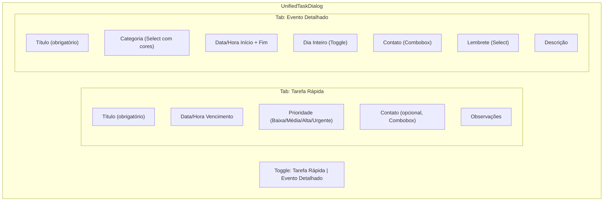

# 📅 Plano de Arquitetura: Calendário V2 (Smart Events)

> **Data:** 2026-01-16  
> **Versão:** 1.0  
> **Status:** 🟡 Em Planeamento  
> **Autor:** Arquiteto de Software OctoApps

---

## 1. Sumário Executivo

Este documento descreve a reformulação completa do módulo de Calendário e Tarefas do OctoApps, evoluindo de um sistema simplista para uma plataforma de **Smart Events** focada em CRM Jurídico.

### Objetivos Principais

1. **Taxonomia Rica:** Permitir que o Gestor crie categorias de eventos (Audiência, Prazo, Reunião) com cores e templates
2. **Flexibilidade Total:** Suportar tarefas "soltas" (sem vínculo) e "vinculadas" (com contexto automático)
3. **Experiência Unificada:** Modal inteligente que adapta-se ao contexto de criação

---

## 2. Diagnóstico do Sistema Atual

### 2.1 Schema SQL Atual (`DATABASE_SCHEMA.md`)

| Coluna | Tipo | Nullable | Observações |
|--------|------|----------|-------------|
| `id` | uuid | NO | PK |
| `titulo` | text | NO | - |
| `descricao` | text | YES | - |
| `caso_id` | uuid | YES | FK para `casos` |
| `responsavel_id` | uuid | YES | FK para `profiles` |
| `criado_por` | uuid | YES | - |
| `status` | text | YES | Default: 'pendente' |
| `prioridade` | text | YES | Default: 'media' |
| `data_prazo` | date | YES | ⚠️ Apenas data, sem hora |
| `data_conclusao` | date | YES | - |

> [!WARNING]
> **Discrepância Crítica:** O schema SQL não possui as colunas `oportunidade_id`, `contato_id`, `tipo` que existem nos types TypeScript (`task.ts`). O código frontend assume colunas que não existem!

### 2.2 Componentes Frontend Atuais

| Componente | Linhas | Propósito |
|------------|--------|-----------|
| [CRMCalendar.tsx](file:///c:/Users/Usuario/OneDrive/Documentos/Antigravity/Octoapps/OctoApp/src/components/crm/CRMCalendar.tsx) | 620 | Calendário principal com mês/semana/dia |
| [useTasks.ts](file:///c:/Users/Usuario/OneDrive/Documentos/Antigravity/Octoapps/OctoApp/src/hooks/useTasks.ts) | 232 | Hook CRUD de tarefas |
| [task.ts](file:///c:/Users/Usuario/OneDrive/Documentos/Antigravity/Octoapps/OctoApp/src/types/task.ts) | 203 | Tipos TypeScript (mais completos que DB) |

### 2.3 Problemas Identificados

1. **Schema Incompleto:** Tabela `tarefas` não suporta vínculos com `contatos` ou `oportunidades`
2. **Sem Categorização:** Não existe sistema de tipos/categorias de eventos
3. **Cores Hardcoded:** Cores definidas no código, não configuráveis
4. **Sem Suporte a Duração:** Apenas `data_prazo` (date), sem `hora_inicio`/`hora_fim`
5. **Duplicação:** Existe tabela `agendamentos` separada para eventos com hora

---

## 3. Novo Schema SQL (Proposta)

### 3.1 Nova Tabela: `event_categories`

```sql
-- =====================================================
-- TABELA: event_categories
-- Categorias de eventos/tarefas configuráveis pelo Gestor
-- =====================================================
CREATE TABLE IF NOT EXISTS public.event_categories (
    id              UUID PRIMARY KEY DEFAULT gen_random_uuid(),
    organization_id UUID REFERENCES auth.users(id) ON DELETE CASCADE,
    
    -- Identificação
    name            TEXT NOT NULL,
    description     TEXT,
    
    -- Visual
    color           TEXT NOT NULL DEFAULT '#1e3a8a',  -- Azul Marinho
    icon            TEXT DEFAULT 'calendar',          -- Lucide icon name
    
    -- Comportamento
    is_system       BOOLEAN DEFAULT FALSE,            -- Categorias do sistema (não editáveis)
    is_all_day      BOOLEAN DEFAULT FALSE,            -- Categoria típica de dia inteiro?
    default_duration_minutes INTEGER DEFAULT 60,      -- Duração padrão em minutos
    
    -- Metadata
    ordem           INTEGER DEFAULT 0,
    ativo           BOOLEAN DEFAULT TRUE,
    created_at      TIMESTAMPTZ DEFAULT NOW(),
    updated_at      TIMESTAMPTZ DEFAULT NOW()
);

-- RLS
ALTER TABLE public.event_categories ENABLE ROW LEVEL SECURITY;

-- Índices
CREATE INDEX idx_event_categories_org ON public.event_categories(organization_id);
```

### 3.2 Seed Data: Categorias Padrão

```sql
-- Inserir categorias padrão do sistema
INSERT INTO public.event_categories (name, color, icon, is_system, ordem) VALUES
    ('Tarefa',        '#1e3a8a', 'check-square',     TRUE, 1),  -- Azul Marinho
    ('Follow-up',     '#7c3aed', 'phone-forwarded',  TRUE, 2),  -- Roxo
    ('Reunião',       '#059669', 'users',            TRUE, 3),  -- Verde
    ('Audiência',     '#dc2626', 'gavel',            TRUE, 4),  -- Vermelho
    ('Prazo',         '#ea580c', 'clock',            TRUE, 5),  -- Laranja
    ('Ligação',       '#0891b2', 'phone',            TRUE, 6),  -- Cyan
    ('E-mail',        '#db2777', 'mail',             TRUE, 7);  -- Pink
```

### 3.3 Alterações na Tabela `tarefas`

```sql
-- =====================================================
-- MIGRATION: Atualizar tabela tarefas para V2
-- =====================================================

-- 1. Adicionar novas colunas
ALTER TABLE public.tarefas
    ADD COLUMN IF NOT EXISTS category_id UUID REFERENCES public.event_categories(id),
    ADD COLUMN IF NOT EXISTS contato_id UUID REFERENCES public.contatos(id) ON DELETE SET NULL,
    ADD COLUMN IF NOT EXISTS oportunidade_id UUID REFERENCES public.oportunidades(id) ON DELETE SET NULL,
    ADD COLUMN IF NOT EXISTS tipo TEXT DEFAULT 'Tarefa',
    ADD COLUMN IF NOT EXISTS data_vencimento TIMESTAMPTZ,  -- Novo: inclui hora
    ADD COLUMN IF NOT EXISTS data_inicio TIMESTAMPTZ,
    ADD COLUMN IF NOT EXISTS duracao_estimada INTEGER,     -- Minutos
    ADD COLUMN IF NOT EXISTS is_all_day BOOLEAN DEFAULT FALSE,
    ADD COLUMN IF NOT EXISTS lembrete_antecedencia INTEGER,
    ADD COLUMN IF NOT EXISTS lembrete_enviado BOOLEAN DEFAULT FALSE,
    ADD COLUMN IF NOT EXISTS recorrente BOOLEAN DEFAULT FALSE,
    ADD COLUMN IF NOT EXISTS recorrencia_tipo TEXT,
    ADD COLUMN IF NOT EXISTS recorrencia_fim DATE,
    ADD COLUMN IF NOT EXISTS checklist JSONB,
    ADD COLUMN IF NOT EXISTS progresso INTEGER DEFAULT 0,
    ADD COLUMN IF NOT EXISTS tags TEXT[],
    ADD COLUMN IF NOT EXISTS anexos JSONB,
    ADD COLUMN IF NOT EXISTS ordem INTEGER DEFAULT 0,
    ADD COLUMN IF NOT EXISTS ativo BOOLEAN DEFAULT TRUE,
    ADD COLUMN IF NOT EXISTS data_atualizacao TIMESTAMPTZ DEFAULT NOW(),
    ADD COLUMN IF NOT EXISTS participantes_ids UUID[];

-- 2. Migrar data_prazo para data_vencimento (preservar dados)
UPDATE public.tarefas 
SET data_vencimento = data_prazo::timestamptz 
WHERE data_vencimento IS NULL AND data_prazo IS NOT NULL;

-- 3. Criar índices
CREATE INDEX IF NOT EXISTS idx_tarefas_contato ON public.tarefas(contato_id);
CREATE INDEX IF NOT EXISTS idx_tarefas_oportunidade ON public.tarefas(oportunidade_id);
CREATE INDEX IF NOT EXISTS idx_tarefas_category ON public.tarefas(category_id);
CREATE INDEX IF NOT EXISTS idx_tarefas_vencimento ON public.tarefas(data_vencimento);

-- 4. Trigger para updated_at
CREATE OR REPLACE FUNCTION update_tarefas_timestamp()
RETURNS TRIGGER AS $$
BEGIN
    NEW.data_atualizacao = NOW();
    RETURN NEW;
END;
$$ LANGUAGE plpgsql;

DROP TRIGGER IF EXISTS tr_tarefas_updated ON public.tarefas;
CREATE TRIGGER tr_tarefas_updated
    BEFORE UPDATE ON public.tarefas
    FOR EACH ROW
    EXECUTE FUNCTION update_tarefas_timestamp();
```

### 3.4 Migração de Dados Existentes

```sql
-- =====================================================
-- MIGRATION: Dados existentes → novo schema
-- =====================================================

-- 1. Buscar ID da categoria "Tarefa" (padrão do sistema)
DO $$
DECLARE
    v_tarefa_category_id UUID;
BEGIN
    SELECT id INTO v_tarefa_category_id 
    FROM public.event_categories 
    WHERE name = 'Tarefa' AND is_system = TRUE 
    LIMIT 1;
    
    -- 2. Atribuir categoria padrão a tarefas antigas
    UPDATE public.tarefas
    SET category_id = v_tarefa_category_id
    WHERE category_id IS NULL;
END $$;
```

---

## 4. Especificação de Componentes Frontend

### 4.1 Unified Task Dialog (Modal Inteligente)

O coração da nova funcionalidade: um modal que combina criação de tarefas rápidas e eventos detalhados.



#### Props Interface

```typescript
interface UnifiedTaskDialogProps {
  // Controle do modal
  open: boolean;
  onOpenChange: (open: boolean) => void;
  
  // Contexto pré-preenchido (opcional)
  defaultContactId?: string;        // Vínculo automático
  defaultContactName?: string;      // Para display
  defaultOpportunityId?: string;    // Vínculo com oportunidade
  defaultDate?: Date;               // Data clicada no calendário
  
  // Callbacks
  onSuccess?: (task: Task) => void;
  onClose?: () => void;
  
  // Modo inicial
  initialMode?: 'quick' | 'detailed';
  
  // Lock de contexto
  lockContact?: boolean;  // Se true, contato não pode ser alterado
}
```

#### Lógica de Cores

| Modo | Cor Visual |
|------|------------|
| Tarefa Rápida | `#1e3a8a` (Azul Marinho) fixo |
| Evento Detalhado | Herda cor da categoria selecionada |

### 4.2 Mockup Textual do Modal

```
┌─────────────────────────────────────────────────────────────┐
│  ✕  Nova Tarefa / Evento                                    │
├─────────────────────────────────────────────────────────────┤
│                                                             │
│  ┌────────────────────┬─────────────────────┐              │
│  │   Tarefa Rápida    │   Evento Detalhado  │  <- Toggle   │
│  └────────────────────┴─────────────────────┘              │
│                                                             │
│  ┌─────────────────────────────────────────────────────┐   │
│  │ Título *                                             │   │
│  │ __________________________________________________ │   │
│  └─────────────────────────────────────────────────────┘   │
│                                                             │
│  ┌────────────────────────┐ ┌────────────────────────┐     │
│  │ 📅 Data     │ 16/01/26 │ │ 🕐 Hora      │ 14:00  │     │
│  └────────────────────────┘ └────────────────────────┘     │
│                                                             │
│  ┌─────────────────────────────────────────────────────┐   │
│  │ 👤 Contato (opcional)                [🔍 Pesquisar] │   │
│  │ Maria Silva - Lead                                   │   │
│  └─────────────────────────────────────────────────────┘   │
│                (SE vindo do Detalhe Lead: bloqueado)        │
│                                                             │
│  ┌─────────────────────────────────────────────────────┐   │
│  │ 🎯 Prioridade                                        │   │
│  │ ○ Baixa  ● Média  ○ Alta  ○ Urgente                 │   │
│  └─────────────────────────────────────────────────────┘   │
│                                                             │
│  ┌─────────────────────────────────────────────────────┐   │
│  │ 📝 Observações                                       │   │
│  │ __________________________________________________ │   │
│  │ __________________________________________________ │   │
│  └─────────────────────────────────────────────────────┘   │
│                                                             │
│            [Cancelar]              [✓ Criar Tarefa]        │
│                                                             │
│  ◀────────────────────────────────────────────────────┼   │
│    Indicador visual: #1e3a8a (Azul Marinho)                │
└─────────────────────────────────────────────────────────────┘
```

### 4.3 Componente: EventCategorySettings

Página de configurações para gestão de categorias.

**Rota:** `/sistema/configuracoes/eventos`

```typescript
interface EventCategorySettingsProps {
  // Usa hook interno para CRUD
}

// Funcionalidades:
// - Lista de categorias com drag-and-drop reordenação
// - Modal de criação/edição
// - Color Picker restrito à paleta Tailwind
// - Ícone selector (Lucide icons)
// - Toggle ativo/inativo
// - Proteção para categorias do sistema (is_system = true)
```

### 4.4 Paleta de Cores Permitidas

Para evitar cores ilegíveis, restringir às cores sólidas do Tailwind 500:

```typescript
export const ALLOWED_CATEGORY_COLORS = [
  { name: 'Marinho',   value: '#1e3a8a', tailwind: 'blue-900' },
  { name: 'Azul',      value: '#3b82f6', tailwind: 'blue-500' },
  { name: 'Índigo',    value: '#6366f1', tailwind: 'indigo-500' },
  { name: 'Roxo',      value: '#8b5cf6', tailwind: 'violet-500' },
  { name: 'Rosa',      value: '#ec4899', tailwind: 'pink-500' },
  { name: 'Vermelho',  value: '#ef4444', tailwind: 'red-500' },
  { name: 'Laranja',   value: '#f97316', tailwind: 'orange-500' },
  { name: 'Amarelo',   value: '#eab308', tailwind: 'yellow-500' },
  { name: 'Verde',     value: '#22c55e', tailwind: 'green-500' },
  { name: 'Teal',      value: '#14b8a6', tailwind: 'teal-500' },
  { name: 'Cyan',      value: '#06b6d4', tailwind: 'cyan-500' },
  { name: 'Cinza',     value: '#6b7280', tailwind: 'gray-500' },
] as const;
```

---

## 5. Checklist de Implementação

### Fase 1: Backend (Migrations)

- [ ] Criar migration `event_categories` table
- [ ] Aplicar seed data com categorias padrão
- [ ] Criar migration para alterações em `tarefas`
- [ ] Criar migration de dados (atribuir categoria padrão)
- [ ] Configurar RLS policies para `event_categories`
- [ ] Gerar novos TypeScript types via Supabase CLI

### Fase 2: Frontend - Hooks e Services

- [ ] Criar hook `useEventCategories.ts`
- [ ] Atualizar `useTasks.ts` para suportar novo schema
- [ ] Criar service `eventCategories.service.ts`
- [ ] Atualizar types em `task.ts`

### Fase 3: Frontend - Componentes

- [ ] Criar `UnifiedTaskDialog.tsx`
- [ ] Criar `EventCategoryPicker.tsx` (dropdown com cores)
- [ ] Criar `ContactCombobox.tsx` (pesquisa de contatos)
- [ ] Criar `EventCategorySettings.tsx` (página config)
- [ ] Criar `ColorPicker.tsx` (paleta restrita)

### Fase 4: Integração

- [ ] Integrar `UnifiedTaskDialog` no `CRMCalendar.tsx`
- [ ] Integrar `UnifiedTaskDialog` no detalhe de Lead/Oportunidade
- [ ] Adicionar rota de Configurações
- [ ] Atualizar sidebar com link para configurações

### Fase 5: Refactor Legacy

- [ ] Deprecar criação de agendamentos separados (unificar com tarefas)
- [ ] Atualizar views que consomem tarefas antigas
- [ ] Remover código duplicado

---

## 6. Estratégia de Migração e Retrocompatibilidade

### 6.1 Impacto em Código Existente

| Arquivo | Impacto | Ação Necessária |
|---------|---------|-----------------|
| [CRMCalendar.tsx](file:///c:/Users/Usuario/OneDrive/Documentos/Antigravity/Octoapps/OctoApp/src/components/crm/CRMCalendar.tsx) | 🔴 Alto | Refatorar para usar novo modal e categorias |
| [useTasks.ts](file:///c:/Users/Usuario/OneDrive/Documentos/Antigravity/Octoapps/OctoApp/src/hooks/useTasks.ts) | 🟡 Médio | Adicionar suporte a category_id |
| [task.ts](file:///c:/Users/Usuario/OneDrive/Documentos/Antigravity/Octoapps/OctoApp/src/types/task.ts) | 🟢 Baixo | Já possui muitos campos, apenas adicionar category |

### 6.2 Migração de Dados

1. **Tarefas existentes:** Recebem categoria "Tarefa" (sistema)
2. **Agendamentos existentes:** Mantidos como estão (fase futura unifica)
3. **Código legado:** Continua funcionando durante transição

### 6.3 Feature Flags (Opcional)

```typescript
// config/featureFlags.ts
export const FEATURE_FLAGS = {
  CALENDAR_V2_ENABLED: true,        // Habilita novo sistema
  UNIFIED_DIALOG_ENABLED: true,     // Usa novo modal
  LEGACY_AGENDAMENTOS: false,       // Mantém sistema antigo
};
```

---

## 7. Verificação e Testes

### 7.1 Testes Automatizados

> [!NOTE]
> O projeto utiliza **Vitest** como framework de testes. Verificar se existem testes para o módulo de tarefas.

**Comando:** `npm run test`

### 7.2 Testes Manuais Propostos

| # | Cenário | Passos | Resultado Esperado |
|---|---------|--------|-------------------|
| 1 | Criar tarefa rápida do calendário | Clicar em dia → Modal abre → Tab "Tarefa" → Preencher título → Salvar | Tarefa aparece no calendário com cor azul marinho |
| 2 | Criar evento com categoria | Modal → Tab "Evento" → Selecionar "Audiência" → Salvar | Evento aparece com cor vermelha da categoria |
| 3 | Tarefa vinculada de Lead | Ir ao detalhe do Lead → Clicar "Nova Tarefa" | Modal abre com contato preenchido e bloqueado |
| 4 | Gestão de categorias | Ir a Configurações → Criar nova categoria | Categoria disponível no picker |

### 7.3 Verificação Browser

Utilizar a ferramenta de browser subagent para:
1. Navegar para `/crm/calendario`
2. Verificar renderização do calendário
3. Testar criação de evento
4. Capturar screenshot

---

## 8. Estimativa de Esforço

| Fase | Estimativa | Dependências |
|------|------------|--------------|
| Backend (Migrations) | 2-3h | Acesso Supabase |
| Hooks e Services | 3-4h | Migrations completas |
| Componentes UI | 8-10h | Design system, Shadcn |
| Integração | 4-5h | Componentes prontos |
| Testes e QA | 2-3h | Tudo acima |
| **Total** | **~20-25h** | - |

---

## 9. Decisões de Design ✅ Resolvidas

> [!NOTE]
> **Decisões aprovadas pelo utilizador em 2026-01-16:**

| Questão | Decisão |
|---------|---------|
| Unificação com Agendamentos | ✅ **Migrar tudo para `tarefas`** - tabela `agendamentos` será deprecada |
| Recorrência | ✅ **Implementar agora** - suporte a tarefas recorrentes incluído |
| Notificações | ✅ **Integrar com `notificacoes`** - usar tabela existente |

### Implicações Técnicas:

1. **Migração de Dados:** Script SQL para mover registos de `agendamentos` → `tarefas`
2. **Deprecation Path:** `useAgendamentos` mantido como wrapper temporário
3. **Campos Adicionais:** `recorrencia_tipo`, `recorrencia_fim`, `recorrencia_parent_id`


---

*Documento gerado em 2026-01-16 | OctoApps Calendar V2 Planning*
