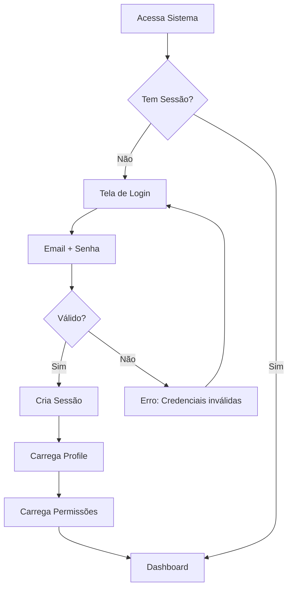
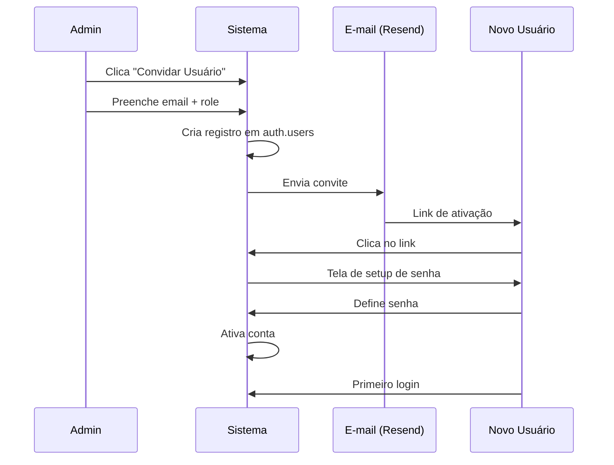
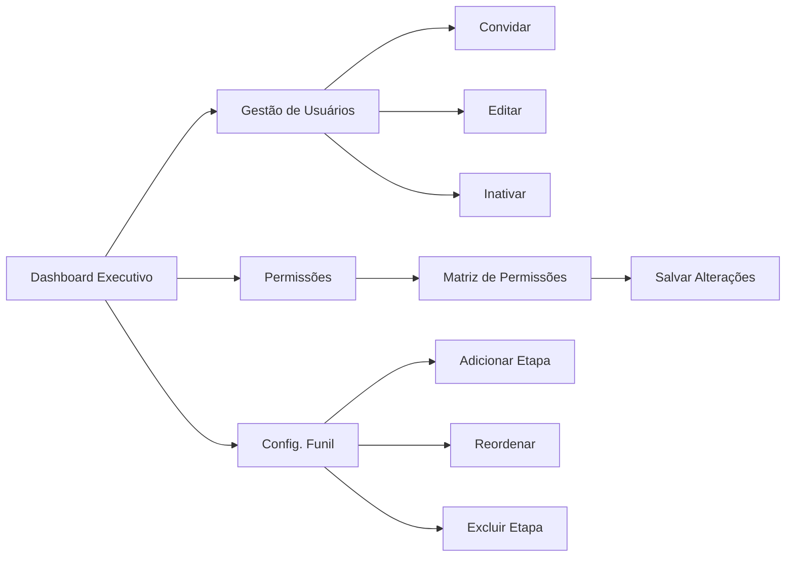
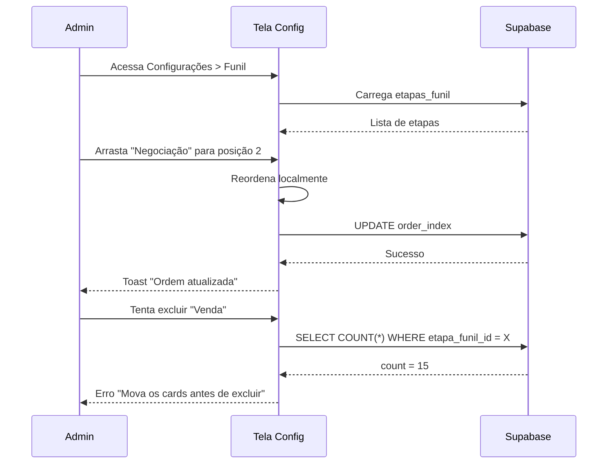
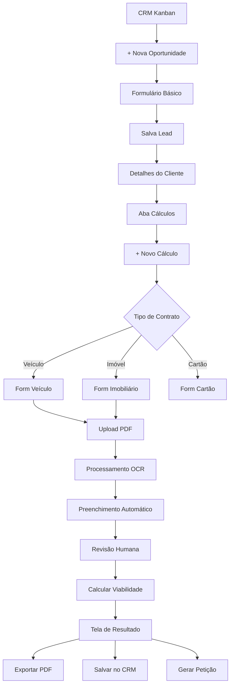
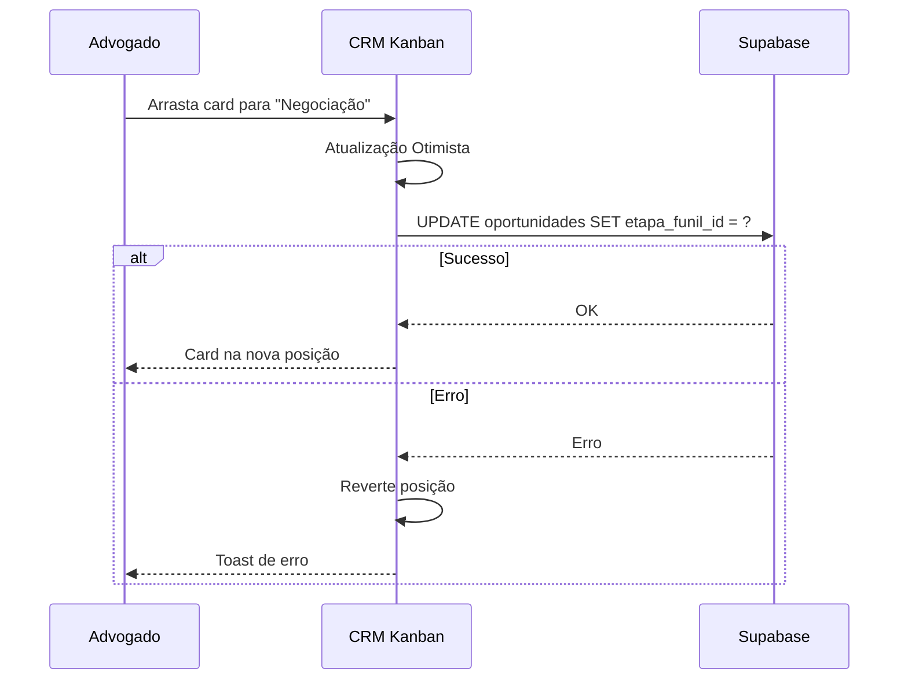
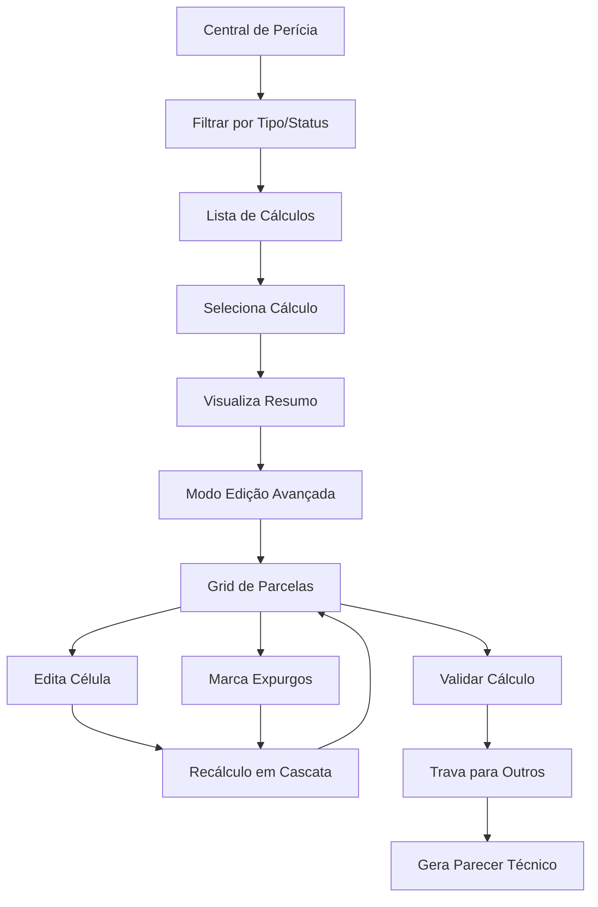
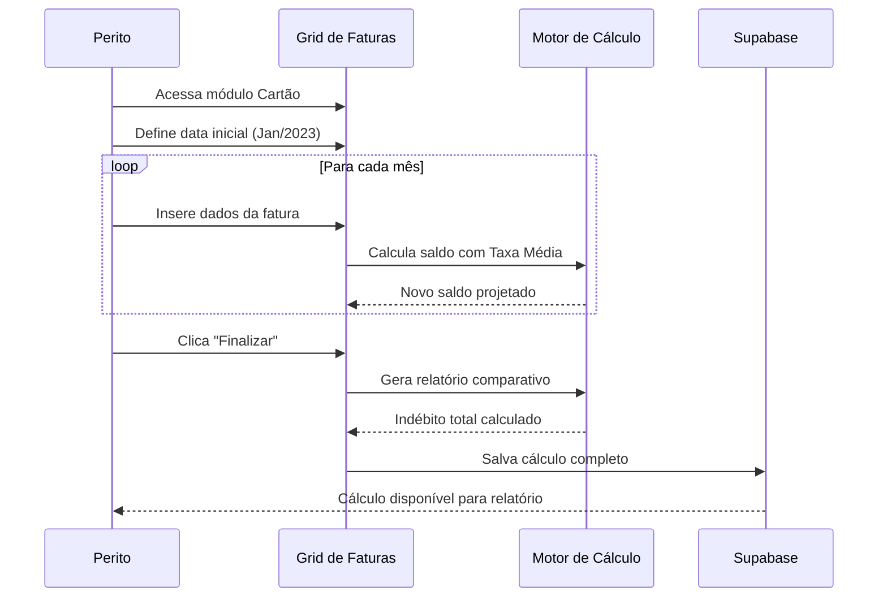
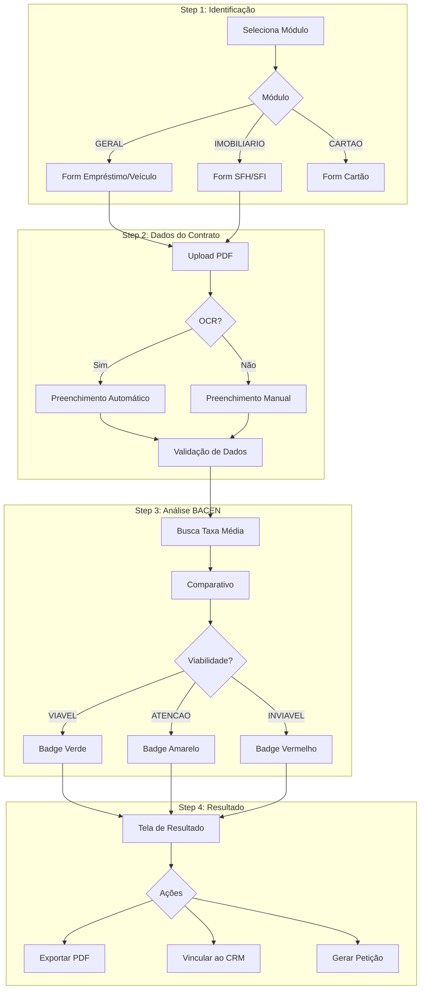
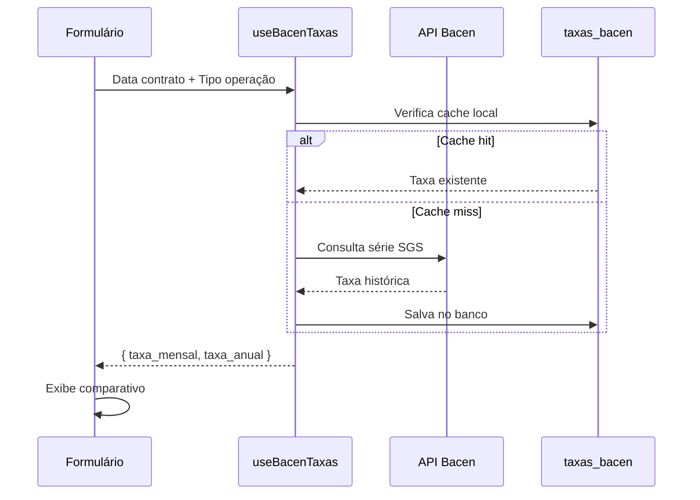

# Fluxos de Navegação - OctoApps

> **Última Atualização:** 2026-01-08

---

## Índice

1. [Fluxo de Autenticação](#fluxo-de-autenticação)
2. [Jornada do Administrador](#jornada-do-administrador)
3. [Jornada do Colaborador](#jornada-do-colaborador)
4. [Jornada do Perito](#jornada-do-perito)
5. [Fluxo de Cálculo Revisional](#fluxo-de-cálculo-revisional)

---

## Fluxo de Autenticação

### Login



### Convite de Usuário



---

## Jornada do Administrador

### Dashboard → Configurações



### Configuração de Funil



---

## Jornada do Colaborador

### Do Lead à Análise de Viabilidade



### Movimentação no Kanban



---

## Jornada do Perito

### Auditoria e Validação



### Reconstrução de Cartão de Crédito



---

## Fluxo de Cálculo Revisional

### Wizard Completo



### Integração com BACEN



---

## Diagrama de Rotas

```
/
├── /login                    # Autenticação
├── /setup-password           # Primeiro acesso
│
├── /_authenticated/          # Rotas protegidas
│   ├── /dashboard            # Dashboard principal
│   │   └── /executivo        # Dashboard executivo (Admin)
│   │
│   ├── /crm/
│   │   ├── /oportunidades    # Pipeline Kanban
│   │   ├── /oportunidade/:id # Detalhes
│   │   └── /contatos         # Lista de contatos
│   │
│   ├── /calc/
│   │   ├── /wizard           # Novo cálculo
│   │   ├── /:id              # Detalhes do cálculo
│   │   ├── /pericia          # Central do Perito
│   │   └── /lista            # Lista de cálculos
│   │
│   ├── /configuracoes/
│   │   ├── /usuarios         # Gestão de usuários
│   │   ├── /permissoes       # Matriz de permissões
│   │   ├── /funil            # Etapas do pipeline
│   │   └── /minha-conta      # Perfil pessoal
│   │
│   └── /peticoes/            # Gerador de petições
│       ├── /templates        # Gestão de templates
│       └── /nova             # Gerar petição
```

---

*Documentação de Fluxos - OctoApps*
