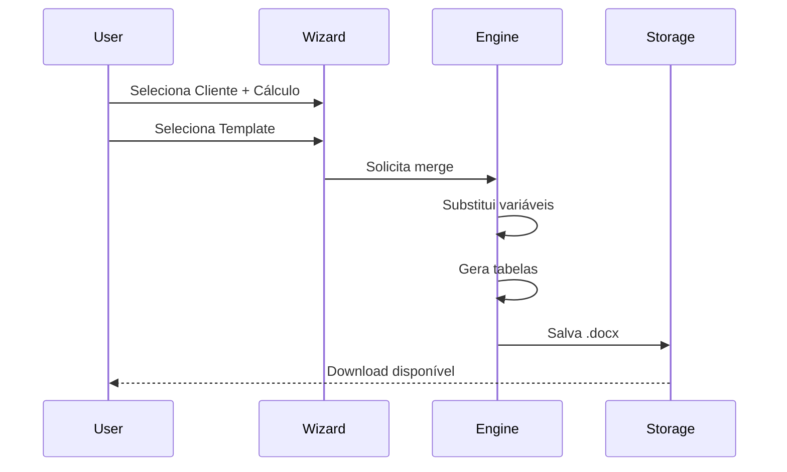

# Módulos do Sistema - OctoApps

> **Última Atualização:** 2026-01-08

---

## Índice

1. [CRM (Gestão de Relacionamento)](#crm-gestão-de-relacionamento)
2. [Cálculo Revisional](#cálculo-revisional)
3. [OCR / Automação IA](#ocr--automação-ia)
4. [Gerador de Petições](#gerador-de-petições)
5. [Administração](#administração)

---

## CRM (Gestão de Relacionamento)

### Objetivo
Centralizar a gestão do ciclo de vida do cliente e garantir a integridade dos dados para os cálculos.

### Sub-módulos

#### 1. Pipeline (Kanban)
- **Interface**: Quadro visual com colunas dinâmicas
- **Funcionalidades**:
  - Drag-and-drop de cards entre etapas
  - Gestão de etapas (Admin: criar/editar/excluir)
  - Filtros por responsável, tipo, data e status

#### 2. Oportunidades (Cards)
- **Estrutura de Dados**:
  - **Identificação**: Nome, CPF/CNPJ, E-mail, Telefone
  - **Processual**: Tipo de Ação, Valor da Causa, Nº Processo
  - **Origem**: Canal de aquisição
- **Tabs**: Visão Geral | Timeline | Cálculos | Documentos | Agenda

### Tabelas Relacionadas

| Tabela | Descrição |
|--------|-----------|
| `oportunidades` | Dossiê do cliente/lead |
| `contatos` | Pessoas físicas/jurídicas |
| `etapas_funil` | Colunas do Kanban |
| `tarefas` | Atividades vinculadas |

### Rotas Principais

| Rota | Descrição |
|------|-----------|
| `/crm/oportunidades` | Pipeline Kanban |
| `/crm/oportunidade/:id` | Detalhes do cliente |
| `/crm/contatos` | Lista de contatos |

---

## Cálculo Revisional

### Objetivo
Motor matemático de alta precisão para identificar abusividades e recalcular dívidas.

### Sub-módulos

#### 1. Motor Geral (Veículos e Empréstimos)
- **Sistemas suportados**: Tabela Price, CDC
- **Inputs**:
  - Valor Financiado, Taxa de Juros, Data Contrato, Prazo
  - Capitalização: Mensal ou Diária
  - Tarifas para expurgo (TAC, Seguros, Registro)

#### 2. Motor Imobiliário (SFH/SFI)
- **Complexidade**: Alta (Correção Monetária + Seguros)
- **Inputs específicos**:
  - Sistema de Amortização: SAC, Price, SACRE
  - Indexador (obrigatório): TR, IPCA, INPC, IGPM
  - Seguros: MIP, DFI

#### 3. Motor Cartão de Crédito
- **Interface**: Grid editável para input de faturas
- **Estrutura por mês**:
  - Data Vencimento, Total da Fatura, Pagamento, Compras, Encargos
- **Algoritmo**: Recomposição de dívida com taxa média de mercado

#### 4. Ferramentas do Perito
- **Edição Avançada (Overrides)**: Alterar parcelas específicas
- **Validação**: Botão para travar edições

### Integração BACEN

```typescript
// Consulta automática de Taxa Média de Mercado
const taxa = await buscarTaxaBacen({
  dataContrato: '2024-01-15',
  modalidade: 'VEICULO_PF'
});
```

### Tabelas Relacionadas

| Tabela | Descrição |
|--------|-----------|
| `contratos_revisionais` | Dados do wizard |
| `resultado_analise_previa` | Resultados da análise |
| `taxas_bacen` | Taxas históricas do BC |
| `fluxo_caixa` | Fluxos originais/revisados |

### Rotas Principais

| Rota | Descrição |
|------|-----------|
| `/calc/wizard` | Wizard de novo cálculo |
| `/calc/:id/resultado` | Resultado da análise |
| `/calc/pericia` | Central do Perito |

---

## OCR / Automação IA

### Objetivo
Reduzir o tempo de data entry lendo contratos PDF.

### Fluxo de Processamento


### Dados Extraídos

| Campo | Descrição |
|-------|-----------|
| `valor_financiado` | Montante principal |
| `taxa_mensal` | Taxa de juros a.m. |
| `taxa_anual` | Taxa de juros a.a. |
| `data_contrato` | Data de assinatura |
| `primeiro_vencimento` | Data da 1ª parcela |
| `prazo_meses` | Quantidade de parcelas |
| `sistema_amortizacao` | Price, SAC, etc. |

### Regras de Negócio

- **RN-001**: Converter formato BR (`1.000,00`) para DB (`1000.00`)
- **RN-002**: Priorizar Taxa Efetiva sobre Taxa Nominal
- **RN-003**: Falhar imediato em PDFs com senha

### Tabela Relacionada

| Tabela | Descrição |
|--------|-----------|
| `ocr_logs` | Histórico de processamentos |

---

## Gerador de Petições

### Objetivo
Transformar dados estruturados em peças jurídicas finais.

### Funcionalidades

1. **Gestão de Templates**: Upload de modelos .docx com variáveis
2. **Motor de Merge**: Substituição de `{{variáveis}}`
3. **Geração de Tabelas**: JSON → Tabela Word

### Variáveis Disponíveis

```
{{cliente.nome}}
{{cliente.cpf}}
{{cliente.endereco}}
{{calculo.valor_financiado}}
{{calculo.economia_estimada}}
{{calculo.taxa_contrato}}
{{calculo.taxa_media_bacen}}
{{banco.nome}}
{{processo.numero}}
```

### Fluxo de Geração



---

## Administração

### Objetivo
Controle estratégico e configuração do sistema.

### Funcionalidades

#### 1. Gestão de Usuários
- Convites via e-mail (Resend)
- Inativação de contas
- Atribuição de roles

#### 2. Configuração de Funil
- Criar/Editar/Excluir etapas
- Reordenação drag-and-drop
- **Regra**: Não pode excluir etapa com oportunidades

#### 3. Permissões
- Matriz de módulo × ação
- Override individual por usuário
- Realtime sync

#### 4. Dashboard Executivo
- KPIs consolidados
- Gráfico de conversão
- Atividades da equipe

### Rotas Exclusivas (Admin)

| Rota | Descrição |
|------|-----------|
| `/configuracoes/usuarios` | Gestão de membros |
| `/configuracoes/permissoes` | Matriz de permissões |
| `/configuracoes/funil` | Etapas do pipeline |
| `/dashboard/executivo` | Métricas gerenciais |

---

*Documentação de Módulos - OctoApps*
