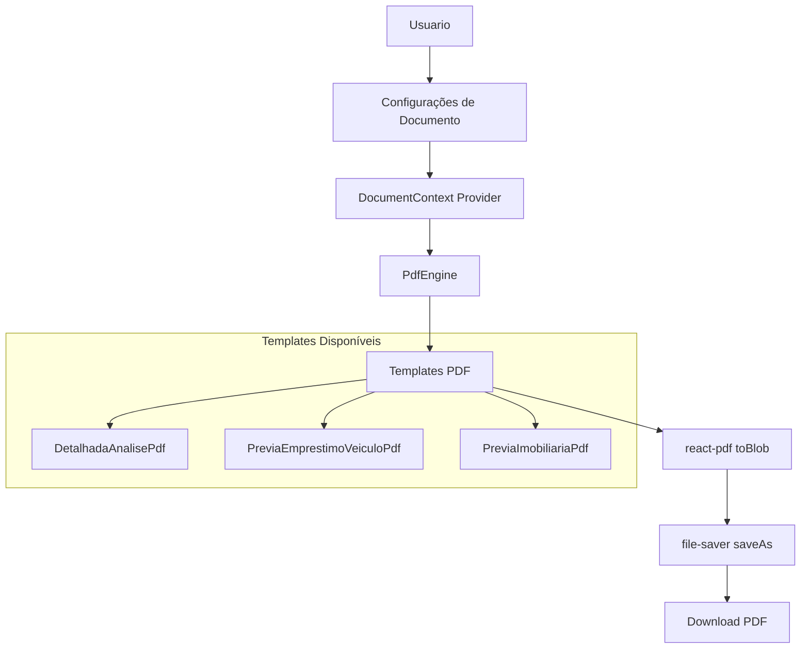

# Sistema de Geração de PDF - Documentação Técnica

> **Versão:** 1.0  
> **Data:** 2026-01-08  
> **Status:** Ativo

---

## 1. Visão Geral

O OctoApps utiliza o **@react-pdf/renderer** para gerar documentos PDF client-side. O sistema é composto por:

- **Motor Central** (`PdfEngine.tsx`) - Estilos compartilhados e utilidades
- **Tipos e Configurações** (`DocumentTypes.ts`) - Interface de settings do usuário
- **Context Provider** (`DocumentContext.tsx`) - Gerenciamento de estado global
- **Templates** - Componentes React para cada tipo de documento
- **Preview** (`PdfPreviewPanel.tsx`) - Pré-visualização em HTML



---

## 2. Arquitetura de Componentes

### 2.1 PdfEngine.tsx
**Localização:** `src/components/pdf-engine/PdfEngine.tsx`

Motor central que define estilos padrão compartilhados por todos os templates.

```typescript
// Estilos Comuns
export const commonStyles = StyleSheet.create({
    page: { paddingTop: 35, paddingBottom: 65, paddingHorizontal: 35, fontFamily: 'Helvetica' },
    header: { marginBottom: 20, borderBottomWidth: 1, borderBottomColor: '#111', paddingBottom: 10 },
    title: { fontSize: 24, textAlign: 'center', marginBottom: 10 },
    subtitle: { fontSize: 12, textAlign: 'center', marginBottom: 20, color: '#666' },
    text: { fontSize: 10, marginBottom: 10, lineHeight: 1.5, textAlign: 'justify' },
    footer: { position: 'absolute', bottom: 30, left: 0, right: 0, textAlign: 'center', color: 'grey', fontSize: 8 },
    watermark: { position: 'absolute', top: '30%', left: '25%', width: '50%', height: '50%', opacity: 0.1, transform: 'rotate(-45deg)', zIndex: -1 }
});

export const PdfEngine = {
    styles: commonStyles,
    createStyles: (styles) => StyleSheet.create(styles)
};
```

### 2.2 DocumentTypes.ts
**Localização:** `src/components/pdf-engine/DocumentTypes.ts`

Define a interface de configurações personalizáveis pelo usuário:

```typescript
export interface UserDocumentSettings {
    id?: string;
    user_id?: string;
    logo_url?: string | null;           // Logo do escritório
    watermark_url?: string | null;      // Marca d'água
    watermark_opacity?: number;         // 0.0 a 1.0
    watermark_scale?: number;           // 0.2 a 1.0
    primary_color?: string;             // Cor primária (hex)
    secondary_color?: string;           // Cor secundária (hex)
    table_header_bg?: string;           // Background cabeçalho tabela
    table_border_color?: string;        // Cor bordas tabela
    heading_color?: string;             // Cor títulos
    text_color?: string;                // Cor texto
    header_text?: string;               // Texto timbre (nome empresa/CNPJ)
    footer_text?: string | null;        // Rodapé personalizado
    show_page_numbers?: boolean;        // Exibir numeração
}

export const DEFAULT_SETTINGS: UserDocumentSettings = {
    primary_color: '#000000',
    secondary_color: '#6b7280',
    watermark_opacity: 0.15,
    watermark_scale: 0.5,
    show_page_numbers: true,
    table_header_bg: '#f1f5f9',
    table_border_color: '#e2e8f0',
    heading_color: '#334155',
    text_color: '#0f172a',
};
```

### 2.3 DocumentContext.tsx
**Localização:** `src/components/pdf-engine/DocumentContext.tsx`

Provider React que carrega as configurações do usuário do Supabase:

```typescript
export function DocumentSettingsProvider({ children }: { children: React.ReactNode }) {
    const [settings, setSettings] = useState<UserDocumentSettings>(DEFAULT_SETTINGS);
    const [loading, setLoading] = useState(true);

    const fetchSettings = async () => {
        const { data: { user } } = await supabase.auth.getUser();
        if (!user) return;

        const { data } = await supabase
            .from('user_document_settings')
            .select('*')
            .eq('user_id', user.id)
            .single();

        if (data) {
            setSettings({ ...DEFAULT_SETTINGS, ...data });
        }
    };

    // ...
}

export function useDocumentSettings() {
    const context = useContext(DocumentContext);
    if (context === undefined) {
        throw new Error('useDocumentSettings must be used within a DocumentSettingsProvider');
    }
    return context;
}
```

---

## 3. Templates Disponíveis

### 3.1 DetalhadaAnalisePdf (Parecer Técnico)
**Localização:** `src/components/pdf-templates/detalhada-analise-pdf.tsx`

| Página | Conteúdo |
|--------|----------|
| 1 | Capa com classificação de risco, KPIs, dados do contrato, análise de taxas |
| 2 | Apêndice AP-01: Evolução Saldo Devedor (Banco) |
| 3 | Apêndice AP-02: Evolução Saldo Devedor (Recalculado) |
| 4 | Apêndice AP-03: Demonstrativo de Diferenças Mensais |

**Props:**
```typescript
interface LaudoRevisionalTemplateProps {
    formData: Partial<DetalhadaPageData>;
    resultado: CalculoDetalhadoResponse;
    dashboard: {
        kpis: { economiaTotal, parcelaOriginalValor, novaParcelaValor, taxaPraticada, taxaMercado, ... };
        totais: { totalPagoBanco, totalJurosBanco, totalPagoRecalculado, ... };
        evolucao: Array<{ mes, saldoBanco, saldoRecalculado, diferenca }>;
    };
    settings: UserDocumentSettings;
}
```

### 3.2 PreviaEmprestimoVeiculoPdf (Dossiê de Viabilidade - Veículos)
**Localização:** `src/components/pdf-templates/previa-emprestimo-veiculo-pdf.tsx`

Documento de página única para triagem rápida de empréstimos pessoais e financiamentos de veículos.

**Seções:**
- Banner de classificação (VIÁVEL / ATENÇÃO / INVIÁVEL)
- Cards de economia potencial e sobretaxa
- Tabela de composição da economia
- Análise de taxas de juros
- Comparativo de prestações
- Alertas (capitalização diária, carência)
- Recomendação técnica

### 3.3 PreviaImobiliariaPdf (Dossiê Imobiliário)
**Localização:** `src/components/pdf-templates/previa-imobiliaria-pdf.tsx`

Documento de página única para análise de financiamentos imobiliários (SFH/SFI).

**Seções:**
- Banner de classificação
- Cards de economia estimada e sobretaxa
- Dados do contrato
- Comparativo de cenários (Contrato vs Taxa Média vs Juros Simples)
- Análise de taxas de juros

---

## 4. Fluxo de Geração de PDF

### 4.1 No Cálculo Revisional (detalhada-page.tsx)

```typescript
// 1. Importações
import { pdf } from '@react-pdf/renderer';
import { saveAs } from 'file-saver';
import { DetalhadaAnalisePdf } from '@/components/pdf-templates/detalhada-analise-pdf';
import { useDocumentSettings } from '../pdf-engine/DocumentContext';

// 2. Obter settings via hook
const { settings } = useDocumentSettings();

// 3. Função de exportação
const handleExportPDF = async () => {
    if (!calculationResult || !dashboardData) {
        toast.warning('É necessário gerar o resultado primeiro');
        return;
    }

    try {
        toast.loading('Gerando PDF...', { id: 'pdf-loading' });

        // Criar componente do documento
        const doc = (
            <DetalhadaAnalisePdf
                formData={formData}
                resultado={calculationResult}
                dashboard={dashboardData}
                settings={settings || {}}
            />
        );

        // Gerar blob
        const blob = await pdf(doc).toBlob();

        // Iniciar download
        const nomeArquivo = `Parecer_${formData.devedor || 'Cliente'}_${Date.now()}.pdf`;
        saveAs(blob, nomeArquivo);

        toast.dismiss('pdf-loading');
        toast.success('PDF gerado com sucesso!');
    } catch (error) {
        toast.dismiss('pdf-loading');
        toast.error('Erro ao gerar PDF');
        console.error('[PDF Export] Erro:', error);
    }
};
```

### 4.2 Condições para Habilitação do Botão

O botão "Baixar PDF" só é habilitado quando:
1. `calculationResult` não é null (cálculo foi executado)
2. `dashboardData` não é null (dados processados)

```tsx
<Button
    onClick={handleExportPDF}
    disabled={!calculationResult}  // Condição principal
>
    <Download className="h-4 w-4 mr-1" />
    Baixar PDF
</Button>
```

---

## 5. Tabela do Supabase

### user_document_settings

```sql
CREATE TABLE user_document_settings (
    id UUID PRIMARY KEY DEFAULT uuid_generate_v4(),
    user_id UUID REFERENCES auth.users(id) ON DELETE CASCADE,
    logo_url TEXT,
    watermark_url TEXT,
    watermark_opacity DECIMAL(3,2) DEFAULT 0.15,
    watermark_scale DECIMAL(3,2) DEFAULT 0.5,
    primary_color VARCHAR(7) DEFAULT '#000000',
    secondary_color VARCHAR(7) DEFAULT '#6b7280',
    table_header_bg VARCHAR(7) DEFAULT '#f1f5f9',
    table_border_color VARCHAR(7) DEFAULT '#e2e8f0',
    heading_color VARCHAR(7) DEFAULT '#334155',
    text_color VARCHAR(7) DEFAULT '#0f172a',
    header_text TEXT,
    footer_text TEXT,
    show_page_numbers BOOLEAN DEFAULT true,
    created_at TIMESTAMPTZ DEFAULT NOW(),
    updated_at TIMESTAMPTZ DEFAULT NOW(),
    UNIQUE(user_id)
);

-- RLS Policy
ALTER TABLE user_document_settings ENABLE ROW LEVEL SECURITY;
CREATE POLICY "Users can manage own settings" ON user_document_settings
    FOR ALL USING (auth.uid() = user_id);
```

---

## 6. Limitações Conhecidas

| Limitação | Descrição | Workaround |
|-----------|-----------|------------|
| Fontes | Somente Helvetica built-in | Registrar fontes customizadas via `Font.register()` |
| Imagens | Requer URL absoluta acessível | Usar Storage Supabase com URLs públicas |
| Tabelas truncadas | AP-01/02 limitadas a 30 linhas no PDF | Por design para evitar PDFs muito longos |
| Performance | Geração pode levar 2-5s | Exibir loading adequado |
| Flex Gap | Não suportado nativamente | Usar `marginBottom` ou views vazias |

---

## 7. Boas Práticas

1. **Sempre usar `PdfEngine.styles`** como base para novos templates
2. **Estender estilos** com `PdfEngine.createStyles()` para manter consistência
3. **Passar `settings` sempre**, usar `DEFAULT_SETTINGS` como fallback
4. **Componentes `fixed`** para header/footer que devem repetir em todas as páginas
5. **Watermark** deve ter `zIndex: -1` para ficar atrás do conteúdo
6. **Testar taxas** - verificar se valores vêm como decimal (0.27) ou percentual (27%)

---

## 8. Referências

- [react-pdf Documentação](https://react-pdf.org/)
- [file-saver NPM](https://www.npmjs.com/package/file-saver)
- [Supabase Storage](https://supabase.com/docs/guides/storage)
