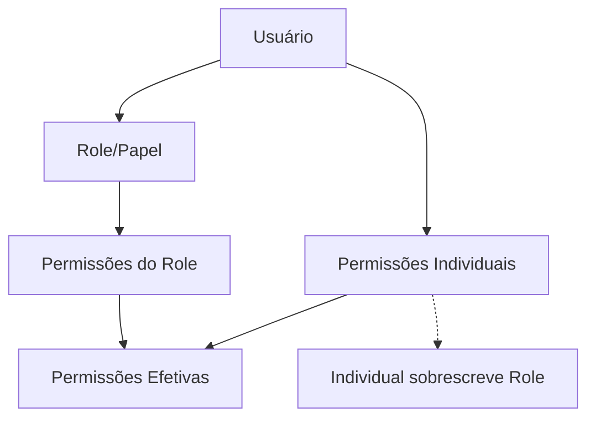
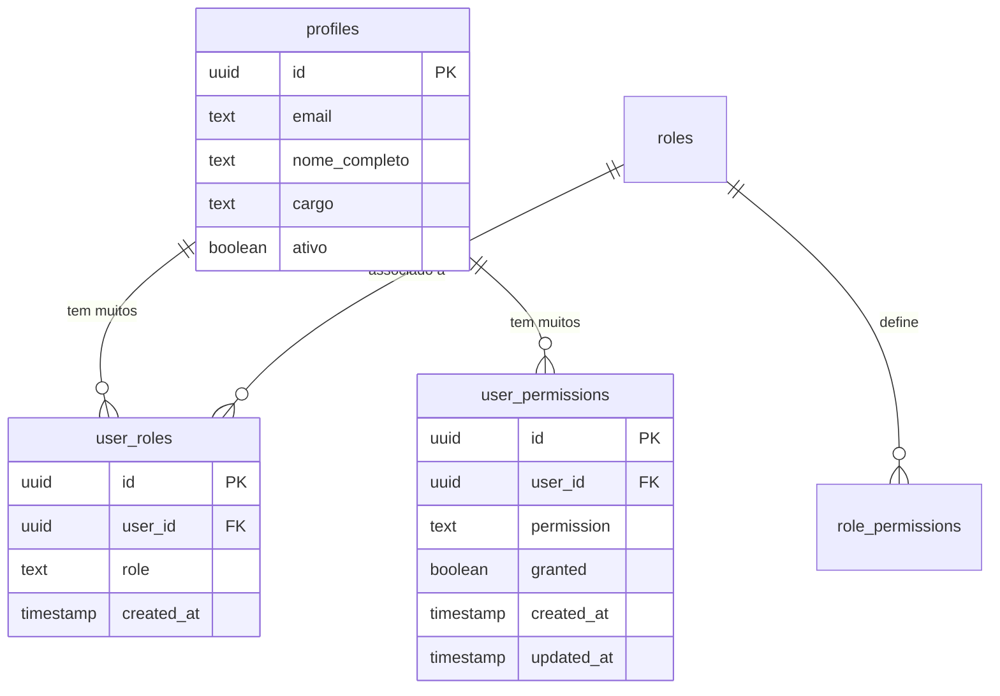
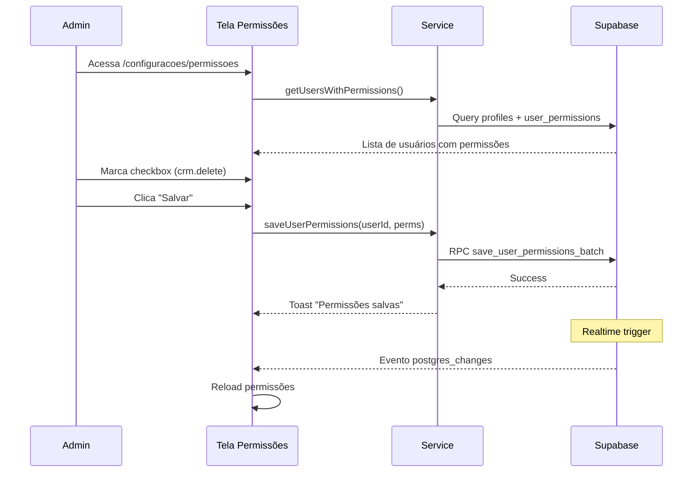
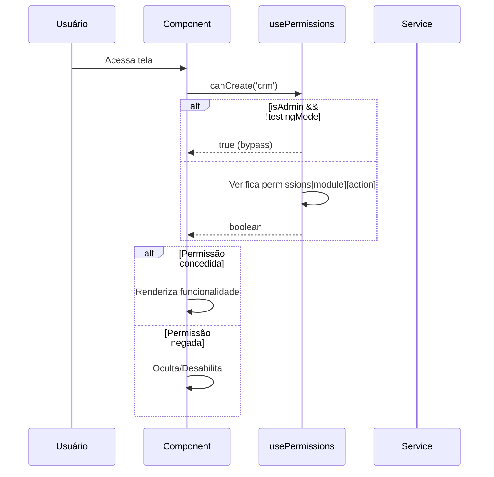

# Sistema de Permissões - OctoApps

> **Última Atualização:** 2026-01-08

---

## Índice

1. [Visão Geral](#visão-geral)
2. [Arquitetura de Dados](#arquitetura-de-dados)
3. [Tipos de Permissões](#tipos-de-permissões)
4. [Implementação Frontend](#implementação-frontend)
5. [Políticas de Segurança (RLS)](#políticas-de-segurança-rls)
6. [Fluxos de Gerenciamento](#fluxos-de-gerenciamento)

---

## Visão Geral

O OctoApps implementa um sistema de **permissões granulares** baseado em:

1. **Roles (Papéis)**: Conjuntos predefinidos de permissões herdadas
2. **Permissões Individuais**: Overrides específicos por usuário
3. **Permissões Efetivas**: Resultado da combinação role + individual



---

## Arquitetura de Dados

### Tabelas do Banco de Dados



### Tabela: `user_roles`

| Coluna | Tipo | Descrição |
|--------|------|-----------|
| `id` | UUID | Identificador único |
| `user_id` | UUID | FK para `auth.users.id` |
| `role` | TEXT | Nome do papel (admin, advogado, perito) |
| `created_at` | TIMESTAMPTZ | Data de criação |

**Constraint Unique:** `(user_id, role)`

### Tabela: `user_permissions`

| Coluna | Tipo | Descrição |
|--------|------|-----------|
| `id` | UUID | Identificador único |
| `user_id` | UUID | FK para `auth.users.id` |
| `permission` | TEXT | Código da permissão (formato: `module.action`) |
| `granted` | BOOLEAN | Se a permissão está concedida |
| `created_at` | TIMESTAMPTZ | Data de criação |
| `updated_at` | TIMESTAMPTZ | Data de atualização |

**Constraint Unique:** `(user_id, permission)`

---

## Tipos de Permissões

### Módulos do Sistema

| Código | Nome | Descrição |
|--------|------|-----------|
| `crm` | Pipeline | Gestão de oportunidades no Kanban |
| `contacts` | Contatos | Leads e clientes do escritório |
| `calculations` | Cálculos | Motor de cálculo revisional |
| `petitions` | Petições | Geração de documentos |

### Ações (CLED)

| Código | Nome | Descrição |
|--------|------|-----------|
| `create` | Criar | Criar novos registros |
| `read` | Ler | Visualizar dados |
| `update` | Editar | Modificar registros existentes |
| `delete` | Deletar | Excluir registros |

### Formato da Permissão

```
{module_code}.{action_code}
```

**Exemplos:**
- `crm.create` - Criar oportunidades
- `contacts.read` - Visualizar contatos
- `calculations.update` - Editar cálculos
- `petitions.delete` - Excluir petições

---

## Implementação Frontend

### Hook: `usePermissions`

**Localização:** `src/hooks/usePermissions.ts`

```typescript
import { usePermissions } from '../../hooks/usePermissions';

function MyComponent() {
  const { 
    can,           // Verificação genérica
    canCreate,     // Atalho para create
    canRead,       // Atalho para read
    canUpdate,     // Atalho para update
    canDelete,     // Atalho para delete
    canManagePermissions, // Apenas admins
    loading,
    error 
  } = usePermissions();

  // Verificação simples
  if (canCreate('crm')) {
    // Mostrar botão de criar
  }

  // Verificação genérica
  if (can('calculations', 'update')) {
    // Permitir edição
  }
}
```

### Hook: `useModulePermissions`

Para componentes focados em um módulo específico:

```typescript
import { useModulePermissions } from '../../hooks/usePermissions';

function CRMComponent() {
  const { canCreate, canRead, canUpdate, canDelete } = useModulePermissions('crm');
  
  // Todas as verificações são para o módulo 'crm'
}
```

### Verificações Avançadas

```typescript
const { canAll, canAny, getModulePermissions } = usePermissions();

// Verificar múltiplas permissões (AND)
const canFullAccess = canAll([
  { module: 'crm', action: 'create' },
  { module: 'crm', action: 'delete' }
]);

// Verificar pelo menos uma (OR)
const canSomeAccess = canAny([
  { module: 'crm', action: 'update' },
  { module: 'contacts', action: 'update' }
]);

// Obter todas as permissões de um módulo
const crmPerms = getModulePermissions('crm');
// { create: true, read: true, update: false, delete: false }
```

### Service Layer

**Localização:** `src/services/permissions.service.ts`

```typescript
import { permissionsService } from '../services/permissions.service';

// Buscar permissões efetivas de um usuário
const perms = await permissionsService.getUserEffectivePermissions(userId);

// Salvar permissões (apenas admin)
await permissionsService.saveUserPermissions(userId, {
  crm: { create: true, read: true, update: true, delete: false },
  contacts: { create: true, read: true, update: false, delete: false }
});
```

---

## Políticas de Segurança (RLS)

### Row Level Security

Todas as tabelas possuem RLS habilitado para garantir:
- **Multi-tenancy**: Isolamento de dados entre escritórios
- **Segurança por usuário**: Acesso apenas aos próprios dados

### Exemplo: Política de Oportunidades

```sql
-- Usuários podem ver oportunidades que criaram ou são responsáveis
CREATE POLICY "Users can view own opportunities" ON oportunidades
FOR SELECT USING (
    criado_por = auth.uid() 
    OR responsavel_id = auth.uid()
);

-- Admins têm acesso total
CREATE POLICY "Admins full access" ON oportunidades
FOR ALL USING (
    EXISTS (
        SELECT 1 FROM user_roles 
        WHERE user_id = auth.uid() 
        AND role = 'admin'
    )
);
```

### Função RPC: `get_user_effective_permissions`

Retorna as permissões efetivas combinando roles e individuais:

```sql
CREATE OR REPLACE FUNCTION get_user_effective_permissions(target_user_id UUID)
RETURNS TABLE (
    module_code TEXT,
    action_code TEXT,
    granted BOOLEAN,
    source TEXT
) AS $$
BEGIN
    -- Lógica de combinação:
    -- 1. Buscar permissões do role
    -- 2. Aplicar overrides individuais
    -- 3. Retornar resultado efetivo
END;
$$ LANGUAGE plpgsql SECURITY DEFINER;
```

### Função RPC: `save_user_permissions_batch`

Salva permissões em lote (apenas admins):

```sql
CREATE OR REPLACE FUNCTION save_user_permissions_batch(
    target_user_id UUID,
    permissions_json JSONB
) RETURNS VOID AS $$
BEGIN
    -- Validar se usuário atual é admin
    IF NOT is_admin() THEN
        RAISE EXCEPTION 'Apenas administradores podem alterar permissões';
    END IF;
    
    -- Upsert das permissões
    INSERT INTO user_permissions (user_id, permission, granted)
    SELECT 
        target_user_id,
        (elem->>'module_code') || '.' || (elem->>'action_code'),
        (elem->>'granted')::boolean
    FROM jsonb_array_elements(permissions_json) elem
    ON CONFLICT (user_id, permission) 
    DO UPDATE SET granted = EXCLUDED.granted, updated_at = now();
END;
$$ LANGUAGE plpgsql SECURITY DEFINER;
```

---

## Fluxos de Gerenciamento

### Fluxo: Conceder Permissão



### Fluxo: Verificação de Permissão (Runtime)



---

## Componente de Gerenciamento

**Localização:** `src/components/users/PermissionsManagement.tsx`

**Rota:** `/configuracoes/permissoes` (apenas Admin)

### Features

1. **Tabela de Usuários**: Lista todos os usuários com seus roles
2. **Matriz de Checkboxes**: Módulo x Ação para cada usuário
3. **Salvamento Individual**: Por usuário
4. **Realtime Updates**: Sincronização automática

### Estrutura Visual

```
┌────────────────────────────────────────────────────────────┐
│ Gerenciamento de Permissões                                │
├─────────────────┬──────────────────────────────────────────┤
│ Usuário         │ CRM    │ Contatos │ Cálculos │ Petições  │
│                 │ C R U D│ C R U D  │ C R U D  │ C R U D   │
├─────────────────┼────────┼──────────┼──────────┼───────────┤
│ João (Admin)    │ ✓ ✓ ✓ ✓│ ✓ ✓ ✓ ✓  │ ✓ ✓ ✓ ✓  │ ✓ ✓ ✓ ✓   │
│ Maria (Advogada)│ ✓ ✓ ✓ ○│ ✓ ✓ ○ ○  │ ✓ ✓ ✓ ○  │ ✓ ✓ ✓ ○   │
│ Diego (Perito)  │ ○ ✓ ○ ○│ ○ ✓ ○ ○  │ ✓ ✓ ✓ ✓  │ ✓ ✓ ✓ ○   │
└─────────────────┴────────┴──────────┴──────────┴───────────┘
                    C=Criar R=Ler U=Editar D=Deletar
```

---

*Documentação de Permissões - OctoApps*
