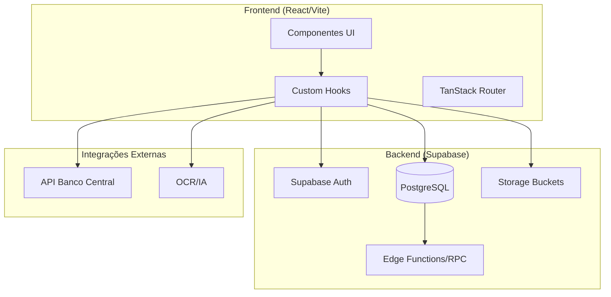
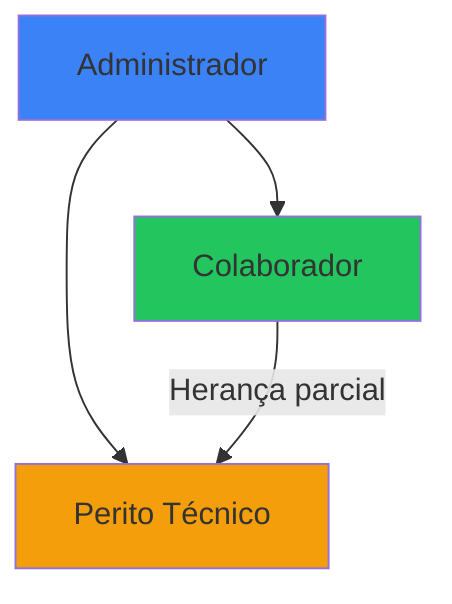

# Documentação Técnica Geral - OctoApps

> **Última Atualização:** 2026-01-08  
> **Versão:** 1.0

---

## Índice

1. [Visão Geral do Sistema](#visão-geral-do-sistema)
2. [Arquitetura](#arquitetura)
3. [Hierarquia de Usuários](#hierarquia-de-usuários)
4. [Sistema de Permissões](#sistema-de-permissões)
5. [Módulos do Sistema](#módulos-do-sistema)
6. [Stack Tecnológica](#stack-tecnológica)
7. [Documentos Relacionados](#documentos-relacionados)

---

## Visão Geral do Sistema

O **OctoApps** é uma plataforma SaaS jurídico-financeira que centraliza:
- **CRM (Gestão de Relacionamento)**: Pipeline Kanban para gestão de leads e oportunidades
- **Cálculos Revisionais**: Motor matemático de alta precisão para análise de contratos bancários
- **Geração de Petições**: Templates automatizados com merge de dados
- **Automação OCR**: Extração inteligente de dados de contratos PDF

### Público-Alvo
- Escritórios de advocacia bancária
- Peritos financeiros/contábeis
- Profissionais de revisão contratual

### Problema Resolvido
| Dor | Solução |
|-----|---------|
| Ineficiência operacional com planilhas | Plataforma integrada com CRM + Cálculos |
| Risco de erro em cálculos financeiros | Motor com `Decimal.js` para precisão de centavos |
| Falta de rastreabilidade | Timeline completa e histórico de versões |

---

## Arquitetura

### Diagrama de Alto Nível



### Padrão Arquitetural

O projeto segue **Feature-Based Architecture**:

```
src/
├── components/
│   ├── auth/           # Autenticação
│   ├── calculations/   # Módulo de cálculos
│   ├── crm/            # CRM/Pipeline
│   ├── contacts/       # Gestão de contatos
│   ├── layout/         # Sidebar, Header
│   └── ui/             # Componentes base (shadcn)
├── hooks/              # Custom hooks
├── services/           # Lógica de negócio
├── types/              # TypeScript types
└── lib/                # Supabase client, utils
```

---

## Hierarquia de Usuários

O sistema define **3 perfis principais** de usuários:



### Quadro Comparativo de Perfis

| Perfil | Descrição | Acesso Principal |
|--------|-----------|------------------|
| **Administrador** | Sócios/Gestores do escritório | Acesso total (CRUD completo) |
| **Colaborador** | Advogados, assistentes jurídicos | Operacional (CRM, Cálculos básicos) |
| **Perito Técnico** | Especialista financeiro/contábil | Cálculos avançados + Validação |

---

## Sistema de Permissões

O sistema implementa um modelo de **permissões granulares** baseado em:
- **Roles (Papéis)**: Conjuntos predefinidos de permissões
- **Permissões Individuais**: Override para casos específicos

### Estrutura de Dados

```
profiles ─────┐
              │
user_roles ───┼─► roles ─► role_permissions
              │
user_permissions (override individual)
```

### Módulos com Permissões

| Código | Módulo | Descrição |
|--------|--------|-----------|
| `crm` | Pipeline | Gestão de oportunidades |
| `contacts` | Contatos | Leads e clientes |
| `calculations` | Cálculos | Motor revisional |
| `petitions` | Petições | Geração de documentos |

### Ações (CLED)

- `create`: Criar novos registros
- `read`: Visualizar dados
- `update`: Editar registros existentes
- `delete`: Excluir registros

### Verificação de Permissões

```typescript
// Hook usePermissions
const { canCreate, canRead, canUpdate, canDelete } = usePermissions();

// Verificar permissão específica
if (canCreate('crm')) {
  // Pode criar oportunidades
}
```

---

## Módulos do Sistema

### 1. CRM (Gestão de Relacionamento)
- Pipeline Kanban com drag-and-drop
- Etapas configuráveis pelo Admin
- Timeline de atividades

### 2. Cálculo Revisional
- **Geral/Veículos**: Tabela Price, capitalização diária
- **Imobiliário**: SAC/Price com indexadores (TR, IPCA, INPC)
- **Cartão de Crédito**: Recomposição fatura a fatura

### 3. OCR/Automação
- Extração de dados de contratos PDF
- Preenchimento automático de formulários
- Validação humana obrigatória

### 4. Gerador de Petições
- Templates Word com variáveis `{{campo}}`
- Merge automático com dados do CRM + Cálculos
- Exportação .docx editável

---

## Stack Tecnológica

| Camada | Tecnologia | Versão |
|--------|------------|--------|
| **Frontend** | React | 18.3.1 |
| **Build** | Vite | 6.3.5 |
| **Estilização** | Tailwind CSS | 4.1.18 |
| **Componentes** | shadcn/ui | - |
| **Roteamento** | TanStack Router | v1 |
| **Backend** | Supabase | - |
| **Banco de Dados** | PostgreSQL | 17.6 |
| **Linguagem** | TypeScript | 5.9.3 |
| **Cálculos** | Decimal.js | - |

---

## Documentos Relacionados

| Documento | Descrição |
|-----------|-----------|
| [USUARIOS.md](./USUARIOS.md) | Detalhamento dos perfis de usuário |
| [PERMISSOES.md](./PERMISSOES.md) | Sistema de permissões completo |
| [MODULOS.md](./MODULOS.md) | Detalhamento dos módulos |
| [SEGURANCA.md](./SEGURANCA.md) | Políticas de segurança e RLS |
| [FLUXOS.md](./FLUXOS.md) | Fluxos de navegação e processos |

---

*Documentação Técnica - OctoApps v1.0*
