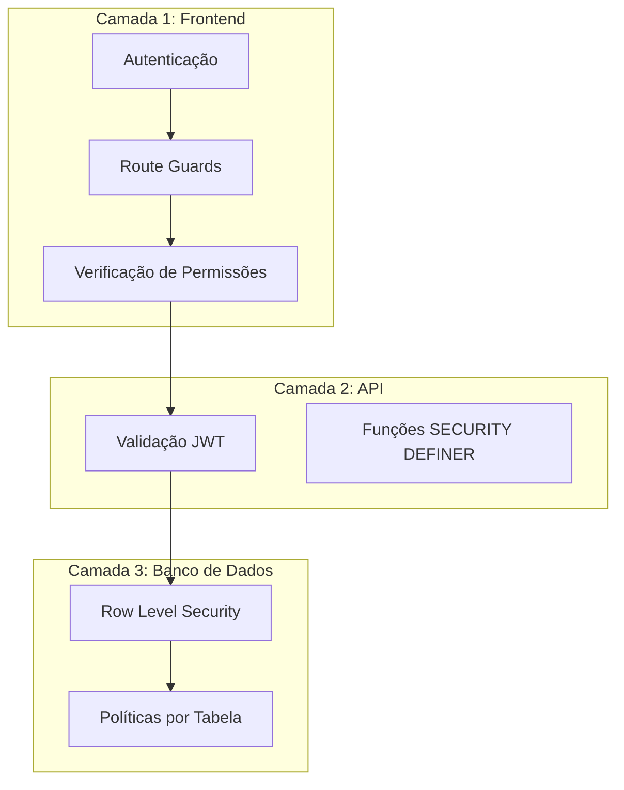

# Segurança e RLS - OctoApps

> **Última Atualização:** 2026-01-08

---

## Índice

1. [Visão Geral](#visão-geral)
2. [Autenticação](#autenticação)
3. [Row Level Security (RLS)](#row-level-security-rls)
4. [Multi-Tenancy](#multi-tenancy)
5. [Boas Práticas](#boas-práticas)

---

## Visão Geral

O OctoApps implementa segurança em múltiplas camadas:



---

## Autenticação

### Supabase Auth

O sistema utiliza **Supabase Auth** com JWT para autenticação.

```typescript
// src/lib/supabase.ts
import { createClient } from '@supabase/supabase-js';

export const supabase = createClient(
  import.meta.env.VITE_SUPABASE_URL,
  import.meta.env.VITE_SUPABASE_ANON_KEY
);
```

### Hook: useAuth

**Localização**: `src/hooks/useAuth.ts`

```typescript
const { 
  user,          // Usuário logado
  session,       // Sessão atual
  isAdmin,       // Função: verifica se é admin
  signIn,        // Login
  signOut,       // Logout
  loading 
} = useAuth();
```

### Route Guards

**Localização**: `src/routes/_authenticated.tsx`

```typescript
// TanStack Router - beforeLoad
export const Route = createFileRoute('/_authenticated')({
  beforeLoad: async ({ context }) => {
    const { session } = context.auth;
    if (!session) {
      throw redirect({ to: '/login' });
    }
  }
});
```

---

## Row Level Security (RLS)

### Conceito

RLS garante que cada query no banco de dados seja automaticamente filtrada baseada no usuário autenticado.

### Habilitação por Tabela

```sql
-- Habilitar RLS
ALTER TABLE oportunidades ENABLE ROW LEVEL SECURITY;
ALTER TABLE contatos ENABLE ROW LEVEL SECURITY;
ALTER TABLE contratos_revisionais ENABLE ROW LEVEL SECURITY;
-- ... (todas as tabelas)
```

### Políticas Comuns

#### 1. Usuário vê próprios registros

```sql
CREATE POLICY "users_own_records" ON oportunidades
FOR SELECT USING (
    criado_por = auth.uid() 
    OR responsavel_id = auth.uid()
);
```

#### 2. Admin tem acesso total

```sql
CREATE POLICY "admin_full_access" ON oportunidades
FOR ALL USING (
    EXISTS (
        SELECT 1 FROM user_roles 
        WHERE user_id = auth.uid() 
        AND role = 'admin'
    )
);
```

#### 3. Usuário pode criar

```sql
CREATE POLICY "users_can_insert" ON oportunidades
FOR INSERT WITH CHECK (
    criado_por = auth.uid()
);
```

#### 4. Usuário pode atualizar próprios

```sql
CREATE POLICY "users_can_update_own" ON oportunidades
FOR UPDATE USING (
    criado_por = auth.uid() 
    OR responsavel_id = auth.uid()
);
```

### Tabelas com RLS

| Tabela | Políticas Aplicadas |
|--------|---------------------|
| `profiles` | Leitura própria + Admin total |
| `oportunidades` | Criador/Responsável + Admin |
| `contatos` | Criador/Responsável + Admin |
| `contratos_revisionais` | Criador + Admin |
| `user_permissions` | Admin apenas |
| `user_roles` | Admin apenas |
| `tarefas` | Criador/Responsável |
| `notificacoes` | Destinatário apenas |

---

## Multi-Tenancy

### Preparação para SaaS

O sistema foi projetado para suportar múltiplos escritórios (tenants) no futuro.

### Estratégia: Tenant ID

```sql
-- Modelo conceitual para expansão futura
ALTER TABLE oportunidades ADD COLUMN tenant_id UUID;

-- Política com tenant
CREATE POLICY "tenant_isolation" ON oportunidades
FOR ALL USING (
    tenant_id = current_setting('app.current_tenant')::uuid
);
```

### Estado Atual

- **MVP**: Uso interno, sem isolamento de tenant
- **Futuro**: Campo `tenant_id` em todas as tabelas principais

---

## Funções SECURITY DEFINER

Funções que precisam de privilégios elevados:

### is_admin()

```sql
CREATE OR REPLACE FUNCTION is_admin()
RETURNS BOOLEAN AS $$
BEGIN
    RETURN EXISTS (
        SELECT 1 FROM user_roles 
        WHERE user_id = auth.uid() 
        AND role = 'admin'
    );
END;
$$ LANGUAGE plpgsql SECURITY DEFINER;
```

### get_user_effective_permissions()

```sql
CREATE OR REPLACE FUNCTION get_user_effective_permissions(target_user_id UUID)
RETURNS TABLE (
    module_code TEXT,
    action_code TEXT,
    granted BOOLEAN,
    source TEXT
) AS $$
BEGIN
    -- Combina permissões de role + individuais
    -- Individual sobrescreve role
    RETURN QUERY
    WITH role_perms AS (
        -- Permissões herdadas do role
    ),
    individual_perms AS (
        -- Permissões específicas do usuário
    )
    SELECT DISTINCT ON (module_code, action_code)
        module_code,
        action_code,
        granted,
        source
    FROM (
        SELECT * FROM role_perms
        UNION ALL
        SELECT * FROM individual_perms
    ) combined
    ORDER BY module_code, action_code, 
             CASE WHEN source = 'individual' THEN 1 ELSE 2 END;
END;
$$ LANGUAGE plpgsql SECURITY DEFINER;
```

---

## Boas Práticas

### 1. Nunca confiar apenas no frontend

```typescript
// ❌ Ruim: apenas verificação no frontend
if (canDelete('crm')) {
  await supabase.from('oportunidades').delete().eq('id', id);
}

// ✅ Bom: RLS no banco bloqueia automaticamente
// Mesmo se frontend for burlado, RLS protege
```

### 2. Usar funções RPC para operações sensíveis

```typescript
// ❌ Ruim: operação direta
await supabase.from('user_permissions').insert({ ... });

// ✅ Bom: via RPC com validação
await supabase.rpc('save_user_permissions_batch', { ... });
```

### 3. Validar entrada de dados

```typescript
// Usar Zod para validação
const schema = z.object({
  valor: z.number().positive(),
  taxa: z.number().min(0).max(100),
  data: z.string().datetime()
});

const validated = schema.parse(input);
```

### 4. Logs de auditoria

```typescript
// Registrar ações sensíveis
await supabase.from('logs_atividades').insert({
  user_id: user.id,
  acao: 'DELETE_OPORTUNIDADE',
  registro_id: opportunityId,
  dados_anteriores: oldData
});
```

### 5. Proteção HTTPS

- Todas as conexões são via HTTPS
- Supabase gerencia certificados
- Dados sensíveis nunca em plain text

---

## Checklist de Segurança

- [x] RLS habilitado em todas as tabelas
- [x] Políticas por perfil de usuário
- [x] Funções SECURITY DEFINER para operações elevadas
- [x] Route guards no frontend
- [x] Verificação de permissões via hook
- [x] Logs de atividades
- [x] Validação de entrada com Zod
- [ ] Auditoria completa (V2)
- [ ] Multi-tenant isolation (Futuro)

---

*Documentação de Segurança - OctoApps*
