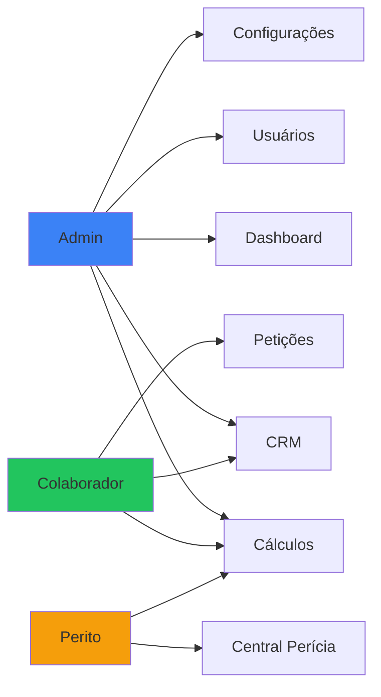

# Documentação de Usuários - OctoApps

> **Última Atualização:** 2026-01-08

---

## Índice

1. [Perfil: Administrador](#perfil-administrador)
2. [Perfil: Colaborador](#perfil-colaborador)
3. [Perfil: Perito Técnico](#perfil-perito-técnico)
4. [Matriz de Permissões](#matriz-de-permissões)
5. [Regras de Negócio](#regras-de-negócio)

---

## Perfil: Administrador

### Descrição
- **Quem**: Sócios e gestores do escritório (ex: Paulo Guedes)
- **Nível de Acesso**: Completo (CRUD total em todos os módulos)
- **Responsabilidade Principal**: Gerenciar usuários, configurar funis do CRM, visualizar dashboards gerais

### O que PODE fazer

| Área | Ações Permitidas |
|------|------------------|
| **Gestão de Usuários** | Criar, editar, inativar qualquer usuário |
| **Configuração de Negócio** | Alterar etapas do funil, definir metas |
| **Visualização** | Ver todos os leads, cálculos e petições de todos os usuários |
| **Operação** | Executar todas as funções operacionais |

### O que NÃO PODE fazer

- Alterar estrutura do banco de dados (criar colunas/tabelas via interface)
- Se auto-excluir (se for o único admin)

### Telas Exclusivas

1. **Dashboard Administrativo** (`/dashboard`)
   - KPIs consolidados
   - Gráfico de pipeline
   - Atividades recentes da equipe

2. **Gestão de Usuários** (`/usuarios`)
   - Listagem de membros
   - Convite por e-mail
   - Gerenciamento de perfis

3. **Configuração de Funil** (`/configuracoes/funil`)
   - Criar/editar/excluir etapas
   - Reordenação drag-and-drop

4. **Permissões** (`/configuracoes/permissoes`)
   - Matriz de permissões por usuário/módulo

---

## Perfil: Colaborador

### Descrição
- **Quem**: Advogados, assistentes jurídicos, estagiários
- **Nível de Acesso**: Operacional (foco em CRM e Cálculos básicos)
- **Responsabilidade Principal**: Atendimento ao cliente, cadastro de oportunidades, execução de análises prévias

### O que PODE fazer

| Área | Ações Permitidas |
|------|------------------|
| **CRM** | Criar, editar e mover leads; agendar tarefas |
| **Cálculos** | Criar cálculos ilimitados, editar inputs, exportar relatórios |
| **Petições** | Gerar documentos a partir de templates |
| **Visualização** | Ver leads (todos ou apenas os próprios, conforme config) |

### O que NÃO PODE fazer

- Alterar etapas do funil de vendas
- Criar novos usuários
- Deletar histórico de vendas ganhas
- Editar fórmulas de cálculo (apenas parâmetros)

### Telas Principais

1. **CRM Kanban** (`/crm/oportunidades`)
   - Pipeline visual com cards
   - Filtros por responsável/status
   
2. **Detalhes do Cliente** (`/crm/oportunidade/:id`)
   - Abas: Visão Geral, Timeline, Cálculos, Documentos
   
3. **Novo Cálculo** (`/calc/wizard`)
   - Seleção de tipo (Veículo, Imóvel, Cartão)
   - Upload OCR
   - Formulário dinâmico

4. **Resultado de Análise** (`/calc/:id/resultado`)
   - Comparativo Banco vs Recalculado
   - Exportação PDF

---

## Perfil: Perito Técnico

### Descrição
- **Quem**: Especialista financeiro/contábil (ex: Diego Nascimento)
- **Nível de Acesso**: Foco no Módulo de Cálculos com poderes avançados
- **Responsabilidade Principal**: Validar metodologias, ajustar parâmetros complexos, analisar casos de alta complexidade

### O que PODE fazer

| Área | Ações Permitidas |
|------|------------------|
| **Edição Profunda** | Alterar qualquer parâmetro de cálculo (taxas, datas, valores, índices) |
| **Validação** | Marcar cálculos como "Validado" (selo de qualidade) |
| **Overrides** | Editar manualmente parcelas específicas no grid de resultados |
| **Gestão de Modelos** | Criar/salvar presets de cálculo |

### O que NÃO PODE fazer

- Excluir usuários ou alterar configurações administrativas
- Apagar histórico de quem criou o cálculo

### Telas Especializadas

1. **Central de Perícia** (`/calc/pericia`)
   - Tabela filtrada de cálculos pendentes de validação
   - Filtros avançados por tipo/margem de abusividade

2. **Editor Avançado** (`/calc/:id/editar-avancado`)
   - Grid de parcelas com edição inline
   - Painel de parâmetros globais
   - Recálculo em cascata

3. **Reconstrutor de Cartão** (`/calc/cartao/:id`)
   - Grid mensal de faturas
   - Input massivo de dados
   - Cálculo de indébito

---

## Matriz de Permissões

### Por Módulo

| Módulo | Admin | Colaborador | Perito |
|--------|:-----:|:-----------:|:------:|
| **CRM** | ✅ CRUD | ✅ CRUD | 🔵 Read |
| **Contatos** | ✅ CRUD | ✅ CRUD | 🔵 Read |
| **Cálculos** | ✅ CRUD | ✅ CRU* | ✅ CRUD+ |
| **Petições** | ✅ CRUD | ✅ CRU | ✅ CRU |
| **Usuários** | ✅ CRUD | ❌ | ❌ |
| **Configurações** | ✅ | ❌ | ❌ |

**Legenda:**
- ✅ CRUD = Create, Read, Update, Delete
- 🔵 Read = Apenas leitura
- CRU* = Pode deletar apenas rascunhos
- CRUD+ = Inclui validação e override

### Acesso Visual

---

## Regras de Negócio

### RN-001: Imutabilidade do Admin Principal
> O sistema não permite que o usuário logado exclua ou inative a si mesmo, nem altere seu próprio perfil para nível inferior.

### RN-002: Integridade do Funil de Vendas
> Etapas do funil só podem ser excluídas se estiverem vazias (sem oportunidades ativas, perdidas ou ganhas).

### RN-003: Campos Estáticos
> Nenhum perfil pode criar novos campos de dados via interface. Alterações estruturais requerem intervenção do desenvolvedor.

### RN-004: Bloqueio de Edição de Fórmulas (Colaborador)
> O Colaborador pode editar parâmetros de entrada (taxas, datas, valores), mas nunca a lógica da fórmula de cálculo.

### RN-005: Imutabilidade do Parecer Emitido (Perito)
> Após o Perito validar um cálculo, ele é travado para edição por outros perfis. Apenas Perito ou Admin podem destravá-lo.

### RN-006: Restrição de Exclusão (Colaborador)
> O Colaborador pode excluir cálculos/rascunhos, mas não pode excluir Cliente/Oportunidade que já avançou para etapas de "Fechamento" ou "Venda".

---

*Documentação de Usuários - OctoApps*
