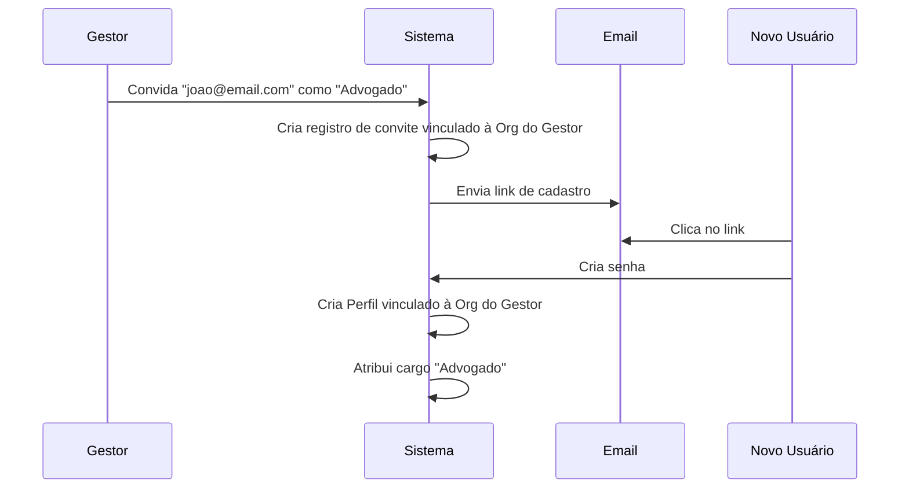

# Documentação de Usuários - OctoApps

> **Última Atualização:** 2026-01-16

---

## Índice

1. [Conceitos: Organização e Multi-tenancy](#conceitos-organização-e-multi-tenancy)
2. [Perfil: Admin Master (Dono da Plataforma)](#perfil-admin-master-dono-da-plataforma)
3. [Perfil: Gestor (Dono da Empresa)](#perfil-gestor-dono-da-empresa)
4. [Perfil: Colaborador (Advogado, Assistente, Financeiro)](#perfil-colaborador-advogado-assistente-financeiro)
5. [Perfil: Perito Técnico](#perfil-perito-técnico)
6. [Matriz de Permissões](#matriz-de-permissões)
7. [Regras de Negócio](#regras-de-negócio)

---

## Conceitos: Organização e Multi-tenancy

O OctoApps opera em um modelo **Multi-tenant**.
- **Organização (Empresa)**: É a entidade legal (Escritório de Advocacia, Consultoria) que contrata o OctoApps.
- **Isolamento**: Dados de uma organização (Clientes, Cálculos, Leads) são estritamente isolados e invisíveis para outras organizações.
- **Membros**: Todo usuário (exceto Admin Master) pertence obrigatoriamente a uma única Organização.

---

## Perfil: Admin Master (Dono da Plataforma)

### Descrição
- **Quem**: Donos do SaaS OctoApps (Super Usuários).
- **Nível de Acesso**: Irrestrito Global.
- **Responsabilidade**: Manutenção da plataforma, suporte técnico avançado, gestão de planos e assinaturas das organizações.

### O que PODE fazer
- Acessar qualquer organização para fins de suporte (Impersonate).
- Gerenciar assinaturas e bloqueios de inadimplentes.
- Criar/Editar configurações globais do sistema.

---

## Perfil: Gestor (Dono da Empresa)

*(Antigo Administrador)*

### Descrição
- **Quem**: Sócios e proprietários do escritório cliente (ex: Paulo Guedes).
- **Nível de Acesso**: Total dentro da sua Organização.
- **Responsabilidade**: Configurar dados da empresa (Logo, CNPJ), gerenciar equipe, assinar planos.

### O que PODE fazer
- **Gestão da Empresa**: Editar Razão Social, CNPJ, Logomarca, Cores do Relatório.
- **Gestão de Equipe**: Convidar novos usuários (Advogados, Peritos) e definir seus cargos.
- **Financeiro**: Acessar faturas e gestão de assinatura do OctoApps.
- **Operacional**: Acesso completo a CRM, Cálculos e Petições.

### O que NÃO PODE fazer
- Acessar dados de outras Organizações.
- Alterar estrutura do banco de dados global.

### Telas Exclusivas
1. **Minha Empresa** (`/configuracoes/empresa`)
   - Upload de Logo e dados cadastrais.
2. **Gestão de Usuários** (`/usuarios`)
   - Convite e gestão de acessos.

---

## Perfil: Colaborador (Advogado, Assistente, Financeiro)

### Descrição
- **Quem**: Funcionários do escritório.
- **Cargos Específicos**:
    - **Advogado**: Foco em petições e gestão de casos.
    - **Assistente**: Foco em triagem, cadastro e atendimento inicial.
    - **Financeiro**: Foco em honorários e fluxo de caixa (se houver módulo).
- **Nível de Acesso**: Operacional (restrito à sua Organização).

### Permissões por Cargo
| Cargo | CRM | Cálculos | Petições | Configurações |
|-------|-----|----------|----------|---------------|
| **Advogado** | ✅ Completo | ✅ Criar/Editar | ✅ Completo | ❌ |
| **Assistente** | ✅ Completo | ✅ Criar (Lim.) | 🔵 Leitura | ❌ |
| **Financeiro** | 🔵 Leitura | ❌ | ❌ | ❌ |

*(Nota: Detalhes finos configuráveis na Matriz de Permissões)*

---

## Perfil: Perito Técnico

### Descrição
- **Quem**: Especialista financeiro/contábil contratado ou parceiro.
- **Nível de Acesso**: Especializado no Módulo de Cálculos.
- **Responsabilidade**: Validar cálculos complexos, criar premissas de cálculo.

### O que PODE fazer
- **Edição Profunda**: Alterar índices, séries temporais e regras de negócio de um cálculo específico.
- **Validação**: "Assinar" um cálculo como tecnicamente correto.

---

## Fluxo de Convite e Organização

---

## Matriz de Permissões (Resumo)

| Recurso | Admin Master | Gestor | Advogado | Perito | Assistente |
|---------|:------------:|:------:|:--------:|:------:|:----------:|
| **Dados da Empresa** | ✅ | ✅ | 🔵 | 🔵 | 🔵 |
| **Usuários** | ✅ Global | ✅ da Org | ❌ | ❌ | ❌ |
| **Cálculos (Básico)** | ✅ | ✅ | ✅ | ✅ | ✅ |
| **Cálculos (Avançado)**| ✅ | ✅ | ⚠️ | ✅ | ❌ |
| **Financeiro (SaaS)** | ✅ | ✅ | ❌ | ❌ | ❌ |

**Legenda:**
- ✅ Acesso Total
- 🔵 Apenas Leitura
- ⚠️ Acesso Parcial/Restrito
- ❌ Sem Acesso

---

## Regras de Negócio Adicionais

### RN-USER-01: Unicidade de Organização
> Um e-mail de usuário só pode estar vinculado a **uma** Organização por vez. Para participar de múltiplas, deve usar e-mails diferentes ou (futuramente) recurso de multi-org.

### RN-USER-02: Herança de Configurações
> Todos os relatórios gerados por Colaboradores ou Peritos usam automaticamente o Logo e Cabeçalho definidos pelo **Gestor** da Organização.

### RN-USER-03: Proteção de Admin Master
> Nenhum usuário (nem mesmo Gestor) pode atribuir a si mesmo ou a outros o cargo de Admin Master. Este cargo é atribuído apenas via banco de dados/infra.
